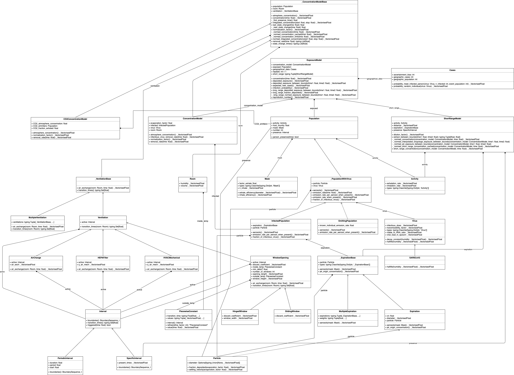

*************************
Diameter-dependent model
*************************

This section describes the model and its dependence on the Particles diameter. A Unified Modeling Language (UML) diagram describing all the data classes and their relations can be found :ref:`here<caimira-uml-diagram>`, at the bottom of the document.

Context
=======

The :mod:`caimira.apps.calculator.model_generator` module is responsible to bind all the inputs defined in the user interface into the respective model variables.
The :py:mod:`caimira.apps.calculator.report_generator` module is responsible to bind the results from the model calculations into the respective output variables presented in the CAiMIRA report.
The :mod:`caimira.models` module itself implements the core CAiMIRA methods.  A useful feature of the implementation is that we can benefit from vectorisation, which allows running multiple parameterizations of the model at the same time.

Unlike other similar models, some of the CAiMIRA variables are considered for a given aerosol diameter :math:`D`, 
as the behavior of the virus-laden particles in the room environment and inside the susceptible host (once inhaled) are diameter-dependent. 
Here, these variables are identified by their functional dependency on :math:`D`, as for the **emission rate** -- :math:`\mathrm{vR}(D)`, **removal rate** -- :math:`\mathrm{vRR}(D)`, and **concentration** -- :math:`C(t, D)`.

Despite the outcome of the CAiMIRA results include the entire range of diameters, throughout the model,
most of the variables and parameters are kept in their diameter-dependent form for any possible detailed analysis of intermediate results.
Only the final quantities shown in output, such as the concentration and the dose, are integrated over the diameter distribution.
This is performed thanks to a Monte-Carlo (MC) integration at the level of the dose (:math:`\mathrm{vD^{total}}`) which is computed over a distribution of particle diameters,
from which the average value (i.e. :code:`.mean()` of the numpy array) is then calculated -- this is equivalent to an analytical integral over diameters
provided the sample size is large enough. Example of the MC integration over the diameters for the dose:
:code:`deposited_exposure += np.array(short_range_exposure * fdep).mean()`

It is important to distinguish between 1) Monte-Carlo random variables (which are vectorised independently on its diameter-dependence) and 2) numerical Monte-Carlo integration for the diameter-dependence.
Since the integral of the diameter-dependent variables are solved when computing the dose -- :math:`\mathrm{vD^{total}}` -- while performing some of the intermediate calculations, 
we normalize the results by *dividing* by the Monte-Carlo variables that are diameter-independent, so that they are not considered in the Monte-Carlo integration (e.g. the **viral load** parameter, or the result of the :meth:`caimira.models.InfectedPopulation.emission_rate_per_aerosol_when_present` method).

Expiration
==========

The **Expiration** class (representing the expiration of aerosols by an infected person) has the `Particle` -- :attr:`caimira.models.Expiration.particle` -- as one of its properties, 
which represents the virus-laden aerosol with a vectorised parameter: the particle `diameter` (assuming a perfect sphere).
For a given aerosol diameter, one :class:`caimira.models.Expiration` object provides the aerosol **volume** - :math:`V_p(D)`, multiplied by the **mask outward efficiency** - :math:`η_\mathrm{out}(D)` to include the filtration capacity, when applicable.

The BLO model represents the distribution of diameters used in the model. It corresponds to the sum of three log-normal distributions, weighted by the **B**, **L** and **O** modes.
The aerosol diameter distributions are given by the :meth:`caimira.monte_carlo.data.BLOmodel.distribution` method.

The :class:`caimira.monte_carlo.data.BLOmodel` class itself contains the method to return the mathematical values of the probability distribution for a given diameter (in microns), 
as well as the method to return its integral between the **min** and **max** diameters.
The BLO model is used to provide the probability density function (PDF) of the aerosol diameters for a given **Expiration** type defined in :meth:`caimira.monte_carlo.data.expiration_distribution`.
To compute the total number concentration of particles per mode (B, L and O), :math:`cn` in particles/cm\ :sup:`3`\, in other words, the total concentration of aerosols per unit volume of expired air, 
an integration of the log-normal distributions is performed over all aerosol diameters. In the code it is used as a scaling factor in the :class:`caimira.models.Expiration` class.

Under the :mod:`caimira.apps.calculator.model_generator`, when it comes to generate the Expiration model, the `diameter` property is sampled through the BLO :meth:`caimira.monte_carlo.data.BLOmodel.distribution` method, while the value for the :math:`cn` is given by the :meth:`caimira.monte_carlo.data.BLOmodel.integrate` method.
To summarize, the Expiration object contains, as a vectorised float, a sample of diameters following the BLO distribution. Depending on different expiratory types, the contributions from each mode will be different, therefore the resulting distribution also differs from model to model.

Emission Rate - vR(D)
=====================

The mathematical equations to calculate :math:`\mathrm{vR}(D)` are defined in the paper - Henriques, A. et al. [2]_ - as follows:

:math:`\mathrm{vR}(D)_j= \mathrm{vl_{in}} \cdot E_{c,j}(D,f_{\mathrm{amp}},\eta_{\mathrm{out}}(D)) \cdot {\mathrm{BR}}_{\mathrm{k}}` ,

:math:`E_{c,j}^{\mathrm{total}} = \int_0^{D_{\mathrm{max}}} E_{c,j}(D)\, \mathrm{d}D` .

The later integral, which is giving the total volumetric particle emission concentration (in mL/m\ :sup:`3` \), is a example of a numerical Monte-Carlo integration over the particle diameters, 
since :math:`E_{c,j}(D)` is a diameter-dependent quantity. :math:`E^{\mathrm{total}}_{c, j}` is calculated from the mean of the Monte-Carlo sample :math:`E_{c,j}(D)`.
Note that :math:`D_{\mathrm{max}}` value will differ, depending on the type of exposure (see below).

In the code, for a given Expiration, we use different methods to perform the calculations *step-by-step*:

1. Calculate the non aerosol-dependent quantities in the emission rate, which is the multiplication of the diameter-**independent** variables: :meth:`caimira.models.InfectedPopulation.emission_rate_per_aerosol_when_present`. This corresponds to the :math:`\mathrm{vl_{in}} \cdot \mathrm{BR_{k}}` part of the :math:`\mathrm{vR}(D)` equation.
2. Calculate the diameter-**dependent** variable :meth:`caimira.models.InfectedPopulation.aerosols`, which is the result of :math:`E_{c,j}(D) = N_p(D) \cdot V_p(D) \cdot (1 − η_\mathrm{out}(D))` (in mL/(m\ :sup:`3` \.µm)), with :math:`N_p(D)` being the product of the BLO distribution by the scaling factor :math:`cn`. Note that this result is not integrated over the diameters at this stage, thus the units are still *'per aerosol diameter'*.
3. Calculate the full emission rate, which is the multiplication of the two previous methods, and corresponds to :math:`\mathrm{vR(D)}`: :meth:`caimira.models._PopulationWithVirus.emission_rate_when_present`.

Note that the diameter-dependence is kept at this stage. Since other parameters downstream in code are also diameter-dependent, the Monte-Carlo integration over the aerosol sizes is computed at the level of the dose :math:`\mathrm{vD^{total}}`.
In case one would like to have intermediate results for emission rate, perform the Monte-Carlo integration of :math:`E_{c, j}^{\mathrm{total}}` and compute :math:`\mathrm{vR^{total}} =\mathrm{vl_{in}} \cdot E_{c, j}^{\mathrm{total}} \cdot \mathrm{BR_k}`.

Virus Concentration - C(t, D)
=============================

The estimate of the concentration of virus-laden particles in a given room is based on a two-box exposure model:

* **Box 1** - long-range exposure: also known as the *background* concentration, corresponds to the exposure of airborne virions where the susceptible (exposed) host is more than 2 m away from the infected host(s), considering the result of a mass balance equation between the emission rate of the infected host(s) and the removal rates from the environmental/virological characteristics.
* **Box 2** - short-range exposure: also known as the *exhaled jet* concentration in close-proximity, corresponds to the exposure of airborne virions where the susceptible (exposed) host is distanced between 0.5 and 2 m from an infected host, considering the result of a two-stage exhaled jet model.

Note that most of the methods used to calculate the concentration are defined in the superclass :meth:`caimira.models._ConcentrationModelBase`, while the specific methods for the long-range virus concentration are part of the subclass :meth:`caimira.models.ConcentrationModel`.
The specific removal rate, background concentration and normalization factors will depend on what concentration is being calculated (e.g. viral concentration or CO\ :sub:`2` concentration) and are respectively defined in :meth:`caimira.models._ConcentrationModelBase.removal_rate`, 
:meth:`caimira.models._ConcentrationModelBase.background_concentration` and :meth:`caimira.models._ConcentrationModelBase.normalization_factor`. 

Long-range approach
*******************

The long-range concentration of virus-laden aerosols of a given size :math:`D`, that is based on the mass balance equation between the emission and removal rates, is given by:

:math:`C_{\mathrm{LR}}(t, D)=\frac{\mathrm{vR}(D) \cdot N_{\mathrm{inf}}}{\lambda_{\mathrm{vRR}}(D) \cdot V_r}-\left (\frac{\mathrm{vR}(D) \cdot N_{\mathrm{inf}}}{\lambda_{\mathrm{vRR}}(D) \cdot V_r}-C_0(D) \right )e^{-\lambda_{\mathrm{vRR}}(D)t}` ,

and computed, as a function of the exposure time and particle diameter, in the :meth:`caimira.models._ConcentrationModelBase.concentration` method.
The long-range concentration, integrated over the exposure time (in piecewise constant steps), :math:`C(D)`, is given by :meth:`caimira.models._ConcentrationModelBase.integrated_concentration`.

In the :math:`C_{\mathrm{LR}}(t, D)` equation above, the **emission rate** - :math:`\mathrm{vR}(D)` - and the **viral removal rate** - :math:`\lambda_{\mathrm{vRR}}(D)`, :meth:`caimira.models.ConcentrationModel.infectious_virus_removal_rate` - are both diameter-dependent.
One can show that the resulting concentration is always proportional to the emission rate :math:`\mathrm{vR}(D)`. Hence, for computational speed-up purposes
the code computes first a normalized version of the concentration, i.e. divided by the emission rate, before multiplying by :math:`\mathrm{vR}(D)`.

To summarize, we can split the concentration in two different formulations:

* Normalized concentration :meth:`caimira.models._ConcentrationModelBase._normed_concentration`: :math:`\mathrm{C_\mathrm{LR, normed}}(t, D)` that computes the concentration without including the emission rate.
* Concentration :meth:`caimira.models._ConcentrationModelBase.concentration` : :math:`C_{\mathrm{LR}}(t, D) = \mathrm{C_\mathrm{LR, normed}}(t, D) \cdot \mathrm{vR}(D)`, where :math:`\mathrm{vR}(D)` is the result of the :meth:`caimira.models._PopulationWithVirus.emission_rate_when_present` method.

Note that in order to get the total concentration value in this stage, the final result should be averaged over the particle diameters (i.e. Monte-Carlo integration over diameters, see above).
For the calculator app report, the total concentration (MC integral over the diameter) is performed only when generating the plot.
Otherwise, the diameter-dependence continues until we compute the inhaled dose in the :class:`caimira.models.ExposureModel` class.

The following methods calculate the integrated concentration between two times. They are mostly used when calculating the **dose**:

* :meth:`caimira.models._ConcentrationModelBase.normed_integrated_concentration`, :math:`\mathrm{C_\mathrm{normed}}(D)` that returns the integrated long-range concentration of viruses in the air, between any two times, normalized by the emission rate. Note that this method performs the integral between any two times of the previously mentioned :meth:`caimira.models._ConcentrationModelBase._normed_concentration` method.
* :meth:`caimira.models._ConcentrationModelBase.integrated_concentration`, :math:`C(D)`, that returns the same result as the previous one, but multiplied by the emission rate.

The integral over the exposure times is calculated directly in the class (integrated methods).

Short-range approach
********************

The short-range concentration is the result of a two-stage exhaled jet model developed by Jia, W. et al. [1]_ and is expressed as:

:math:`C_{\mathrm{SR}}(t, D) = C_{\mathrm{LR}} (t, D) + \frac{1}{S({x})} \cdot (C_{0, \mathrm{SR}}(D) - C_{\mathrm{LR}, 100μm}(t, D))` ,

where :math:`S(x)` is the dilution factor due to jet dynamics, as a function of the interpersonal distance :math:`x` and :math:`C_{0, \mathrm{SR}}(D)` corresponds to the initial concentration of virions at the mouth/nose outlet during exhalation.
:math:`C_{\mathrm{LR}, 100μm}(t, D)` is the long-range concentration, calculated in :meth:`caimira.models._ConcentrationModelBase.concentration` method but **interpolated** to the diameter range used for close-proximity (from 0 to 100μm).
Note that :math:`C_{0, \mathrm{SR}}(D)` is constant over time, hence only dependent on the particle diameter distribution. 

For code simplification, we split the :math:`C_{\mathrm{SR}}(t, D)` equation into two components:

* short-range component: :math:`\frac{1}{S({x})} \cdot (C_{0, \mathrm{SR}}(D) - C_{\mathrm{LR}, 100μm}(t, D))`, dealt with in the dataclass :class:`caimira.models.ShortRangeModel`.
* long-range component: :math:`C_{\mathrm{LR}} (t, D)`.

The short-range data class (:class:`caimira.models.ShortRangeModel`) models the short-range component of a close-range interaction **concentration** and the respective **dilution_factor**.
Its inputs are the **expiration** definition, the **activity type**, the **presence time**, and the **interpersonal distance** between any two individuals.
When generating a full model, the short-range class is defined with a new **Expiration** distribution, 
given that the **min** and **max** diameters for the short-range interactions are different from those used in the long-range concentration (the idea is that very large particles should not be considered in the long-range case as they fall rapidly on the floor, 
while they must be in for the short-range case).

As mentioned in Jia, W. et al. [1]_, the jet concentration depends on the **long-range concentration** of viruses. 
Here, once again, we shall normalize the short-range concentration to the diameter-independent quantities. 
IMPORTANT NOTE: since the susceptible host is physically closer to the infector, the emitted particles are larger in size, 
hence a new distribution of diameters should be taken into consideration. 
As opposed to :math:`D_{\mathrm{max}} = 30\mathrm{μm}` for the long-range MC integration, the short-range model will assume a :math:`D_{\mathrm{max}} = 100\mathrm{μm}`.
Very similar to what we did with the **emission rate**, we need to calculate the scaling factor from the probability distribution, :math:`N_p(D)` - :math:`cn`, as well as the **volume concentration** for those diameters.

During a given exposure time, multiple short-range interactions can be defined in the model.
In addition, for each individual interaction, the expiration type may be different.

To calculate the short-range component, we first need to calculate what is the **dilution factor**, that depends on the distance :math:`x` as a random variable, from a log normal distribution in :meth:`caimira.monte_carlo.data.short_range_distances`.
This factor is calculated in a two-stage expiratory jet model, with its transition point defined as follows:

:math:`\mathrm{xstar}=𝛽_{\mathrm{x1}} (Q_{\mathrm{exh}} \cdot u_{0})^\frac{1}{4} \cdot (\mathrm{tstar} + t_{0})^\frac{1}{2} - x_{0}`,

where :math:`Q_{\mathrm{exh}}= φ \mathrm{BR}` is the expired flow rate during the expiration period, in :math:`m^{3} s^{-1}`, `φ` is the exhalation coefficient
(dimensionless) and represents the ratio between the total period of a breathing cycle and the duration of the exhalation alone. 
Assuming the duration of the inhalation part is equal to the exhalation and one starts immediately after the other, `φ` will always be equal to `2` no matter what is the breating cycle time. :math:`\mathrm{BR}` is the given exhalation rate.
:math:`u_{0}` is the expired jet speed (in :math:`m s^{-1}`) given by :math:`u_{0}=\frac{Q_{\mathrm{exh}}}{A_{m}}`, :math:`A_{m}` being the area of the mouth assuming a perfect circle (average `mouth_diameter` of `0.02m`).
The time of the transition point :math:`\mathrm{tstar}` is defined as `2s` and corresponds to the end of the exhalation period, i.e. when the jet is interrupted. The distance of the virtual origin of the puff-like stage is defined by 
:math:`x_{0}=\frac{\textrm{mouth_diameter}}{2𝛽_{\mathrm{r1}}}` (in m), and the corresponding time is given by :math:`t_{0} = \frac{\sqrt{\pi} \cdot \textrm{mouth_diameter}^3}{8𝛽_{\mathrm{r1}}^2𝛽_{\mathrm{x1}}^2Q_{exh}}` (in s).
Having the distance for the transition point, we can calculate the dilution factor at the transition point, defined as follows:

:math:`\mathrm{Sxstar}=2𝛽_{\mathrm{r1}}\frac{(xstar + x_{0})}{\textrm{mouth_diameter}}`.

The remaining dilution factors, either in the jet- or puff-like stages are calculated as follows:

:math:`\mathrm{factors}(x)=\begin{cases}\hfil 2𝛽_{\mathrm{r1}}\frac{(x + x_{0})}{\textrm{mouth_diameter}} & \textrm{if } x < \mathrm{xstar},\\\hfil \mathrm{Sxstar} \cdot \biggl(1 + \frac{𝛽_{\mathrm{r2}}(x - xstar)}{𝛽_{\mathrm{r1}}(xstar + x_{0})}\biggl)^3 & \textrm{if } x > \mathrm{xstar}.\end{cases}`

The penetration coefficients in the jet-like stage :math:`𝛽_{\mathrm{r1}}`, :math:`𝛽_{\mathrm{r2}}` and :math:`𝛽_{\mathrm{x1}}` are defined by the following empirical values `0.18`, `0.2`, and `2.4` respectively. The dilution factor for each distance :math:`x` is then stored in the :math:`\mathrm{factors}` array that is returned by the method.

Having the dilution factors, the **initial concentration of virions at the mouth/nose**, :math:`C_{0, \mathrm{SR}}(D)`, is calculated as follows:

:math:`C_{0, \mathrm{SR}}(D) = N_p(D) \cdot V_p(D) \cdot \mathrm{vl_{in}} \cdot 10^{-6}`, 
given by :meth:`caimira.models.Expiration.jet_origin_concentration`. It computes the same quantity as :meth:`caimira.models.Expiration.aerosols`, except for the mask inclusion. As previously mentioned, it is normalized by the **viral load**, which is a diameter-independent property. 
Note, the :math:`10^{-6}` factor corresponds to the conversion from :math:`\mathrm{μm}^{3} \cdot \mathrm{cm}^{-3}` to :math:`\mathrm{mL} \cdot m^{-3}`.

Note that similarly to the `long-range` approach, the MC integral over the diameters is not calculated at this stage.

For consistency, the long-range concentration parameter, :math:`C_{\mathrm{LR}, 100\mathrm{μm}}(t, D)` in the :class:`caimira.models.ShortRangeModel` class **only**, 
shall also be normalized by the **viral load** and, since in the short-range model the diameter range is different than at long-range (as mentioned above), 
we need to account for that difference.
The former operation is given in method :meth:`caimira.models.ShortRangeModel._long_range_normed_concentration`. For the diameter range difference, there are a few options:
one solution would be to recompute the values a second time using :math:`D_{\mathrm{max}} = 100\mathrm{μm}`;
or perform a approximation using linear interpolation, which is possible and more effective in terms of performance. We decided to adopt the interpolation solution.
The set of points with a known value are given by the default expiration particle diameters for long-range, i.e. from 0 to 30 :math:`\mathrm{μm}`.
The set of points we want the interpolated values are given by the short-range expiration particle diameters, i.e. from 0 to 100 :math:`\mathrm{μm}`. 

To summarize, in the code, :math:`C_{\mathrm{SR}}(t, D)` is computed as follows:

* calculate the `dilution_factor` - :math:`S({x})` - in the method :meth:`caimira.models.ShortRangeModel.dilution_factor`, with the distance :math:`x` as a random variable (log normal distribution in :meth:`caimira.monte_carlo.data.short_range_distances`)
* compute :math:`\frac{1}{S({x})} \cdot (C_{0, \mathrm{SR}}(D) - C_{\mathrm{LR}, 100\mathrm{μm}}(t, D))` in method :meth:`caimira.models.ShortRangeModel.normed_concentration`,
* multiply by the diameter-independent parameter,  viral load, in method :meth:`caimira.models.ShortRangeModel.short_range_concentration`
* complete the equation of :math:`C_{\mathrm{SR}}(t, D)` by adding the long-range concentration from the :meth:`caimira.models._ConcentrationModelBase.concentration` (all integrated over :math:`D`), returning the final short-range concentration value for a given time and expiration activity. This is done at the level of the Exposure Model (:meth:`caimira.models.ExposureModel.concentration`).

Note that :meth:`caimira.models.ShortRangeModel._normed_concentration` method is different from :meth:`caimira.models._ConcentrationModelBase._normed_concentration` and :meth:`caimira.models._ConcentrationModelBase.concentration` differs from :meth:`caimira.models.ExposureModel.concentration`.

Unless one is computing the mean concentration values (e.g. for the plots in the report), the diameter-dependence is kept at this stage. Since other parameters downstream in the code are also diameter-dependent, the Monte-Carlo integration over the particle sizes is computed at the level of the dose :math:`\mathrm{vD^{total}}`.
In case one would like to have intermediate results for the initial short-range concentration, this is done at the :class:`caimira.models.ExposureModel` class level.

Dose - vD
=========

The term `dose` refers to the number of viable virions (infectious virus) that will contribute to a potential infection.
It results in a combination of several properties: exposure, ratio of viable virions, inhalation rate, aerosol deposition in the respiratory tract and the effect of protective equipment such as masks.

The receiving dose, which is inhaled by the exposed host, in infectious virions per unit diameter (diameter-dependence), 
is calculated by first integrating the viral concentration profile (for a given particle diameter) over the exposure time and multiplying by scaling factors such as the proportion of virions which are infectious and the deposition fraction,
as well as the inhalation rate and the effect of masks:

:math:`\mathrm{vD}(D) = \int_{t1}^{t2}C(t, D)\;\mathrm{d}t \cdot f_{\mathrm{inf}} \cdot \mathrm{BR}_{\mathrm{k}} \cdot f_{\mathrm{dep}}(D) \cdot (1-\eta_{\mathrm{in}})` .

where :math:`C(t, D)` is the concentration value at a given time, which can be either the short- or long-range concentration, :math:`f_{\mathrm{inf}}` is the fraction of infectious virus, 
:math:`f_{\mathrm{dep}}(D)` is the (diameter-dependent) deposition fraction in the respiratory tract, :math:`\mathrm{BR}_{\mathrm{k}}` is the inhalation rate and :math:`\eta_{\mathrm{in}}` is the inward efficiency of the face mask.

Given that the calculation is diameter-dependent, to calculate the dose in the model, the code contains different methods that consider the parameters that are dependent on the aerosol size, :math:`D`.
The total dose, at the end of the exposure scenario, results from the sum of the dose accumulated over time, integrated over particle diameters:

:math:`\mathrm{vD^{total}} = \int_0^{D_{\mathrm{max}}} \mathrm{vD}(D) \, \mathrm{d}D` .

This calculation is computed using a Monte-Carlo integration over :math:`D`. As previously described, many different parameters samples are generated using the probability distribution from the :math:`N_p(D)` equation.
The dose for each of them is then computed, and their **average** value over all samples represents a good approximation of the total dose, provided that the number of samples is large enough.

Long-range approach
*******************

Regarding the concentration part of the long-range exposure (concentration integrated over time, :math:`\int_{t1}^{t2}C_{\mathrm{LR}}(t, D)\;\mathrm{d}t`), the respective method is :meth:`caimira.models.ExposureModel._long_range_normed_exposure_between_bounds`,
which uses the long-range exposure (concentration) between two bounds (time1 and time2), normalized by the emission rate of the infected population, calculated from :meth:`caimira.models._ConcentrationModelBase.normed_integrated_concentration`.
The former method filters out the given bounds considering the breaks through the day (i.e. the time intervals during which there is no exposition to the virus) and retrieves the integrated long-range concentration of viruses in the air between any two times.

After the calculations of the integrated concentration over the time, in order to calculate the final dose, we have to compute the remaining factors in the above equation.
Note that the **Monte-Carlo integration over the diameters is performed at this stage**, where all the diameter-dependent parameters are grouped together to calculate the final average (:code:`np.mean()`).

Since, in the previous chapters, the quantities where normalised by the emission rate, one will need to re-incorporate it in the equations before performing the MC integrations over :math:`D`.
For that we need to split :math:`\mathrm{vR}(D)` (:meth:`caimira.models._PopulationWithVirus.emission_rate_when_present`) in diameter-dependent and diameter-independent quantities:

:math:`\mathrm{vR}(D) = \mathrm{vR}(D-\mathrm{dependent}) \times \mathrm{vR}(D-\mathrm{independent})`

with

:math:`\mathrm{vR}(D-\mathrm{dependent}) = \mathrm{cn} \cdot V_p(D) \cdot (1 − \mathrm{η_{out}}(D))` - :meth:`caimira.models.InfectedPopulation.aerosols`

:math:`\mathrm{vR}(D-\mathrm{independent}) = \mathrm{vl_{in}} \cdot \mathrm{BR_{k}}` - :meth:`caimira.models.InfectedPopulation.emission_rate_per_aerosol_when_present`

In other words, in the code the procedure is the following (all performed in :meth:`caimira.models.ExposureModel.long_range_deposited_exposure_between_bounds` method):

* start re-incorporating the emission rate by first multiplying by the diameter-dependent quantities: :math:`\mathrm{vD_{aerosol}}(D) = (\int_{t1}^{t2}C_{\mathrm{LR}}(t, D)\;\mathrm{d}t \cdot \mathrm{vR}(D-\mathrm{dependent}) \cdot f_{\mathrm{dep}}(D))`, in :meth:`caimira.models.ExposureModel.long_range_deposited_exposure_between_bounds` method;

* perform the **MC integration over the diameters**, which is considered equivalent as the mean of the distribution if the sample size is large enough: :math:`\mathrm{vD_{aerosol}} = \mathrm{np.mean}(\mathrm{vD_{aerosol}}(D))`;
* multiply the result with the remaining diameter-independent quantities of the emission rate used previously to normalize: :math:`\mathrm{vD_{emission-rate}} = \mathrm{vD_{aerosol}} \cdot \mathrm{vR}(D-\mathrm{independent})`;
* in order to complete the equation, multiply by the remaining diameter-independent variables in :math:`\mathrm{vD}` to obtain the total value: :math:`\mathrm{vD^{total}} = \mathrm{vD_{emission-rate}} \cdot \mathrm{BR}_{\mathrm{k}} \cdot (1-\eta_{\mathrm{in}}) \cdot f_{\mathrm{inf}}`;
* in the end, the dose is a vectorized float used in the probability of infection formula.

**Note**: The aerosol volume concentration (*aerosols*) is introduced because the integrated concentration over the time was previously normalized by the emission rate.
Here, to calculate the integral over the diameters we also need to consider the diameter-dependent variables that are on the emission rate, represented by the aerosol volume concentration which depends on the diameter and on the mask type:

:math:`\mathrm{aerosols} = \mathrm{cn} \cdot V_p(D) \cdot (1 − \mathrm{η_{out}}(D))` .
The :math:`\mathrm{cn}` factor, which represents the total number of aerosols emitted, is introduced here as a scaling factor, as otherwise the Monte-Carlo integral would be normalized to 1 as the probability distribution.

**Note**: for simplification of the notations, here the dose corresponding exclusively to the long-range contribution is written as :math:`\mathrm{vD_{LR}}(D)= \mathrm{vD}(D)`.

In the end, the governing method is :meth:`caimira.models.ExposureModel.deposited_exposure_between_bounds`, in which the `deposited_exposure` is equal to `long_range_deposited_exposure_between_bounds` in the absence of short-range interactions.

Short-range approach
********************
In theory, the dose during a close-proximity interaction (`short-range`) is simply added to the dose inhaled due to the long-range and may be defined as follows:

:math:`\mathrm{vD}(D)= \mathrm{vD^{LR}}(D) + \sum\limits_{i=1}^{n} \int_{t1}^{t2}C_{\mathrm{SR}}(t, D)\;\mathrm{d}t \cdot f_{\mathrm{inf}} \cdot \mathrm{BR}_{\mathrm{k}} \cdot f_{\mathrm{dep}}(D) \cdot (1-\eta_{\mathrm{in}})` ,

where :math:`\mathrm{vD_{LR}}(D)` is the long-range, diameter-dependent dose computed previously.

From above, the short-range concentration:

:math:`C_{\mathrm{SR}}(t, D) = C_{\mathrm{LR}, 100μm} (t, D) + \frac{1}{S({x})} \cdot (C_{0, \mathrm{SR}}(D) - C_{\mathrm{LR}, 100μm}(t, D))` ,

In the code, the method that returns the value for the total dose (independently if it is short- or long-range) is given by :meth:`caimira.models.ExposureModel.deposited_exposure_between_bounds`.
For code simplification, we split the :math:`C_{\mathrm{SR}}(t, D)` equation into two components: 

* short-range component: :math:`\frac{1}{S({x})} \cdot (C_{0, \mathrm{SR}}(D) - C_{\mathrm{LR}, 100μm}(t, D))`;
* long-range component: :math:`C_{\mathrm{LR}} (t, D)`.

Similarly as above, first we perform the multiplications by the diameter-dependent variables so that we can profit from the Monte-Carlo integration. Then we multiply the final value by the diameter-independent variables.
The method :meth:`caimira.models.ShortRangeModel._normed_jet_exposure_between_bounds` gets the integrated short-range concentration of viruses in the air between the times start and stop, normalized by the **viral load**, 
and excluding the **jet dilution** since it is also diameter-independent. 
This corresponds to :math:`C_{0, \mathrm{SR}}(D)`. 

The method :meth:`caimira.models.ShortRangeModel._normed_interpolated_longrange_exposure_between_bounds` retrieves the integrated short-range concentration due to the background concentration, 
normalized by the **viral load** and the **breathing rate**, and excluding the jet **dilution**.
The result is then interpolated to the particle diameter range used in the short-range model (i.e. 100 μm).
This corresponds to :math:`\int_{t1}^{t2} C_{\mathrm{LR}, 100\mathrm{μm}} (t, D)\mathrm{d}t`.
Very similar to the long-range procedure, this method performs the integral of the concentration for the given time boundaries.

Once we have the integral of the concentration normalized by the diameter-independent quantities, we multiply this result by the remaining diameter-dependent properties to perform the integral
over the particle diameters, including the **fraction deposited** computed with an evaporation factor of `1` (as the aerosols do not have time to evaporate during a short-range interaction).
This operation is performed with the MC intergration using the *mean*, which corresponds to:
:math:`\int_{0}^{D_{max}}C_{\mathrm{SR}}(t, D) \cdot f_{\mathrm{dep}}(D) \;\mathrm{d}D` .

Note that in the code we perform the subtraction between the concentration at the jet origin and the `long-range` concentration of viruses in two steps when we calculate the dose, 
since the contribution of the diameter-dependent variable :math:`f_{\mathrm{dep}}` has to be multiplied separately in substractions:

`integral_over_diameters =` :math:`((C_{0, \mathrm{SR}} \cdot f_{\mathrm{dep}}) - (C_{\mathrm{LR}, 100μm} (t, D) \cdot f_{\mathrm{dep}})) \cdot \mathrm{mean()}` .

Then, we add the contribution to the result of the diameter-**independent** vectorized properties **in two seperate phases**:

* multiply by the diameter-independent properties that are dependent on the **activity type** of the different short-range interactions: **breathing rate** and **dilution factor** - within the *for* cycle;
* multiply by the other properties that are **not** dependent on the type of short-range interactions: **viral load**, **fraction of infectious virus** and **inwards mask efficiency**.

The final operation in the :meth:`caimira.models.ExposureModel.deposited_exposure_between_bounds` accounts for the addition of the long-range component of the dose.

If short-range interactions exist: the long-range component is added to the already calculated short-range component (`deposited_exposure`), hence completing :math:`C_{\mathrm{SR}}`.
If the are no short-range interactions: the short-range component (`deposited_exposure`) is zero, hence the result is equal solely to the long-range component :math:`C_{\mathrm{LR}}`.

CO\ :sub:`2` Concentration
=====================================

The estimate of the concentration of CO\ :sub:`2` in a given room to indicate the air quality is given by the same approach as for the long-range virus concentration, 
:math:`C_{\mathrm{LR}}(t, D)`, where :math:`C_0(D)` is considered to be the background (outdoor) CO\ :sub:`2` concentration (:meth:`caimira.models.CO2ConcentrationModel.CO2_atmosphere_concentration`).

Note that in order to calculate the CO\ :sub:`2` concentration one should use the concentration method defined in the superclass - :meth:`caimira.models._ConcentrationModelBase.concentration` - for a dedicated :class:`caimira.models.CO2ConcentrationModel` scenario.
A fraction of 4.2% of the exhalation rate of the defined activity was considered as the  supplied to the room (:meth:`caimira.models.CO2ConcentrationModel.CO2_fraction_exhaled`).

Since the CO\ :sub:`2` concentration differs from the virus concentration, the specific removal rate, CO\ :sub:`2` atmospheric concentration and normalization factors are respectively defined in :meth:`caimira.models.CO2ConcentrationModel.removal_rate`, 
:meth:`caimira.models.CO2ConcentrationModel.background_concentration` and :meth:`caimira.models.CO2ConcentrationModel.normalization_factor`. 

.. _caimira-uml-diagram:

CAiMIRA UML Diagram
===================

The following diagram describes all the data classes and their relations under the `models.py` file. Click the diagram to zoom-in.

   CAiMIRA `models.py` file UML diagram.

REFERENCES
==========

.. [1] Jia, Wei, et al. "Exposure and respiratory infection risk via the short-range airborne route." Building and environment 219 (2022): 109166. `doi.org/10.1016/j.buildenv.2022.109166 <https://doi.org/10.1016/j.buildenv.2022.109166>`_
.. [2] Henriques, Andre, et al. "Modelling airborne transmission of SARS-CoV-2 using CARA: risk assessment for enclosed spaces." Interface Focus 12.2 (2022): 20210076. `doi.org/10.1098/rsfs.2021.0076 <https://doi.org/10.1098/rsfs.2021.0076>`_