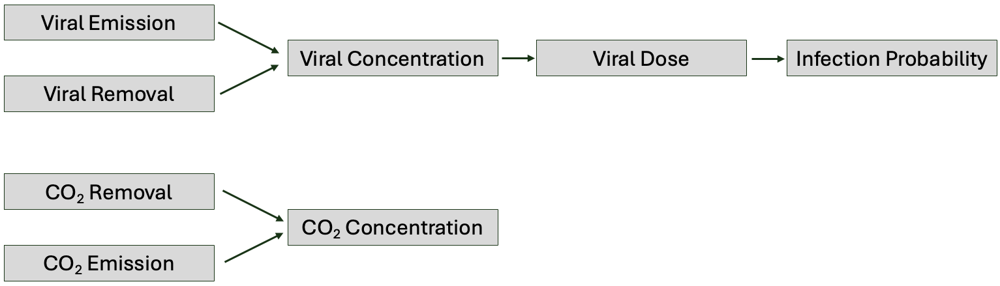

# Physics of Viral Transmission

The CAiMIRA model mimics the physical process of viral transmission through five stages presented in the topmost part of Figure 1: 
Emission, removal, concentration, dose, and infection probability. 
Along with viral transmission, CAiMIRA also simulates emission, removal, and concentration of CO_2, as shown in the lower part of Figure 1.

*Figure 1: Structure of the CAiMIRA model showing the viral transmission and CO_2 simulation processes.*

The viral **emission rate** – $\mathrm{vR}(D)$, **removal rate** – $\mathrm{vRR}(D)$, **concentration** – $C(t, D)$, and **dose** $\mathrm{vD(D)}$ are considered for a given aerosol diameter $D$,
as the behavior of the virus-laden particles in the room environment and inside the respiratory tract are diameter-dependent. The probability of infection is computed from the total viral dose deposited in the respiratory tract

$\mathrm{vD^{total}} =\int_{\mathrm{D_{min}}}^{\mathrm{D_{max}}} \mathrm{vD(D)} \mathrm{d}D$

which is estimated by Monte Carlo integration (see below). 
For computational efficiency, the diameter-dependent dose $\mathrm{vD(D)}$ is factored into three components: 
A probability distribution of $D$, a diameter-independent component, and a remaining diameter-dependent component. 
Because the viral concentration is a factor of the dose, and the viral emission rate is a factor of the viral concentration, $C(t, D)$ and $\mathrm{vR}(D)$ are also factored into probability distribution of $D$, a diameter-independent component, and a remaining diameter-dependent component (details below).
Intermediate results for the total viral emission rate $\mathrm{vR}^{total}$, total viral removal rate $\mathrm{vRR}^{total}$, and total viral concentration $\mathrm{C(t)}^{total}$ can also be obtained by integrating over the particle diameter.

This page describes the derivation of the equations specifying the emission rate, removal rate, and concentration of virions and CO_2, as well as the viral dose exposure and probability of infection (see Figure 1). 
After having derived the full equations, it is described how the computations are devided into different classes and methods in the CAiMIRA implementation for computational efficiency.

## Backend Structure

The `caimira.calculator.validators` package contains modules responsible for binding all input values from the request to their respective model variables. These modules, `co2.co2_validator` and `virus.virus_validator`, inherit from the parent `form_validator` module, and handle input validation for the CO2 and virus model generators, respectively.
The `caimira.calculator.report` package contains modules responsible for binding all results from the model calculations into the respective output variables in the request output. These modules, `co2_report_data` and `virus_report_data`, handle outputs for the CO2 and virus model, respectively.
The `caimira.calculator.store.data_registry` contains input values to CAiMIRA that are not user-defined. These are collected in a class **DataRegistry**.
The `caimira.calculator.models.models.py` (hereafter abbreviated as `models`) and `caimira.calculator.models.monte_carlo` (hereafter abbreviated as `monte_carlo`) implements the core CAiMIRA methods. A useful feature of the implementation is that we can benefit from vectorization, which allows running multiple parameterizations of the model at the same time.

## Emission 
### Derivation of the Analytical Emission Rate
Infectious individuals inside the room are assumed to be the only source of virus. Their emission rate per unit diameter of infectious virus is

$\mathrm{vR}(D)= {\mathrm{BR}}_{\mathrm{k}} \cdot \mathrm{vl_{in}} \cdot f_{\mathrm{inf}} \cdot E_c(D)$

given the breathing rate ${\mathrm{BR}}_{\mathrm{k}}$ for a constant physical activity $k \in \{\mathrm{Seated}, \mathrm{Standing}, \mathrm{Light},$ $\mathrm{Moderate}, \mathrm{Heavy}\}$. $vl_{\mathrm{in}}$ is the viral load in the respiratory tract (in RNA copies per mL) and $f_{inf}$ is the fraction of infectious virus. 
$E_c(D)$ represents the volumetric particle emission concentration per unit diameter (in mL/(m3 .µm) given by

$E_{c}(D) = N_p(D) \cdot V_p(D) \cdot (1 − η_\mathrm{out}(D))$

where $V_p(D)$ is the particles' individual volume and $\eta_{out}$ is the outward mask efficiency. For an expiratory activity $j \subseteq \{\mathrm{Breathing}, \mathrm{Speaking}, \mathrm{Singing}, \mathrm{Shouting}\}$, the number of particles with diameter $D$ is given by 

$N_{p}(D)=\sum_{\forall j} \sum_{i \in \{\mathrm{B},\mathrm{L},\mathrm{O}\}} a_j \cdot f_{\mathrm{amp}, j, i} \cdot c_{n,i} \cdot \left[\frac{1}{D\sqrt{2 \pi} \sigma_{D_i}} \exp{-\frac{(\ln D -\mu_{D_i})^2}{2 (\sigma_{D_i})^2}}\right]$

for B = bronchial, L = larynx, O = oral being the sources of the emitted particles. $a_j$ is the fraction of time the infected performes each expiratory activity $j$.
$c_{n,i}$ is the particle emission concentration, and $\mu_{D_i}$ and $\sigma_{D_i}$ are the mean and standard deviations, respectively, of the log-normal distribution found to fit the number of expired particles with diameter $D$, for $i \in \{\mathrm{B},\mathrm{L},\mathrm{O}\}$ Johnson et al. [2](#id8). 
$f_{\mathrm{amp}, j, i}$ is the amplitude of the vocalization, set to 5 for $i \in \{L,O\}$ if $j = \{\text{Singing}, \text{Shouting}\}$ and otherwise 1. Note, however, that for $i \in \{L,O\}$ and $j = \text{Breathing}$ $f_{\mathrm{amp}, j, i}$ is set to zero in `caimira.calculator.store.data_registry`, although it is technically the particle emission concentration $c_{n,i}$ that is zero in that case. This technicallity has no effect on the output, it only simplifies the implementation of $c_{n,i}$.

Note that the diameter-dependence is kept at this stage. Since other parameters downstream in code are also diameter-dependent, the Monte-Carlo integration over the particle diameter is computed at the level of the dose $\mathrm{vD^{total}}$.
In case one would like to have intermediate results for emission rate, however, one may compute

$\mathrm{vR}^{total} = \int_{D_{\mathrm{min}}}^{D_{\mathrm{max}}} {\mathrm{BR}}_{\mathrm{k}} \cdot \mathrm{vl_{in}} \cdot f_{\mathrm{inf}} \cdot E_c(D) \mathrm{d}D = {\mathrm{BR}}_{\mathrm{k}} \cdot \mathrm{vl_{in}} \cdot f_{\mathrm{inf}} \cdot E_{c}^{\mathrm{total}}$

for 

$E_{c}^{\mathrm{total}} = \int_{D_{\mathrm{min}}}^{D_{\mathrm{max}}} E_c(D) \mathrm{d}D $

using Monte Carlo integration.

### Distribution of the Particle Diameter
When Monte Carlo integrating over the particle diameter, a probability distribution $\mathrm{p}_D(D)$ is needed for sampling of the particle diameter $D$. 
Observe that

$\mathrm{p}_D(D)=\frac{N_p(D)}{K}=\sum_{i \in I(j)} \frac{c_{n,i}}{K}\left[\frac{1}{D\sqrt{2 \pi} \sigma_{D_i}} \exp{-\frac{(\ln D -\mu_{D_i})^2}{2 (\sigma_{D_i})^2}}\right]$

for
$K=\int_{D_{\mathrm{min}}}^{D_{\mathrm{max}}} N_p(D) \mathrm{d}D $
is a mixture distribution: the sum of three truncated and scaled log-normal probability distributions. 

In the CAiMIRA model, $D$ is sampled from $\mathrm{p}_D(D)$ truncated between $D_{\mathrm{min}}$ and $D_{\mathrm{min}}$ when calling the function `monte_carlo.data.expiration_distribution()`, which retrieves the truncated $\mathrm{p}_D(D)$ from `monte_carlo.data.BLOModel`.

Monte Carlo Integration

Monte Carlo integration takes advantage of the fact that the expected value of a function g of a random variable D can be approximated by drawing samples {$D_1$, $D_2$, ...,$ D_S$} from the probability distribution $\mathrm{p}_D(D)$ and compute the average. That is,

$E[g(D)] = \int_{\mathrm{D_{min}}}^{\mathrm{D_{max}}} \mathrm{g}(D) \cdot \mathrm{p}_D(D) \mathrm{d}D \approx \frac{1}{S}\sum_{i=1}^S \mathrm{g}(D_i)$ 

The approximation improves for a larger number of samples. For computational efficiency, however, the number of samples should not be unneccecarily high. The lower the variability of p(D), the less samples are needed to stabilize the results. Therefore, one wish to choose a probability distribution $\mathrm{p}_D(D)$  that contains as much information about D as possible.

Note that the analytical integrals approximated by Monte Carlo integration in CAiMIRA does not explisitly include $\mathrm{p}_D(D)$. Analytically, one therefore computes $\frac{1}{S}\sum_{i=1}^S \frac{\mathrm{h}(D_i)}{\mathrm{p}_D(D_i)}$.
Every quantity $\mathrm{h}(D)$ that is approximated by Monte Carlo integration in the CAiMIRA model has $N_p(D)$ as a linear factor, which will cancel the $N_p(D)$ factor of $\mathrm{p}_D(D)$, the fraction $\frac{\mathrm{h}(D)}{\mathrm{p}_D(D)}$ will not include $N_p(D)$. Essentially, this means $N_p(D)$ is "replaced" by $K$ in the equation for $E_{c}(D)$ in the model implementation. For example, one therefore computes 

$E_{c}^{\mathrm{total}} = \int_{D_{\mathrm{min}}}^{D_{\mathrm{max}}} \frac{E_c(D) \cdot K}{N_p(D)} \cdot \mathrm{p}_D(D) \mathrm{d}D \approx \frac{1}{S}\sum_{i=1}^S \frac{E_c(D) \cdot K}{N_p(D)}$.

### Computation of the Emission Rate
The computation of the emission rate $\mathrm{vR}(D)$ in CAiMIRA can be divided into three steps:

* Calculate the diameter-**independent** component of $\mathrm{vR}(D)$, i.e. ${\mathrm{BR}}_{\mathrm{k}} \cdot \mathrm{vl_{in}} \cdot f_{\mathrm{inf}}$, in `models.InfectedPopulation.emission_rate_per_aerosol_per_person_when_present()`. 
* Draw S samples {$D_1$, $D_2$, ...,$D_S$} from $\mathrm{p}_D(D)$  (default S = 250 000 samples) when creating an **Expiration** object by calling the function `monte_carlo.data.expiration_distribution()`.
* Compute the diameter-**dependent** $\frac{E_c(D_i) \cdot K}{N_p(D_i)}$ for every $D_i \in ${$D_1$, $D_2$, ...,$D_S$} in `models.InfectedPopulation.aerosols()`. WRONG, why multiply by $cn$ also?

The emission rate (per person infected) $\mathrm{vR(D)}$ can be computed by: `models._PopulationWithVirus.emission_rate_per_person_when_present()`, outputting a vector $[\mathrm{vR(D_1)}, \mathrm{vR(D_2)}, ..., \mathrm{vR(D_S)}]$ who's average is $\mathrm{vR}^{total}$.

By default, however, the diameter-dependence is kept at this stage because more diameter-dependent variables will be introduced downstream in the model before Monte-Carlo integrating over the aerosol sizes to obtain the dose $\mathrm{vD^{total}}$.

The methods for computing the components of the emission rate can be accessed through the class **InfectedPopulation**, representing a population of infected with a certain number of people, all with the same expirational activity, physical activity, virus, face mask, immunity and (incremental) presence. **InfectedPopulation** is initialized an **Expiration** object, an **Activity** object, a **Virus** object, a **Mask** object, a float host_immunity, and an **Interval** object corresponding to those properties. Furthermore, **InfectedPopulation** is initialized with by **DataRegistry** and the integer number of people in the infected population.

The **Expiration** object (`models.Expiration`) represents the expiration of aerosols by an infected person, and is initialized by an S-dimentional array (or a single float if S=1) of the samples {$D_1$, $D_2$, ...,$D_S$} drawn from $\mathrm{p}_D(D)$.The samples {$D_1$, $D_2$, ...,$D_S$} are generated by **CustomKernel** (`monte_carlo.sampleable.CustomKernel`). The **CustomKernel** is built for the distribution $\mathrm{p}_D(D)$ defined by the `distribution()` method of **BLOModel** (`monte_carlo.data.BLOmodel`). **Expiration** is also passed a float $cn$ upon initialization, acting as a scaling factor computed as the integral over every mode in $\{\mathrm{B},\mathrm{L},\mathrm{O}\}$ between $D_{\mathrm{min}}$ and $D_{\mathrm{max}}$ in `BLOModel.integrate()`. The **BLOModel** is initialized by a set of BLO_factors corresponding to the type of expirational activity performed. Consult `monte_carlo.data.expiration_distribution()` for further details on how **Expiration** is initialized.

In the property `Expiration.particle`, the class **Particle** (representing virus-laden aerosols) is initialized with the array of diameters stored in **Expiration**. **Particle** contains methods for computing the diameter-dependent deposition factor and settling velocity of aerosols, which will be used downstream in the model.

## Removal
The viral **viral removal rate** is given by

$\lambda_{\mathrm{vRR}}(t,D) = \lambda_{\mathrm{ACH}}(t)+\lambda_{\mathrm{dep}}(D)+\lambda_{\mathrm{bio}}$

where $\lambda_{\mathrm{ACH}}(t)$ is the air exchange per hour, $\\lambda_{\mathrm{dep}}(D)$ is the particle deposition, and $\lambda_{\mathrm{bio}}$ is the biological decay. The diameter-dependent viral removal rate at a given time is calculated by `models.ConcentrationModel.removal_rate()`.

## Viral Concentration
The estimate of the concentration of virus-laden particles in a given room is based on a two-box exposure model:

* **Box 1** - long-range exposure: also known as the *background* concentration, corresponds to the exposure of airborne virions where the susceptible (exposed) host is more than 2 m away from the infected host(s), considering the result of a mass balance equation between the emission rate of the infected host(s) and the removal rates from the environmental/virological characteristics.
* **Box 2** - short-range exposure: also known as the *exhaled jet* concentration in close-proximity, corresponds to the exposure of airborne virions where the susceptible (exposed) host is distanced between 0.5 and 2 m from an infected host, considering the result of a two-stage exhaled jet model.

Most of the methods used to calculate the long-range concentration are defined in the superclass `models._ConcentrationModelBase()`, with the abstract methods `removal_rate()`, `min_background_concentration()`, and `normalization_factor()` implemented for **viral** concentrations specifically in the subclass `models.ConcentrationModel()`. Later, we will see that `models.CO2ConcentrationModel()` also inherits from `models._ConcentrationModelBase()`. The short-range virus concentration is modelled by the independent class `models.ShortRangeModel()`.

### Long-Range Compartment
#### Derivation of the Analytical Long-Range Concentration
Assuming mass balance, the change in the viral concentration equal the difference between the total emission rate per volume and the total removal rate. If we assume all the infected have the same emission rate, the total emission rate per unit volume is the product of $\mathrm{vR(D)}$ and the number of infected $N_{\mathrm{inf}}$ divided by the room volume $V_r$. The total removal rate is the product of the viral removal rate $\lambda_{\mathrm{vRR}}(t,D)$ and the current viral concentration $C_{\mathrm{LR}}(t, D)$. In conclusion, the viral concentration is described by the ordinary differential equation (ODE)

$\frac{\partial C_{\mathrm{LR}}(t, D)}{\partial t} = \frac{\mathrm{vR}(D)\,N_{\mathrm{inf}}}{V_r} - \lambda_{vRR}(D) \cdot C_{\mathrm{LR}}(t, D)$.

Assuming the viral concentration is the only time-dependent variable, this ODE can be solved analytically for a given particle size $D$. The solution might only hold over time intervals $[t_i, t_{i+1}]$ where the assumption that $\lambda_{vRR}(D)$ and $N_{\mathrm{inf}}$ are time-independent holds. In that case, the viral concentration at the end of the previous interval $C_{\mathrm{LR}}(t_i,D)$ can be carried forward as an intital condition to the next interval. 

The homogeneous solution (satisfying 
$\frac{\partial C_{\mathrm{LR}}(t, D)}{\partial t} + \lambda_{vRR}(D)\cdot\,C_{\mathrm{LR}}(t, D) = 0$)
is 
$C_{\mathrm{LR}}(t, D)_{h}=A_1\cdot \exp{-\lambda_{vRR}(D)\cdot t}$. 
Assuming the particular solution is a constant $A_2$ we have the **general solution**

$C_{\mathrm{LR}}(t, D) = A_2 + A_1\cdot \exp{-\lambda_{vRR}(D)\cdot t}$

with derivative

$\frac{\partial C_{\mathrm{LR}}(t, D)}{\partial t} = -A_1\cdot \lambda_{vRR}(D) \cdot \exp{-\lambda_{vRR}(D)\cdot t}$

Combining the two equations containing $\frac{\partial C_{\mathrm{LR}}(t, D)}{\partial t}$ we get

$C_{\mathrm{LR}}(t, D) = \frac{\mathrm{vR(D)}\,N_{\mathrm{inf}}}{\lambda_{vRR}(D)\,V_r} + A_1\cdot \exp{-\lambda_{vRR}(D)\cdot t}$, 

which combined with the general solution yields

$A_2 = \frac{\mathrm{vR(D)}\,N_{\mathrm{inf}}}{\lambda_{vRR}(D)\,V_r}$.

For at the end of the last time interval (at $t=t_i$) the general solution gives
$C_{\mathrm{LR}}(t_i, D) = A_2 + A_1\cdot \exp{-\lambda_{vRR}(D)\cdot t_i}$. 
Hence, 

$A_1 = -\left(\frac{\mathrm{vR(D)}\,N_{\mathrm{inf}}}{\lambda_{vRR}(D)\,V_r}-C_{\mathrm{LR}}(t_i, D)\right) \cdot \exp{\lambda_{vRR}(D)\cdot t_i}$.

In conclusion, the analytical solution of the ODE describing the viral concentration, assuming only the concentration is time-dependent, is

$C_{\mathrm{LR}}(t, D) = \frac{\mathrm{vR(D)}\,N_{\mathrm{inf}}}{\lambda_{vRR}(D)\,V_r} - \left(\left(\frac{\mathrm{vR(D)}\,N_{\mathrm{inf}}}{\lambda_{vRR}(D)\,V_r}- C_{\mathrm{LR}}(t_i, D)\right) \cdot \exp{\lambda_{vRR}(D)\cdot t_i}\right) \exp{-\lambda_{vRR}(D)\cdot t}$

$= \frac{\mathrm{vR(D)}\,N_{\mathrm{inf}}}{\lambda_{vRR}(D)\,V_r} - \left(\frac{\mathrm{vR(D)}\,N_{\mathrm{inf}}}{\lambda_{vRR}(D)\,V_r}-C_{\mathrm{LR}}(t_i, D)\right) \exp{-\lambda_{vRR}(D)\cdot (t-t_i)}$. 

In CAiMIRA, we compute the normaized concentration $\frac{C_{\mathrm{LR}}(t, D)}{\mathrm{vR(D)}}$ in `models._ConcentrationModelBase._normed_concentration()`. 
The normalized concentration $\frac{C_{\mathrm{LR}}(t_i, D)}{\mathrm{vR(D)}}$ is computed and stored to be used in the next step by `models._ConcentrationModelBase._normed_concentration_cached()`. 
To inspect the properties of $\frac{C_{\mathrm{LR}}(t_i, D)}{\mathrm{vR(D)}}$ by finding its solution to the differential equation

$C_{\mathrm{LR}}(t_{i+1}, D)= \frac{\mathrm{vR(D)}\,N_{\mathrm{inf},i+1}}{\lambda_{vRR,i+1}(D)\,V_r} - \left(\frac{\mathrm{vR(D)}\,N_{\mathrm{inf},i+1}}{\lambda_{vRR,i+1}(D)\,V_r}-C_{\mathrm{LR}}(t_i, D)\right) \exp{-\lambda_{vRR,i+1}(D)\cdot (t_{i+1}-t_i)}$. 

Lets first clarify the notation by setting $y_i =C_{\mathrm{LR}}(t_{i}, D)$, $B_{i+1}=\frac{\mathrm{vR(D)}\,N_{\mathrm{inf},i+1}}{\lambda_{vRR,i+1}(D)\,V_r}$, 
and $K_i = \exp{-\lambda_{vRR,i+1}(D)\cdot (t_{i+1}-t_i)}$. Note that we no longer assume that the number of infected and viral removal rate are time-independent: 
$B_i$ depends on $i$ because $N_{\mathrm{inf},i+1}$ and/or $\lambda_{vRR,i+1}(D)$ change with $i$. Using the new notation, we get

$y_{i+1}= B_{i+1} - (B_{i+1}-y_i) K_i \quad \Rightarrow \quad y_{i+1} = B_{i+1}(1-K_i)+K_i y_i$

yielding the solution

$y_i=y_0 \cdot \left(\prod_{j=0}^{i-1} K_j\right)+\sum_{m=0}^{i-1}B_{m+1}\cdot \left(\prod_{j=m+1}^{i-1} K_j\right)(1- K_m)$

Observing that 

$\prod_{j=n}^{i-1}K_j = \prod_{j=n}^{i-1}\exp{-\lambda_{vRR,j+1}(D)\cdot (t_{j+1}-t_j)} = \exp{ - \sum_{j=n}^{i-1} \lambda_{vRR,j+1}(D)\cdot(t_{j+1}-t_j)}$,

$t_0=0$, and $y_0=C_{\mathrm{LR}}(0, D)=C_0$ we obtain the solution 

$C_{\mathrm{LR}}(t_i, D)
=C_0 \cdot \left(\exp{ - \sum_{j=0}^{i-1} \lambda_{vRR,j+1}(D)\cdot(t_{j+1}-t_j)}\right)
+\sum_{m=0}^{i-1}
\frac{\mathrm{vR(D)}\,N_{\mathrm{inf},m+1}}{\lambda_{vRR,m+1}(D)\,V_r}
\cdot \left(\exp{ - \sum_{j=m+1}^{i-1} \lambda_{vRR,j+1}(D)\cdot(t_{j+1}-t_j)}\right)
\cdot \left(1- \exp{-\lambda_{vRR,m+1}(D)\cdot (t_{m+1}-t_m)}\right)$

Importantly, the viral emission $\mathrm{vR(D)}$ is constant so, assuming the initial viral concentration $C_0=0$, $\mathrm{vR(D)}$ is a linear factor of $C_{\mathrm{LR}}(t_i, D)$ for all $i$.
Therefore, we can always compute the normalized concentration at the last time step $\frac{C_{\mathrm{LR}}(t_i, D)}{\mathrm{vR(D)}}$ and $\mathrm{vR(D)}$ separately.

Inserting $C_{\mathrm{LR}}(t_i, D)$ into the solution of the mass-balance ODE above, and replacing $N_{\mathrm{inf}}$ and $\lambda_{vRR}$ by $N_{\mathrm{inf},i+1}$ and $\lambda_{vRR,i+1}$, 
we find an expression for the long range viral concentration that does not require recurrent computations of $C_{\mathrm{LR}}(t_i, D)$.
The expression will, however, depend on all the stepwise constant values of the number of infected and viral removal rate.
Computationally, it might be just as efficient to compute $C_{\mathrm{LR}}(t_i, D)$ recurrently, as in CAiMIRA, because we also want to compute the concentration profile.

#### Computation of the Long-Range Concentration
For computational speed-up purposes we first compute $\frac{C_{\mathrm{LR}}(t, D)}{\mathrm{vR(D)}}$, i.e. the long-range concentration normalized by the emission rate. This diameter-dependent component is later retrieved in `models.ExposureModel` to compute the dose exposure.

Intermediate results for the long-range viral concentration can be obtained by computing

* The normalized concentration $\frac{C_{\mathrm{LR}}(t, D)}{\mathrm{vR(D)}}$ in `models._ConcentrationModelBase._normed_concentration()`.
* The normalization factor $\frac{\mathrm{vR(D)}}{\mathrm{p}_D(D)}$ in `models._PopulationWithVirus.emission_rate_per_person_when_present()`, which is called in `models.ConcentrationModel.normalization_factor()` to override the abstract method `models._ConcentrationModelBase.normalization_factor()`.
* $\frac{C_{\mathrm{LR}}(t, D)}{\mathrm{p}_D(D)}$ as the product of the two above methods in `models._ConcentrationModelBase.concentration()`.

Averaging the array $\left[\frac{C_{\mathrm{LR}}(t, D_1)}{\mathrm{p}_D(D_1)}, \frac{C_{\mathrm{LR}}(t, D_2)}{\mathrm{p}_D(D_2)}, ..., \frac{C_{\mathrm{LR}}(t, D_S)}{\mathrm{p}_D(D_S)}\right]$ returned by `models._ConcentrationModelBase.concentration()` corresponds to Monte Carlo integrating

$C_{\mathrm{LR}}^{\mathrm{total}}(t) = \int_{D_{\mathrm{min}}}^{D_{\mathrm{max}}} C_{\mathrm{LR}}(t, D) \mathrm{d}D$.

For the calculator app report, the total concentration (MC integral over the diameter) is performed only when generating the plot.
Otherwise, the diameter-dependence continues until we compute the inhaled dose in the `models.ExposureModel` class.

#### Dynamic occupancy
The mass-balance equation above assumes the emission rate $\mathrm{vR(D)}$ is the same for all the $N_{\mathrm{inf}}$ infected. Different infected may, however, have different physical activities, expirational activities, face mask, immunity, and presence. Concequently, the viral emission rate $\mathrm{vR(D)}$ and the probability distribution of the particle diameter $\mathrm{p}_{D}(D)$ are not the same for every infected. Lets assume we have $n_p$ different populations of infected, each with $N_{\mathrm{inf},n}$ infected with emission rate $\mathrm{vR}_n(D)$ and particle diameters sampled from $\mathrm{p}_{D,n}(D)$. Then, the mass balance equation describing the evolution of the viral concentration becomes

$\frac{\partial C_{\mathrm{LR}}(t, D)}{\partial t} = \frac{\sum_{n=1}^{n_p}\mathrm{vR}_n(D)\,N_{\mathrm{inf},n}}{V_r} - \lambda_{vRR}(D) \cdot C_{\mathrm{LR}}(t, D).$

Using the exact same procedure and assumptions as for the previous ODE, we find the solution to be

$C_{\mathrm{LR}}(t, D)= \frac{\sum_{n=1}^{n_p}\mathrm{vR}_n(D)\,N_{\mathrm{inf},n}}{\lambda_{vRR}(D)\,V_r} - \left(\frac{\sum_{n=1}^{n_p}\mathrm{vR}_n(D)\,N_{\mathrm{inf},n}}{\lambda_{vRR}(D)\,V_r}-C_{\mathrm{LR}}(t_i, D)\right) \exp{-\lambda_{vRR}(D)\cdot (t-t_i)}$

Note that $C_{\mathrm{LR}}(t_0, D)=0$ and 

$C_{\mathrm{LR}}(t_1, D)= \frac{\sum_{n=1}^{n_p}\mathrm{vR}_n(D)\,N_{\mathrm{inf},n}}{\lambda_{vRR}(D)\,V_r} - \left(\frac{\sum_{n=1}^{n_p}\mathrm{vR}_n(D)\,N_{\mathrm{inf},n}}{\lambda_{vRR}(D)\,V_r}-C_{\mathrm{LR}}(t_0, D)\right) \exp{-\lambda_{vRR}(D)\cdot (t_1-t_0)}$

$= \sum_{n=1}^{n_p} \left[\frac{\mathrm{vR}_n(D)\,N_{\mathrm{inf},n}}{\lambda_{vRR}(D)\,V_r} - \frac{\\,N_{\mathrm{inf},n}}{\lambda_{vRR}(D)\,V_r} \exp{-\lambda_{vRR}(D)\cdot (t_1-t_0)} \right] =\sum_{n=1}^{n_p}C_{\mathrm{LR},n}(t_1, D)$

For the final equality, we set $C_{\mathrm{LR},n}(t_1, D)=\frac{\mathrm{vR}_n(D)\,N_{\mathrm{inf},n}}{\lambda_{vRR}(D)\,V_r} \cdot \left(1-\exp{-\lambda_{vRR}(D)\cdot t_1-t_0}\right)$ to indicate that this expression can be computed by a **ConcentrationModel** object, as described above, because all the $N_{\mathrm{inf},n}$ infected belong to the same **IntectedPopulation**, and thus have the same viral emission rate and samples of $D$. Next, for $t \in [t_1, t_2]$ we have

$C_{\mathrm{LR}}(t, D)= \frac{\sum_{n=1}^{n_p}\mathrm{vR}_n(D)\,N_{\mathrm{inf},n}}{\lambda_{vRR}(D)\,V_r} - \left(\frac{\sum_{n=1}^{n_p}\mathrm{vR}_n(D)\,N_{\mathrm{inf},n}}{\lambda_{vRR}(D)\,V_r}-C_{\mathrm{LR}}(t_1, D)\right) \exp{-\lambda_{vRR}(D)\cdot (t-t_1)}$

$= \frac{\sum_{n=1}^{n_p}\mathrm{vR}_n(D)\,N_{\mathrm{inf},n}}{\lambda_{vRR}(D)\,V_r} - \left(\frac{\sum_{n=1}^{n_p}\mathrm{vR}_n(D)\,N_{\mathrm{inf},n}}{\lambda_{vRR}(D)\,V_r}-\sum_{n=1}^{n_p}C_{\mathrm{LR},n}(t_1, D)\right) \exp{-\lambda_{vRR}(D)\cdot (t-t_1)}$

$= \sum_{n=1}^{n_p} \left[ \frac{\mathrm{vR}_n(D)\,N_{\mathrm{inf},n}}{\lambda_{vRR}(D)\,V_r} - \left(\frac{\mathrm{vR}_n(D)\,N_{\mathrm{inf},n}}{\lambda_{vRR}(D)\,V_r}-C_{\mathrm{LR},n}(t_1, D)\right) \exp{-\lambda_{vRR}(D)\cdot (t-t_1)} \right] =\sum_{n=1}^{n_p}C_{\mathrm{LR},n}(t, D)$

The pattern extends to

$C_{\mathrm{LR}}(t, D)=\sum_{n=1}^{n_p}C_{\mathrm{LR},n}(t, D)$

for all $t$, so we may use multiple **ConcentrationModel** objects to compute the total long-range concentration resulting from emissions from infected with different properties. 

Using several **ConcentrationModel** objects was motivated by the **InfectedPopulation** objects having different samples of $D$ stored in their **Exporation** object, which cannot be considered equal because they stem from different distributions $\mathrm{p}_{D,n}(D)$. 
When we Monte Carlo integrate to obtain the total long-range concentration, we compute

$C_{\mathrm{LR}}^{\mathrm{total}}(t) = \int_{D_{\mathrm{min}}}^{D_{\mathrm{max}}} C_{\mathrm{LR}}(t, D) \mathrm{d}D $

$= \sum_{n=1}^{n_p} \int_{D_{\mathrm{min}}}^{D_{\mathrm{max}}} \frac{C_{\mathrm{LR},n}(t, D)}{\mathrm{p}_{D,n}(D)} \cdot \mathrm{p}_{D,n}(D) \mathrm{d}D$

$ \approx \sum_{n=1}^{n_p} \frac{1}{S_n}\sum_{i=1}^{S_n} \frac{C_{\mathrm{LR},n}(t, D_{n,i})}{\mathrm{p}_{D,n}(D_{n,i})}$.

This computation is performed in `models.ExposureModel.long_range_concentration()` and combined with the short-range concentration in `models.ExposureModel.concentration()`.

### Short-Range Compartment
#### Derivation of the Analytical Short-Range Concentration
The viral concentration at short-range is the result of a two-stage exhaled jet model developed by Jia, W. et al. [1](#id6) and is expressed as:

$C_{\mathrm{SR}}(t, D) 
= C_{\mathrm{LR}} (t, D) + \frac{1}{S({x})} \cdot (C_{0, \mathrm{SR}}(D) - C_{\mathrm{LR}}(t, D))$,

where $S(x) > 0$ is the dilution factor due to jet dynamics, as a function of the interpersonal distance $x$, and 

$C_{0, \mathrm{SR}}(D) = \mathrm{vl_{in}} \cdot f_{\mathrm{inf}} \cdot E_c(D)$

is the initial concentration of virions at the mouth/nose outlet during exhalation. Note that $C_{0, \mathrm{SR}}(D)$ is constant over time, except it is set to zero untill (and including) the the start of the short-range interaction and after the end of the short-range interaction.

We allow the physical and expirational activity of the infected and exposed to be different at short-range and long-range (in the current frontent, only the expirational activity may be different).
Also, because smaller particles remain airborn longer than bigger particles, we set $D_{\mathrm{max}}=20\mathrm{μm}$ at long-range and $D_{\mathrm{min}}=100\mathrm{μm}$ at short-range.
Concequently, $E_c(D)$ has a different $N_p$ for $C_{0, \mathrm{SR}}(D)$ than for $C_{\mathrm{LR}} (t, D)$, so the particle diameters sampled to compute $C_{0, \mathrm{SR}}(D)$ and $C_{\mathrm{LR}} (t, D)$ are drawn from different probability distributions. 
Lets name the different probability distributions at long-range and short-range $\mathrm{p}_{\mathrm{LR},D}(D)$ and $\mathrm{p}_{\mathrm{SR},D}(D)$.

In CAiMIRA version 4.18.0, we sample the diameters from the different $\mathrm{p}_{\mathrm{LR},D}(D)$ and $\mathrm{p}_{\mathrm{SR},D}(D)$, compute $\frac{C_{\mathrm{LR}}(t, D_i)}{\mathrm{p}_{\mathrm{LR},D}(D_i)}$ and $\frac{C_{0, \mathrm{SR}}(D_j)}{\mathrm{p}_{\mathrm{SR},D}(D_j)}$,
and interpolate the vector $\left[\frac{C_{\mathrm{LR}}(t, D_1)}{\mathrm{p}_{\mathrm{LR},D}(D_1)}, \frac{C_{\mathrm{LR}}(t, D_2)}{\mathrm{p}_{\mathrm{LR},D}(D_2)}, ..., \frac{C_{\mathrm{LR}}(t, D_{S_N})}{\mathrm{p}_{\mathrm{LR},D}(D_{S_N})}\right]$ 
to the diameter basis sampled from $\mathrm{p}_{\mathrm{SR},D}(D)$. Thechnically, we then Monte Carlo Integrate

$C_{\mathrm{SR}}^{\mathrm{total}}(t) 
= \int_{D_\mathrm{min}}^{D_\mathrm{max}} C_{\mathrm{SR}}(t, D) \mathrm{d}D 
= \int_{D_\mathrm{min}}^{D_\mathrm{max}} C_{\mathrm{LR}} (t, D) + \frac{1}{S({x})} \cdot (C_{0, \mathrm{SR}}(D) - C_{\mathrm{LR}}(t, D)) \mathrm{d}D $

$ \approx \int_{0}^{100\mathrm{μm}} \frac{C_{\mathrm{LR}}(t, D)}{\mathrm{p}_{\mathrm{LR},D}(D)} + \frac{1}{S({x})} \left( \frac{C_{0, \mathrm{SR}}(D) }{\mathrm{p}_{\mathrm{SR},D}(D)} -\frac{C_{\mathrm{LR}}(t, D)}{\mathrm{p}_{\mathrm{LR},D}(D)}\right) \mathrm{p}_{\mathrm{SR},D}(D) \mathrm{d}D$

which is a good approximation if $\mathrm{p}_{\mathrm{LR},D}(D) \approx \mathrm{p}_{\mathrm{SR},D}(D)$ and $\mathrm{p}_{\mathrm{LR},D}(D_i) \approx 0$ for $D_i > 20\mathrm{μm}$.
In the newer versions of CAiMIRA, however, we aviod the approximation by rather computing

$C_{\mathrm{SR}}^{\mathrm{total}}(t) 
= \int_{D_\mathrm{min}}^{D_\mathrm{max}} C_{\mathrm{SR}}(t, D) \mathrm{d}D 
= \int_{D_\mathrm{min}}^{D_\mathrm{max}} C_{\mathrm{LR}}(t, D) + \frac{1}{S({x})} \left(C_{0, \mathrm{SR}}(D) - C_{\mathrm{LR}}(t, D) \right) \mathrm{d}D $

$= \int_{0}^{20\mathrm{μm}} \frac{C_{\mathrm{LR}}(t, D)}{\mathrm{p}_{\mathrm{LR},D}(D)} \cdot \mathrm{p}_{\mathrm{LR},D}(D) \mathrm{d}D + \frac{1}{S({x})} \cdot \left(\int_{0}^{100\mathrm{μm}} \frac{C_{0, \mathrm{SR}}(D) }{\mathrm{p}_{\mathrm{SR},D}(D)} \cdot \mathrm{p}_{\mathrm{SR},D}(D) \mathrm{d}D- \int_{0}^{20\mathrm{μm}} \frac{C_{\mathrm{LR}}(t, D)}{\mathrm{p}_{\mathrm{LR},D}(D)} \cdot \mathrm{p}_{\mathrm{LR},D}(D) \mathrm{d}D \right)$

$\approx \frac{1}{S_N}\sum_{i=1}^{S_N} \frac{C_{\mathrm{LR}}(t, D_i)}{\mathrm{p}_{\mathrm{LR},D}(D_i)} + \frac{1}{S({x})} \cdot \left(\frac{1}{S_N}\sum_{j=1}^{S_N} \frac{C_{0, \mathrm{SR}}(D_j)}{\mathrm{p}_{\mathrm{SR},D}(D_j)} - \frac{1}{S_N}\sum_{i=1}^{S_N} \frac{C_{\mathrm{LR}}(t, D_i)}{\mathrm{p}_{\mathrm{LR},D}(D_i)} \right)$.

Note that $C_{\mathrm{SR}}(t, D)$ is the actual concentration at short-range, with the long-range concentration entrained. Hence, one is NOT supposed to add the long-range and short-range concentration on top of each other.
To ease addition of contributions from several, incremental short-range interactions, we define the short-range concentration difference

$C_{\mathrm{SR-LR}}^{\mathrm{total}}(t) = C_{\mathrm{SR}}^{\mathrm{total}}(t) - C_{\mathrm{LR}}^{\mathrm{total}}(t)$

$ = \frac{1}{S({x})} \cdot \left(\int_{0}^{100\mathrm{μm}} \frac{C_{0, \mathrm{SR}}(D) }{\mathrm{p}_{\mathrm{SR},D}(D)} \cdot \mathrm{p}_{\mathrm{SR},D}(D) \mathrm{d}D- \int_{0}^{20\mathrm{μm}} \frac{C_{\mathrm{LR}}(t, D)}{\mathrm{p}_{\mathrm{LR},D}(D)} \cdot \mathrm{p}_{\mathrm{LR},D}(D) \mathrm{d}D \right) $

$\approx \frac{1}{S({x})} \cdot \left(\frac{1}{S_N}\sum_{j=1}^{S_N} \frac{C_{0, \mathrm{SR}}(D_j)}{\mathrm{p}_{\mathrm{SR},D}(D_j)} - \frac{1}{S_N}\sum_{i=1}^{S_N} \frac{C_{\mathrm{LR}}(t, D_i)}{\mathrm{p}_{\mathrm{LR},D}(D_i)} \right)$

For the sake of curiosity, note that that if $S({x}) < \infty$ and $C_{0, \mathrm{SR}}(D)$ is small enough (e.g. zero) then $C_{\mathrm{SR-LR}}^{\mathrm{total}}(t) < 0$, 
meaning the exhaled jet of a person with a low (or no) viable viral load and/or emission rate contains less virions than the background concentration. 
In the CAiMIRA model, only the short-range concentration from infectious are modeled, and it seems probable that every infected population has $C_{0, \mathrm{SR}}(D)$ is big enough for $C_{\mathrm{SR-LR}}^{\mathrm{total}}(t) > 0$.

Finally, note that a short-range interaction is always considered to be between a single infected and a single exposed population. Therefore, there is no "dynamic occupancy" at short-range. In case there are different infectedpopulations and different exposed populations having short-range interactions, these are described by completely separate short-range interactions.

#### The Dilution Factor
This **dilution factor** is given by 
$$
S({x}) =
\begin{cases} 
\frac{2𝛽_{r,j}(x+x_{0}}{D_m} \hspace{2cm} 0 < x \leq x^*,\\
S({x^*})[1+\frac{𝛽_{r,p}(x-x^*)}{𝛽_{r,j}(x+x_{0})}]^3 \quad x > x^*,
\end{cases}
$$

where $x_{0}=\frac{D_m}{2𝛽_{\mathrm{r1}}}$ distance of the virtual origin of the puff-like stage (in $\mathrm{m}$) with $D_m$ being the diameter (in $\mathrm{m}$) of the mouth opening, assumed to be a perfect circle.
All the $𝛽$-parameters are streamwise and radial penetration coefficients set in `caimira.calculator.store.data_registry`.
The distance $x$ a random variable sampled from a log-normal distribution in `monte_carlo.data.short_range_distances()` and passed as `distance` to `models.ShortRangeModel`. 
The transition point is defined as 

$\mathrm{x^*}=𝛽_{\mathrm{x1}} \cdot \sqrt[4]{Q_{\mathrm{exh}} \cdot u_{0}} \cdot \sqrt{\mathrm{t^*} + t_{0}} - x_{0}$,

where $Q_{\mathrm{exh}}= φ \mathrm{BR}_{\mathrm{k}}$ is the expired flow rate during the expiration period in $\mathrm{m^{3} s^{-1}}$. 
$φ$ is the (dimensionless) exhalation coefficient, given by the ratio between the total period of a breathing cycle and the duration of the exhalation alone. 
Assuming the duration of an inhalation and an exhalation are equal, and one starts immediately after the other, $φ=2$. 
$\mathrm{BR}_{\mathrm{k}}$ is the breathing rate determined by the infected's physical activity during the short-range interaction.
Next, $u_{0}=\frac{Q_{\mathrm{exh}}}{A_{m}}$ is the expired jet speed (in $\mathrm{m s^{-1}}$), with $A_{m}$ being the area of the mouth opening.
The time of the transition point $\mathrm{t^*}$ is defined as half a breathing cycle, corresponding to the end of the exhalation period when the jet is interrupted, and set in `caimira.calculator.store.data_registry`.
Finally, $t_{0} = \frac{\sqrt{\pi} \cdot D_m^3}{8𝛽_{\mathrm{r1}}^2𝛽_{\mathrm{x1}}^2Q_{exh}}$ is the time (in $\mathrm{s}$) corresponding to the distance of the virtual origin of the puff-like stage $x_{0}$.

#### Computation of the Short-Range Concentration
`models.ShortRangeModel` models the short-range component of the short-range concentration and the **dilution_factor**. 
Its inputs of`models.ShortRangeModel` are the **infected** population expiering the jet, their **expiration**, their physical **activity**, the **presence time** for the short-range interaction, and the **interpersonal distance** between any the infected and the exposed they are breathing at.
Note that **infected** is an instance of `models.InfectedPopulation`, which also contains instances of **Expiration** and **Activity**. However, these correspond to the expirational activities and physical activities of the infected during long-range interactions, which may be different from the expiration and activity during short-range interactions.
Therefore, we generate new **Expiration** and **Activity** objects for **ShortRangeModel** corresponding to the infecteds' behaviour at short range. 
Even if the expirational activities at long-range and short-range are the same, a new **Expiration** instance is needed at short-range because $D_{\mathrm{max}}$ is different at short-range and long-range, yielding **Expiration** objects with different diameter samples. 
`models.ShortRangeModel` is kept completely seperate of `models._ConcentrationModelBase`, exce

Similarly to the computation of the long-range concentration in `models._ConcentrationModelBase`, we separate the computation of diameter-dependent random variables and diameter-independent random variables for computational efficiency. 
We compute
* the normalized viral concentration at the outlet, i.e. $\frac{C_{0, \mathrm{SR}}(D)}{E_c(D)}=\mathrm{vl_{in}} \cdot f_{\mathrm{inf}}$, in `models.ShortRangeModel._normed_jet_origin_concentration()` 
* the dilution factor $\frac{1}{S({x})}$ in `models.ShortRangeModel.dilution_factor()` 
* the normalization factor $\frac{E_c(D)}{\mathrm{p}_{\mathrm{SR},D}(D)}$ in `models.ShortRangeModel.normalization_factor()`.

The product of the two first methods are returned by `models.ShortRangeModel._normed_jet_origin_concentration()` and sendt to **ExposureModel**, 
keeping the diameter dependence and separation of random variables because more diameter-dependent variables will be introduced before Monte Carlo integrating to compute the dose exposure. 

If we want intermediate results for the full short-range concentration, e.g. for the report, we integrate the long-range and short-range components over the particle diameter before adding them together. 
$C_{\mathrm{SR-LR}}^{\mathrm{total}}(t)$ is computed in `models.ShortRangeModel.short_range_concentration_difference()` and added to $C_{\mathrm{LR}}^{\mathrm{total}}(t)$ from `models.ConcentrationModel.concentration()` to compute $C_{\mathrm{SR}}^{\mathrm{total}}(t)$, as explained above. 
Note that `models.ShortRangeModel` is kept completely seperate of `models._ConcentrationModelBase` untill
untill an instance of `models.ConcentrationModel` is passed to, and combined with, `models.ShortRangeModel.short_range_concentration_difference()` to compute $C_{\mathrm{SR}}^{\mathrm{total}}(t)$ [MR TODO].

Note that multiple short-range interactions can be defined during a given exposure time. We initialize one **ShortRangeModel** for each interaction.

### Total Viral Concentration
Different exposed populations may experience different viral concentrations depending on their occupancy periods and the occurrence of short-range interactions. For a given exposed population, the total viral concentration at time $t$ is given by

$C^{\mathrm{total}}(t) = \mathbf{1}_{t \in T}(t) \cdot C_{\mathrm{LR}}^{\mathrm{total}}(t) + \sum_{i=1}^{n_\mathrm{SR}}\mathbf{1}_{t \in T_{\mathrm{SR},i}}(t) \cdot C_{\mathrm{SR-LR},i}^{\mathrm{total}}(t)$

where $n_\mathrm{SR}$ denotes the total number of short-range interactions experienced by the exposed population during its entire occupancy period. The indicator function

$
\mathbf{1}_{t \in T}(t) =
\begin{cases}
1, & \text{if } t \in T, \\
0, & \text{else}
\end{cases}
$

ensures the long-range concentration is only considered for the set of times $T$ when the exposed is inside the room, which is a subset of the time interval $[t_0, t_n]$ from when the exposed first enters at $t_0$ untill they leave for the last time at $t_n$. Similarly, the indicator function associated with the $i$-th short-range interaction is defined as

$
\mathbf{1}_{t \in T_{\mathrm{SR},i}}(t) =
\begin{cases}
1, & \text{if } t \in T_{\mathrm{SR},i}, \\
0, & \text{else},
\end{cases}
$

where $T_{\mathrm{SR},i} \subseteq T$ is the set of times when the $i$-th short-range interaction occurs. Thus, the contribution $C_{\mathrm{SR-LR},i}^{\mathrm{total}}(t)$ is included in the total concentration only while that short-range interaction is happening. Note, as previously mentioned, that we integrate over the particle diameter before summing together the long-range and short-range contributions to the concentration because we have different probability distributions for the particle diameter at long-range and short-range. For each exposed population, $C^{\mathrm{total}}(t)$ is computed by `models.ExposureModel.concentration()`. 

In addition to the viral concentration profile for each exposed population, we have the long-range viral concentration profile which is independent of all the exposed populations. This long-range concentration is computed by `models._ConcentrationModelBase.concentration()`, and also retrieved by `models.ExposureModel.concentration()` for an **ExposureModel** with no short-range interactions.

The viral concentration at long-range and from the perspective of a specific exposed population is plotted over time in the report.

## Dose
### Derivation of the Analytical Dose Exposure
The diameter-dependent viral dose deposited in the respiratory tract of an exposed, i.e. the number of viable virions that will contribute to a potential infection, is given by

$\mathrm{vD}(D) = \int_{t_0}^{t_n}C(t, D)\;\ {d}t \cdot \mathrm{BR}_{\mathrm{k}} \cdot f_{\mathrm{dep}}(D) \cdot (1-\eta_{\mathrm{in}})$,

where $t_0$ is the first time exposed enters and $t_n$ is the last time they leave. $\mathrm{BR}_{\mathrm{k}}$ is the breathing rate of the exposed, $f_{\mathrm{dep}}(D)$ is the deposition factor in the respiratory tract, and $\eta_{\mathrm{in}}$ is the inwards mask efficiency of the face mask worn by the exposed.
$C(t, D)$ is the viral concentration from the perspective of the exposed. 
When the exposed is inside the room and not engaged in a short-range interaction $C(t, D)=C_{\mathrm{LR}} (t, D)$, 
and when the exposed is enganging in their $i$-th short-range interaction $C(t, D)=C_{\mathrm{SR},i} (t, D)$. So 
(we assume only one short-range interaction at a time (i.e. $\bigcap_{i=1}^{n_\mathrm{SR}}T_{\mathrm{SR},i} = \empty$), although this is not technically required in the backend model (TODO?))

$C(t, D) = \mathbf{1}_{t \in T}(t) \cdot C_{\mathrm{LR}} (t, D) + \sum_{i=1}^{n_\mathrm{SR}}\mathbf{1}_{t \in T_{\mathrm{SR},i}}(t) \cdot \frac{1}{S({x})} \cdot (C_{0, \mathrm{SR},i}(D) - C_{\mathrm{LR}}(t, D))$

where the indicator functions and the time intervals $T$ and $T_{\mathrm{SR},i}$ follow the definitions from the previous sections. We have now introduced all diameter-dependent quantities, and all down-stream computations only depend on the total dose exposure

$\mathrm{vD}^{\mathrm{total}} =\int_{\mathrm{D_{min}}}^{\mathrm{D_{max}}} \mathrm{vD}(D) \mathrm{d}D$.

Similarly to the computation of the total viral concentration, we account for having diferent diameter distributions at long-range and short-range when Monte Carlo integrating $C(t, D)$ over $D$ by separating the dose into a long-range and a short-range component as follows

$\mathrm{vD}^{\mathrm{total}} 
=\int_{\mathrm{D_{min}}}^{\mathrm{D_{max}}} \int_{t_0}^{t_n}C(t, D)\;\ {d}t \cdot \mathrm{BR}_{\mathrm{k}} \cdot f_{\mathrm{dep}}(D) \cdot (1-\eta_{\mathrm{in}}) \mathrm{d}D$

$\quad\quad\quad=\int_{\mathrm{D_{min}}}^{\mathrm{D_{max}}} \int_{t_0}^{t_n}\mathbf{1}_{t \in T}(t) \cdot C_{\mathrm{LR}} (t, D) \;\ {d}t \cdot \mathrm{BR}_{\mathrm{k}} \cdot f_{\mathrm{dep}}(D) \cdot (1-\eta_{\mathrm{in}}) \mathrm{d}D$

$\quad\quad\quad\quad+\sum_{i=1}^{n_\mathrm{SR}}\int_{\mathrm{D_{min}}}^{\mathrm{D_{max}}} \int_{t_0}^{t_n}\mathbf{1}_{t \in T_{\mathrm{SR},i}}(t) \cdot \frac{1}{S({x})} \cdot (C_{0, \mathrm{SR},i}(D) - C_{\mathrm{LR}}(t, D)) \;\ {d}t \cdot \mathrm{BR}_{\mathrm{k}} \cdot f_{\mathrm{dep}}(D) \cdot (1-\eta_{\mathrm{in}}) \mathrm{d}D$

Lets define

$\mathrm{vD}_{\mathrm{LR}}(D) =\int_{t_0}^{t_n}\mathbf{1}_{t \in T}(t) \cdot C_{\mathrm{LR}} (t, D) \;\ {d}t \cdot \mathrm{BR}_{\mathrm{k}} \cdot f_{\mathrm{dep}}(D) \cdot (1-\eta_{\mathrm{in}})$

$\mathrm{vD}_{\mathrm{SR-LR},i}(D)=\int_{t_0}^{t_n}\mathbf{1}_{t \in T_{\mathrm{SR},i}}(t) \cdot \frac{1}{S({x})} \cdot (C_{0, \mathrm{SR},i}(D) - C_{\mathrm{LR}}(t, D)) \;\ {d}t \cdot \mathrm{BR}_{\mathrm{k}} \cdot f_{\mathrm{dep}}(D) \cdot (1-\eta_{\mathrm{in}})$

so

$\mathrm{vD}^{\mathrm{total}} = \int_{\mathrm{D_{min}}}^{\mathrm{D_{max}}}\mathrm{vD}_{\mathrm{LR}}(D)\mathrm{d}D + \sum_{i=1}^{n_\mathrm{SR}}\int_{\mathrm{D_{min}}}^{\mathrm{D_{max}}}\mathrm{vD}_{\mathrm{SR-LR},i}(D)\mathrm{d}D$

This separation also makes it easier to compare the importance of long-range vs short-range interactions for viral transmission. While the integral over the particle diameter $D$ is approximated by Monte Carlo integration, the integral over time $t$ is solved analytically.

#### Long-Range Dose Component
Recall that we found an analytical solution for $C_{\mathrm{LR}}(t, D)$ by solving an ODE, assuming the viral concentration was the only time-dependent factor. This assumption holds over time intervals $[t_j, t_{j+1}]$. Therefore

$\int_{t_1}^{t_n} C_{\mathrm{LR}}(t, D) \mathrm{d}t  =  \sum_{j=1}^n \int_{t_j}^{t_{j+1}} C_{\mathrm{LR}}(t, D) \mathrm{d}t $
    
$= \sum_{j=1}^n \int_{t_j}^{t_{j+1}} \left[\mathrm{vR(D)} \cdot \left(\frac{N_{\mathrm{inf}}}{\lambda_{vRR}(D)\,V_r} - \left(\frac{N_{\mathrm{inf}}}{\lambda_{vRR}(D)\,V_r}- \frac{C_{\mathrm{LR},0}(D)}{\mathrm{vR(D)}} \right) \exp{-\lambda_{vRR}(D)\cdot t} \right) \right] \mathrm{d}t$

$=  \sum_{j=1}^n \frac{v_R(D)\,N_{inf}}{\lambda_{vRR}(D, t_j)\,V_r} (t_{j+1}-t_{i}) + \left(\frac{v_R(D)\,N_{inf}}{\lambda_{vRR}(D, t_j)\,V_r}- C_{\mathrm{LR},0}(D)\right) \frac{\exp{-\lambda_{vRR}(D,t_j)t_{j+1}}}{\lambda_{vRR}(D,t_j)} - \left(\frac{v_R(D)\,N_{inf}}{\lambda_{vRR}(D, t_j)\,V_r}- C_{\mathrm{LR},0}(D)\right) \frac{\exp{-\lambda_{vRR}(D,t_j)t_j}}{\lambda_{vRR}(D,t_j)}$

Lets also assume that the occupancy of the exposed is also constant over $[t_j, t_{j+1}]$ (this can be achieved by redefining $[t_j, t_{j+1}]$ withouth contradicting the previous requirement for $[t_j, t_{j+1}]$). Then, the intdicator function is constant over $[t_j, t_{j+1}]$ so

$\int_{t_j}^{t_{j+1}} \mathbf{1}_{t \in T}(t) \cdot C_{\mathrm{LR}}(t, D) \mathrm{d}t=\mathbf{1}_{t \in T}(t_j) \cdot \int_{t_j}^{t_{j+1}} C_{\mathrm{LR}}(t, D) \mathrm{d}t$.

In total, the long range dose component is 

$\mathrm{vD}_{\mathrm{LR}}(D) =\sum_{j=1}^n\mathbf{1}_{t_j \in T}(t) \cdot \left( \frac{v_R(D)\,N_{inf}}{\lambda_{vRR}(D, t_j)\,V_r} (t_{j+1}-t_{i}) + \left(\frac{v_R(D)\,N_{inf}}{\lambda_{vRR}(D, t_j)\,V_r}- C_{\mathrm{LR},0}(D)\right) \frac{\exp{-\lambda_{vRR}(D,t_j)t_{j+1}}}{\lambda_{vRR}(D,t_j)} - \left(\frac{v_R(D)\,N_{inf}}{\lambda_{vRR}(D, t_j)\,V_r}- C_{\mathrm{LR},0}(D)\right) \frac{\exp{-\lambda_{vRR}(D,t_j)t_j}}{\lambda_{vRR}(D,t_j)}\right) \cdot \mathrm{BR}_{\mathrm{k}} \cdot f_{\mathrm{dep}}(D) \cdot (1-\eta_{\mathrm{in}})$

#### Short-Range Dose Component
Similar to the long-range component, we have 

$\int_{t_0}^{t_n} \mathbf{1}_{t \in T_{\mathrm{SR},i}}(t) \cdot C_{\mathrm{SR-LR},i}(t, D) \mathrm{d}t
= \mathbf{1}_{t \in T_{\mathrm{SR},i}}(t_j) \cdot \int_{t_j}^{t_{j+1}} C_{\mathrm{SR-LR},i}(t, D) \mathrm{d}t$.

for $[t_j, t_{j+1}]$ defined in the section above. Next,

$\int_{t_j}^{t_{j+1}} \frac{1}{S({x})} \cdot (C_{0, \mathrm{SR},i}(D) - C_{\mathrm{LR}}(t, D)) \mathrm{d}t=\frac{1}{S({x})} \cdot (t_{j+1}-t_j) \cdot C_{0, \mathrm{SR}}(D) -\frac{1}{S({x})} \int_{t_j}^{t_{j+1}} C_{\mathrm{LR}}(t, D) \mathrm{d}t$.

Note that $t \in T_{\mathrm{SR},i} \Rightarrow t \in T$ (i.e. if there is a short-range interaction occuring, the occupants are present). Therefore, $\mathbf{1}_{t \in T_{\mathrm{SR},i}}(t) = \mathbf{1}_{t \in T_{\mathrm{SR},i}}(t) \cdot \mathbf{1}_{t \in T}(t)$. 

Combining the arguments above, we find that the short-range dose component from the $i$-th short-range interaction is

$\mathrm{vD}_{\mathrm{SR-LR},i}(D)=\mathbf{1}_{t \in T_{\mathrm{SR},i}}(t) \cdot \frac{1}{S({x})} \cdot \left((t_{j+1}-t_j) \cdot C_{0, \mathrm{SR},i}(D) -\int_{t_j}^{t_{j+1}} C_{\mathrm{LR}}(t, D) \mathrm{d}t \right) \cdot \mathrm{BR}_{\mathrm{k}} \cdot f_{\mathrm{dep}}(D) \cdot (1-\eta_{\mathrm{in}})$

$=\mathbf{1}_{t \in T_{\mathrm{SR},i}}(t) \cdot \frac{1}{S({x})} \cdot \left(\mathrm{vD}_{0, \mathrm{SR},i}(D)-\mathrm{vD}_{\mathrm{LR}}(D)\right)$

for 

$\mathrm{vD}_{0, \mathrm{SR},i}(D) = (t_{j+1}-t_j) \cdot C_{0, \mathrm{SR},i}(D) \cdot \mathrm{BR}_{\mathrm{k}} \cdot f_{\mathrm{dep}}(D) \cdot (1-\eta_{\mathrm{in}})$

#### Computation of the Dose
The total dose exposure $\mathrm{vD}^{\mathrm{total}}$ is computed by `models.ExposureModel.deposited_exposure()`. 
When computing the dose, the time intervals $[t_j, t_{j+1}]$ that we intergrate over are determined to:
- only include doses from time intervals where the exposed is present
- only integrate the concentration over time intervals where the occupancy of the infected and ventilation is constant. 

The first point is ensured by the dose being computed for a list of intervals where the occupancy is constant by `models.ExposureModel._deposited_exposure_list()`, which are then added together in `models.ExposureModel.deposited_exposure()`. Within `models.ExposureModel._deposited_exposure_list()`, after ensuring that we are within a time interval with constant occupancy of the exposed, we call `models.ExposureModel.deposited_exposure_between_bounds()` to compute the total dose exposure for that time interval. 

The governing method for computing the dose `models.ExposureModel.deposited_exposure_between_bounds()`. There we consider the long-range component and short-range component of the dose separately, summing over the short-range interactions passed to **ExposureModel** to add the $C_{0, \mathrm{SR},i}(D)$ dose contributions and retrieving $\mathrm{vD}_{\mathrm{LR}}(D)$ from `models.ExposureModel.long_range_deposited_exposure_between_bounds()` to compute $\mathrm{vD}^{\mathrm{total}}$. The full Monte Carlo integration over the particle diameter follows

$\mathrm{vD}^{\mathrm{total}} 
= \int_{\mathrm{D_{min}}}^{\mathrm{D_{max}}}\mathrm{vD}_{\mathrm{LR}}(D)\mathrm{d}D + \sum_{i=1}^{n_\mathrm{SR}} \mathbf{1}_{t \in T_{\mathrm{SR},i}}(t_i) \cdot\left[\frac{1}{S({x})} \cdot\int_{\mathrm{D_{min}}}^{\mathrm{D_{max}}}\mathrm{vD}_{0, \mathrm{SR},i}(D) \mathrm{d}D - \frac{1}{S({x})} \cdot \int_{\mathrm{D_{min}}}^{\mathrm{D_{max}}}\mathrm{vD}_{\mathrm{LR}}(D)\mathrm{d}D \right]$

In case there are no short-range interactions, `models.ExposureModel.deposited_exposure_between_bounds()` will yield the same result as `models.ExposureModel.long_range_deposited_exposure_between_bounds()`.

Recall that we normalized the concentration by the emission rate for computational efficiency before multiplying by the normalization factor to integrate over the particle diameter. Similarly, the order of computations in `models.ExposureModel.deposited_exposure_between_bounds()` are structured to separate Monte Carlo integration of diamter-dependent and non-diameter dependent random variables for computational efficiency. 

##### Separation of Random Variables
We have the following independent random variables in CAiMIRA

1. The particle diameter $D$
2. The breathing rate $\mathrm{BR_{k}}$ 
3. Viral load inside the infected $\mathrm{vl_{in}}$
4. Fraction of infectious virus $f_{\mathrm{inf}}$
4. Face mask efficiency $\eta$
6. Dilution factor $S({x})$

We Monte Carlo integrate over the particle diameter. The remaining random variables are also Monte Carlo sampled from their probability distributions and averaged to approximate their expected value. The breathing rate is actually more specifically implemented as the inhalation or the exhalation rate of either the infected or the exposed. Every type of breathing rate follows a log-normal distribution with mean and variance defined by the physical activity of the person breathing. The viral load inside the infected host is sampled from a normal distribution, and the fraction of infectious virus depend on samples from a uniform distribution. In the future, the product of the viral load distribution and the fraction of infectious virus will be replaced by a function sampling values from a probability distribution of the amount of viable virus refined by the stage of infection. Next, there are two random variables for the face mask efficiency - the inwards efficiency and the outwards efficiency - which are both sampled from uniform distributions with lower and upper limits defined by the type of face mask worn. Finally, the dilution factor is a random variable because it depends on the random distance $x$ (see section on the dilution factor for more details).

Assuming there is no correlation between the diameter dependent and non-diameter dependent Monte Carlo random variables, we improve computational performance by Monte Carlo integrating over the diameter dependent variables and average the non-diameter dependent Monte Carlo random variables separately. The separation is the motivation for computing the viral concentration normalized by the diameter-independent random variables (exhalation rate of the infected and viral load inside the infected). In `models.ExposureModel.long_range_deposited_exposure_between_bounds()` (and `models.ExposureModel.deposited_exposure_between_bounds()`) we first perform a Monte Carlo integration over $D$ of the product of 
- the normalized long-range concentration  $\frac{C_{\mathrm{LR}}(t, D)}{\mathrm{vR(D)}}$ (or short-range concentration $\frac{C_{0, \mathrm{SR}}(D)}{E_c(D)}$), retrieved from `models._ConcentrationModelBase.normed_integrated_concentration()` (or `models.ShortRangeModel._normed_jet_exposure_between_bounds()`)
- the remaining diameter dependent variables, e.g. the deposition factor $f_{\mathrm{dep}}(D)$. 

Thereafter we multiply by the vectors of Monte Carlo sampled values for the diameter-idependent random variables, and average to finally obtain a single floating point estimate of the dose. The computations are performed separately to estimate the dose exposure at long-range and short-range, before the resulting floats are added to finally compute $\mathrm{vD}^{\mathrm{total}}$. 

Independence Assumption

Generally, for two random variables $X$ and $Y$ we have 

$E[X \cdot Y] = E[X] \cdot E[Y] + Cov[X, Y]$, 

where $E$ stands for the expected value and $Cov$ the covariance. If $X$ and $Y$ are uncorrelated, $Cov[X, Y]=0$. It follows from the definition of expected values that

$\int_{-\infty}^{\infty} X \cdot Y p_{X,Y}(X,Y)=\int_{-\infty}^{\infty} X p_{X}(X) \cdot \int_{-\infty}^{\infty} Y p_{Y}(Y)$.

Consequently, we can Monte Carlo integrate over $D$ before averaging over the rest of the random variables, assuming they are independent.

## Infection Probability
The CAiMIRA model primarily computes the **Individual Probability**, i.e. the probability that a specific exposed person will be infected. From this probability we can also find the expected number of new cases. Future work will include the **transmission probability**, i.e. the probability that more than one person will be infected. 

Currently, CAiMIRA is best suited for computing the probability of infection assuming deterministic exposure, i.e. knowing excactly who of the occupants are infected. Assuming all the infected and exposed have the same properties (like activity, face mask, occupancy times, etc), we may compute the probability of infection probabilistically, using the incidence rate of the region.

Efforts are being made to enable computation of the probabilistic probability of infection, i.e. the probability of being infected if we do not know excactly who is infected, for a wider range of scenarios.

A complete documentation of the computation of the infection probability will follow the planned model updates.

## References

* <a id='id6'>**[1]**</a> Jia, Wei, et al. “Exposure and respiratory infection risk via the short-range airborne route.” Building and environment 219 (2022): 109166. [doi.org/10.1016/j.buildenv.2022.109166](https://doi.org/10.1016/j.buildenv.2022.109166)

* <a id='id7'>**[2]**</a> Johnson, G.R. et al,
"Modality of human expired aerosol size distributions"
Journal of Aerosol Science,
Volume 42, Issue 12,
(2011)
Pages 839-851,
ISSN 0021-8502,
https://doi.org/10.1016/j.jaerosci.2011.07.009.
(https://www.sciencedirect.com/science/article/pii/S0021850211001200)

* <a id='id8'>**[3]**</a> Henriques, Andre, et al. “Modelling airborne transmission of SARS-CoV-2 using CARA: risk assessment for enclosed spaces.” Interface Focus 12.2 (2022): 20210076. [doi.org/10.1098/rsfs.2021.0076](https://doi.org/10.1098/rsfs.2021.0076)
