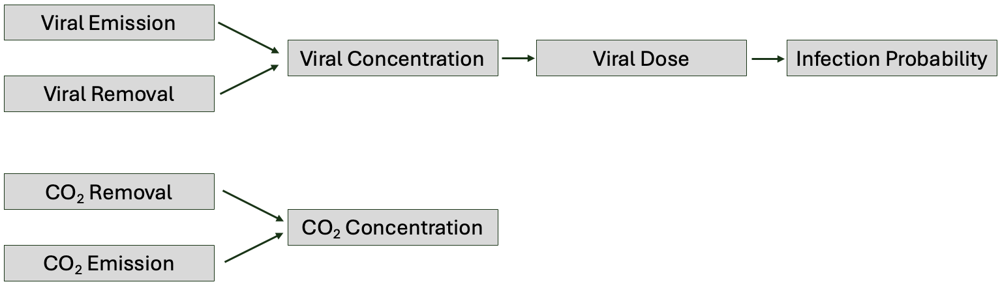

# Physics of Viral Transmission
The CAiMIRA model simulates the physical process of viral transmission through five sequential stages, illustrated by the topmost part of Figure 1: **emission**, **removal**, **concentration**, **dose**, and **infection probability**.
Along with viral transmission, CAiMIRA also simulates **emission**, **removal**, and **concentration** of CO2, as shown in the lowermost part of Figure 1.
This page details the modelling of viral transmission. The modelling of CO2 concentration is detailed on **[Computation of the CO2 Concentration](./co2_concentration.md)**.

*Figure 1: Structure of the CAiMIRA model showing the viral transmission and CO2 simulation processes.*

In the following, `data_registry` refers to `caimira.calculator.store.data_registry`, `models` refers to `caimira.calculator.models.models.py`, and `monte_carlo` refers to `caimira.calculator.models.monte_carlo`.

## Model Parameters
We can divide the parameters of the CAiMIRA model into four categories:
1. Constant deterministic values
2. Random variables with constant probability distributions
3. Adjustable deterministic values
4. Random variables with adjustable probability distributions

The two first categories of parameters are "constant" in the sense that they are not adjusted for each specific scenario by the user. The latter two categories are, on the other hand, influenced by user input. Constant deterministic values are retrieved from `data_registry` or hardcoded into the model in `models`. Adjustable deterministic variables, like the room volume, are direcly specified by the user.

Random variables are Monte Carlo sampled from probability distributions and stored as _VectorisedFloat or _VectorisedInt. Every random variable is sampled from fixed type of probability distribution defined in `data_registry`. The table below lists all random variables in CAiMIRA together with the type of probability distribution they are sampled from and, if the probability distribution is adjustable, which user parameters influence the parameters of the probability distribution.

| Random Variable | Symbol | Probability Distribution| Dependent User Parameters |
|-------------|--------|-------|-------|
| Particle diameter | $D$ | Log-normal mixture | Expirational activity of the infected, long-range or short-range interaction1 |
| Interpersonal distance | $x$ | Log-normal | None2 |
| Viral load inside the infected | $\mathrm{vl_{inf}}$ | Gaussian Kernel density estimation from dataset | None3,4 |
| Viable to RNA ratio | $\mathrm{r_{inf}}$ | Uniform | None3,4 |
| Infectious Dose | $\mathrm{ID}_{50}$ | Uniform | None3 |
| Exhalation rate (infected) | $\mathrm{BR_{k,out}}$ | log-normal distribution | Physical activity of the infected | 
| Inhalation rate (exposed) | $\mathrm{BR_{k,in}}$ | log-normal distribution | Physical activity of the exposed |
| Outwards face mask efficiency (infected's face mask) | $\eta_{\mathrm{out}}$ | Uniform5 | Type of face mask |
| Inwards face mask efficiency (exposed's face mask) | $\eta_{\mathrm{in}}$ | Uniform | Type of face mask |

1The probability distribution of $D$ is truncated using limits that differ between long-range and short-range interactions. The truncation limits are determined solely by the interaction type (long-range or short-range) and not on the exact interpersonal distance.

2The interpersonal distance is only a parameter in CAiMIRA when including short-range interactions.

3Theorietically, the parameters for these probability distribtuions may depend on the virus variant. However, every (COVID-19) virus variants currently implemented is assumed to yield the same viral load, viable to RNA ratio, and infectious dose.

4In the future, the product of the viral load and viable to RNA ratio will be replaced by a function sampling values for the viable viral load. By accounting for symptomatic stage of the infected, the new function will reduce the variability of the samples.

5The outwards face mask efficiency may is sampled from a uniform distribution, as indicated above, if the face mask is 'Cloth'. For the two other face mask options ('FFP2' and 'Type I') $\eta_{\mathrm{out}}$ is a function of the particle diameter and not a separate random variable.

See `data_registry` for literature supporting the parameters.

The viral **emission rate** – $\mathrm{vR}(D)$, **removal rate** – $\lambda_\mathrm{vRR}(D)$, **viral concentration** – $C(t, D)$, and **dose** $\mathrm{vD(D)}$ are considered for a given aerosol diameter $D$, as the behavior of the virus-laden particles in the room environment and inside the respiratory tract are diameter-dependent. To obtain the total total dose exposure $\mathrm{vD^{total}}$ we need sum together the contributions from all particles of all sizes, i.e. integrate over all particle diameters. Because the particle diameter is a random variable, the integral over $D$ can be approximated by Monte Carlo integration. The remaining random variables are Monte Carlo averaged to approximate the expected values of the results. The excact procedures for Monte Carlo integration and approximation of expected values by Monte Carlo sampling is presented further down this page, under "Computation of Expected Results". Before that, the mathematical derivation and implementation of the emission rate, removal rate, viral concentration, and dose will be detailed.

## Emission 
### Derivation of the Analytical Emission Rate
Infectious individuals inside the room are assumed to be the only source of virus. Their emission rate per unit diameter of infectious virus is

$$
\begin{equation*}
\mathrm{vR}(D)= {\mathrm{BR}}_{\mathrm{k}} \cdot \mathrm{vl_{inf}} \cdot f_{\mathrm{inf}} \cdot E_c(D)
\end{equation*}
$$

given the breathing rate ${\mathrm{BR}}_{\mathrm{k}}$ for a constant physical activity $k \in \{\mathrm{Seated}, \mathrm{Standing}, \mathrm{Light},$ $\mathrm{Moderate}, \mathrm{Heavy}\}$. $vl_{\mathrm{in}}$ is the viral load in the respiratory tract (in RNA copies per mL) and $f_{inf}$ is the fraction of infectious virus. 
$E_c(D)$ represents the volumetric particle emission concentration per unit diameter (in mL/(m3 .µm)) given by

$$
E_{c}(D) =
\begin{cases} 
(1 − η_\mathrm{out}) \cdot V_p(D) \cdot N_p(D)  \hspace{9.5mm} \mathrm{if} \quad η_\mathrm{out} \sim \mathrm{Uniform}\\
(1 − η_\mathrm{out}(D)) \cdot  V_p(D) \cdot N_p(D)  \quad  \mathrm{else}
\end{cases}
$$

where $\eta_{out}$ is the outward mask efficiency and $V_p(D)$ is the particles' individual volume. For an expiratory activity $j \subseteq \{\mathrm{Breathing}, \mathrm{Speaking}, \mathrm{Singing}, \mathrm{Shouting}\}$, the number of particles with diameter $D$ is given by 

$$
\begin{equation*}
N_{p}(D)=\sum_{\forall j} \sum_{i \in \{\mathrm{B},\mathrm{L},\mathrm{O}\}} a_j \cdot f_{\mathrm{amp}, j, i} \cdot c_{n,i} \cdot \left[\frac{1}{D\sqrt{2 \pi} \sigma_{D_i}} \exp{-\frac{(\ln D -\mu_{D_i})^2}{2 (\sigma_{D_i})^2}}\right]
\end{equation*}
$$

for B = bronchial, L = larynx, O = oral being the sources of the emitted particles. $a_j$ is the fraction of time the infected performes each expiratory activity $j$.
$c_{n,i}$ is the particle emission concentration, and $\mu_{D_i}$ and $\sigma_{D_i}$ are the mean and standard deviations, respectively, of the log-normal distribution found to fit the number of expired particles with diameter $D$, for $i \in \{\mathrm{B},\mathrm{L},\mathrm{O}\}$ Johnson et al. [2](#id8). 
$f_{\mathrm{amp}, j, i}$ is the amplitude of the vocalization, set to 5 for $i \in \{L,O\}$ if $j = \{\text{Singing}, \text{Shouting}\}$ and otherwise 1. Note, however, that for $i \in \{L,O\}$ and $j = \text{Breathing}$ $f_{\mathrm{amp}, j, i}$ is set to zero in `data_registry`, although it is technically the particle emission concentration $c_{n,i}$ that is zero in that case. This technicallity has no effect on the output, it only simplifies the implementation of $c_{n,i}$.

Note that the diameter-dependence is kept at this stage. Since other parameters downstream in code are also diameter-dependent, the Monte-Carlo integration over the particle diameter is computed at the level of the dose $\mathrm{vD^{total}}$.
In case one would like to have intermediate results for emission rate, however, one may compute

$$
\begin{equation*}
\mathrm{vR}^{total} = \int_{D_{\mathrm{min}}}^{D_{\mathrm{max}}} {\mathrm{BR}}_{\mathrm{k}} \cdot \mathrm{vl_{inf}} \cdot f_{\mathrm{inf}} \cdot E_c(D) \;\ \mathrm{d}D = {\mathrm{BR}}_{\mathrm{k}} \cdot \mathrm{vl_{inf}} \cdot f_{\mathrm{inf}} \cdot E_{c}^{\mathrm{total}}
\end{equation*}
$$

for 

$$
\begin{equation*}
E_{c}^{\mathrm{total}} = \int_{D_{\mathrm{min}}}^{D_{\mathrm{max}}} E_c(D) \;\ \mathrm{d}D 
\end{equation*}
$$

using Monte Carlo integration.

### Probability Distribution of $D$
A detailed description of the Monte Carlo procedures in CAiMIRA is given under "Computation of Expected Results" further down this page. To motivate the implementation of all diameter dependent quantities, however, we need to identify the probability distribution of $D$ as the number of particles $N_p(D)$ normalized by

$$
\begin{equation*}
c_n=\int_{D_{\mathrm{min}}}^{D_{\mathrm{max}}} N_p(D) \;\ \mathrm{d}D 
\end{equation*}
$$

truncated between $D_{\mathrm{min}}$ and $D_{\mathrm{max}}$. In other words, probability distribution of $D$ is the log-normal mixture distribution

$$
\begin{equation*}
\mathrm{p}_D(D)=\frac{N_p(D)}{c_n}=\sum_{i \in I(j)} \frac{c_{n,i}}{c_n}\left[\frac{1}{D\sqrt{2 \pi} \sigma_{D_i}} \exp{-\frac{(\ln D -\mu_{D_i})^2}{2 (\sigma_{D_i})^2}}\right]
\end{equation*}
$$

truncated between $D_{\mathrm{min}}$ and $D_{\mathrm{min}}$. Using $N_p(D) = c_n \cdot \mathrm{p}_D(D)$, we see that

$$
E_{c}(D) =
\begin{cases} 
(1 − η_\mathrm{out}) \cdot V_p(D) \cdot c_n \cdot \mathrm{p}_D(D)  \hspace{9.5mm} \mathrm{if} \quad η_\mathrm{out} \sim \mathrm{Uniform}\\
(1 − η_\mathrm{out}(D)) \cdot  V_p(D) \cdot c_n \cdot \mathrm{p}_D(D)  \quad  \mathrm{else}.
\end{cases}
$$

Therefore, the Monte Carlo integral is computed as

$$
\begin{align*}
E_{c}^{\mathrm{total}} 
= \int_{D_{\mathrm{min}}}^{D_{\mathrm{max}}} E_{c}(D) \;\ \mathrm{d}D 
= \int_{D_{\mathrm{min}}}^{D_{\mathrm{max}}} (1 − η_\mathrm{out}(D)) \cdot  V_p(D) \cdot c_n \cdot \mathrm{p}_D(D) \;\ \mathrm{d}D 
\approx \frac{1}{S_D}\sum_{i=1}^{S_D} (1 − η_\mathrm{out}(D_i)) \cdot  V_p(D_i) \cdot c_n.
\end{align*}
$$

Where $S_D$ is the total number of Monte Carlo samples of $D$. The samples {$D_1$, $D_2$, ...,$D_{S_D}$} are stored in `models.Expiration` objects created by `monte_carlo.data.expiration_distribution()`, with $\mathrm{p}_D(D)$ being implemented in `monte_carlo.data.BLOModel`.

Similarly, when we later Monte Carlo integrate the viral concentration $C(t,D)$ and dose $\mathrm{vD(D)}$ over $D$, we identify $\mathrm{p}_D(D)$ a linear component of $C(t,D)$ and $\mathrm{vD(D)}$ to compute 
$$
\begin{align*}
C^{\mathrm{total}}(t)
= \int_{D_{\mathrm{min}}}^{D_{\mathrm{max}}} C(t,D) \;\ \mathrm{d}D 
\approx \frac{1}{S}\sum_{i=1}^S \frac{C(t,D)}{\mathrm{p}_D(D)}.
\end{align*}
$$

and

$$
\begin{align*}
\mathrm{vD}^{\mathrm{total}}
= \int_{D_{\mathrm{min}}}^{D_{\mathrm{max}}} \mathrm{vD(D)} \;\ \mathrm{d}D 
\approx \frac{1}{S}\sum_{i=1}^S \frac{\mathrm{vD(D)}}{\mathrm{p}_D(D)},
\end{align*}
$$
respectively. 

### Computation of the Emission Rate
The computation of the emission rate $\mathrm{vR}(D)$ in CAiMIRA can be divided into three steps:

* Calculate the diameter-**independent** component of $\mathrm{vR}(D)$, i.e. ${\mathrm{BR}}_{\mathrm{k}} \cdot \mathrm{vl_{inf}} \cdot f_{\mathrm{inf}}$, in `models.InfectedPopulation.emission_rate_per_aerosol_per_person_when_present()`. 
* Draw S samples {$D_1$, $D_2$, ...,$D_S$} from $\mathrm{p}_D(D)$  (default S = 250 000 samples) when creating an **Expiration** object by calling the function `monte_carlo.data.expiration_distribution()`.
* Compute the diameter-**dependent** $(1 − η_\mathrm{out}(D_i)) \cdot  V_p(D_i) \cdot c_n$ for every $D_i \in ${$D_1$, $D_2$, ...,$D_S$} in `models.InfectedPopulation.aerosols()`.

The emission rate (per person infected) $\mathrm{vR(D)}$ can be computed by: `models._PopulationWithVirus.emission_rate_per_person_when_present()`, outputting a vector $[\mathrm{vR(D_1)}, \mathrm{vR(D_2)}, ..., \mathrm{vR(D_S)}]$ who's average is $\mathrm{vR}^{total}$.

By default, however, the diameter-dependence is kept at this stage because more diameter-dependent variables will be introduced downstream in the model before Monte-Carlo integrating over the aerosol sizes to obtain the dose $\mathrm{vD^{total}}$.

The methods for computing the components of the emission rate can be accessed through the class **InfectedPopulation**, representing a population of infected with a certain number of people, all with the same expirational activity, physical activity, virus, face mask, immunity and (incremental) presence. **InfectedPopulation** is initialized an **Expiration** object, an **Activity** object, a **Virus** object, a **Mask** object, a float host_immunity, and an **Interval** object corresponding to those properties. Furthermore, **InfectedPopulation** is initialized with by **DataRegistry** and the integer number of people in the infected population.

The **Expiration** object (`models.Expiration`) represents the expiration of aerosols by an infected person. **Expiration** is initialized by an $S_D$-dimentional array (or a single float if $S_D=1$) of the samples {$D_1$, $D_2$, ...,$D_{S_D}$} drawn from $\mathrm{p}_D(D)$. The samples are generated by **CustomKernel** (`monte_carlo.sampleable.CustomKernel`). The **CustomKernel** is built for the distribution $\mathrm{p}_D(D)$ defined by the `distribution()` method of **BLOModel** (`monte_carlo.data.BLOmodel`). The **BLOModel** is initialized by a set of BLO_factors corresponding to the type of expirational activity performed. **Expiration** also stores the scaling factor $c_n$ computed by `monte_carlo.data.BLOmodel.integrate()`.

In `Expiration.particle`, the class **Particle** (representing virus-laden aerosols) is initialized with the array of diameters stored in **Expiration**. **Particle** contains methods for computing the diameter-dependent deposition factor and settling velocity of aerosols, which will be used downstream in the model.

## Removal
The viral **viral removal rate** is given by

$$
\begin{equation*}
\lambda_{\mathrm{vRR}}(t,D) = \lambda_{\mathrm{ACH}}(t)+\lambda_{\mathrm{bio}}+\lambda_{\mathrm{dep}}(D)
\end{equation*}
$$

where $\lambda_{\mathrm{ACH}}(t)$ is the air exchange per hour, $\lambda_{\mathrm{bio}}$ is the biological decay, and 

$$
\begin{equation*}
\lambda_{\mathrm{dep}}(D) = \frac{1.88 \cdot 10^{-4} \cdot 3600 \cdot f_{ev}^2}{2.5^2 \cdot h_{inf}} \cdot D^2
\end{equation*}
$$

is the particle deposition (per hour) for evaporation factor $f_{ev}$ and the initial hight of the particle (mouth of emittor) $h_{inf}$. 

The diameter-dependent viral removal rate at a given time is calculated by `models.ConcentrationModel.removal_rate()`. The total removal rate over all particle diameters is currently not reported by CAiMIRA, but equals

$$
\begin{equation*}
\lambda_{\mathrm{vRR}}(t)^{\mathrm{total}}
= \int_{D_{\mathrm{min}}}^{D_{\mathrm{max}}} \lambda_{\mathrm{vRR}}(t,D) \;\ \mathrm{d}D 
= (\lambda_{\mathrm{ACH}}(t)+\lambda_{\mathrm{bio}}) \cdot (D_{\mathrm{max}} - D_{\mathrm{min}}) + \frac{1.88 \cdot 10^{-4} \cdot 3600 \cdot f_{ev}^2}{3 \cdot 2.5^2 \cdot h_{inf}} \cdot (D_{\mathrm{max}} - D_{\mathrm{min}})^3.
\end{equation*}
$$

Note that $\lambda_{\mathrm{vRR}}(t)^{\mathrm{total}}$ does not equal the average of the array returned by `models.ConcentrationModel.removal_rate()` because $\mathrm{p}_D(D)$ is not a component of $\lambda_{\mathrm{vRR}}(t,D)$. 

## Viral Concentration
The concentration of virus-laden particles in a given room is computed using a two-box exposure model:

* **Box 1 - Long-Range:** The viral concentration more than 2 m away from the infected host(s) assuming mass balance between the emission rate of the infected host(s) and the removal rates from the environmental/virological characteristics.
* **Box 2 - Short-Range:** The *exhaled jet* concentration in close-proximity, computed using a two-stage exhaled jet model where the susceptible host (exposed) is distanced 0.5-2 m from the infected host.

Because CAiMIRA is only meant to model airborne transmission, interactions where the susceptible and infected hosts are closer than 0.5 m apart are excluded. 

### Long-Range Compartment
#### Derivation of the Analytical Long-Range Concentration
Assuming mass balance, the rate of change of the viral concentration equals the difference between the total emission rate per volume and the total removal rate. 
The total emission rate per volume is simply the sum of the emission rate of every single infected divided by the room volume $V_r$, which can be expressed as $\frac{\sum_{n=1}^{n_p}\mathrm{vR}_n(D)\,N_{\mathrm{inf},n}}{V_r}$ for $n_p$ infected populations where the $n$-th population has $N_{\mathrm{inf},n}$ members with common emission rate $\mathrm{vR}_n(D)$. The removal is zero if the current viral concentration $C_{\mathrm{LR}}(t, D)$ equals the minimum background concentration $C_{\mathrm{min}}$. The removal rate is the product of the current viral removal rate $\lambda_{\mathrm{vRR}}(t,D)$ and viral concentration increase from the background concentration, i.e. the difference between the current viral concentration $C_{\mathrm{LR}}(t, D)$ and the minimum background concentration $C_{\mathrm{min}}$. Thereby, the removal is zero whenever $C_{\mathrm{LR}}(t, D)=C_{\mathrm{min}}$. In conclusion, the viral concentration is described by the ordinary differential equation (ODE)

$$
\begin{equation*}
\frac{\partial C_{\mathrm{LR}}(t, D)}{\partial t} = \frac{\sum_{n=1}^{n_p}\mathrm{vR}_n(D)\,N_{\mathrm{inf},n}}{V_r} - \lambda_{vRR}(t, D) \cdot (C_{\mathrm{LR}}(t, D)-C_{\mathrm{min}}).
\end{equation*}
$$

Assuming the viral concentration is the only time-dependent variable, this ODE can be solved analytically. The viral removal rate is, however, also time-dependent. We assume $\lambda_{vRR}(t, D)$ is stepwise constant and that we may divide the scenario a finite number of time intervals $[t_i, t_{i+1})$ where $\lambda_{vRR}(t, D)=\lambda_{vRR}(t_i, D)$ is constant. Then, we can solve
$$
\begin{equation*}
\frac{\partial C_{\mathrm{LR}}(t, D)}{\partial t} = \frac{\sum_{n=1}^{n_p}\mathrm{vR}_n(D)\,N_{\mathrm{inf},n}}{V_r} - \lambda_{vRR}(t_i, D) \cdot (C_{\mathrm{LR}}(t, D)-C_{\mathrm{min}})
\end{equation*}
$$

analytically for $t \in (t_i, t_{i+1}]$. The viral concentration at the end of the last time interval is carried forward as the initial condition for the solution for the next time interval. 

Solving the ODE

$C_{\mathrm{LR},h}(t, D)=A_1\cdot \exp{-\lambda_{vRR}(t_i,D)\cdot t}$ is the homogeneous solution satisfying 
$\frac{\partial C_{\mathrm{LR}}(t, D)}{\partial t} + \lambda_{vRR}(t_i,D)\cdot\,C_{\mathrm{LR}}(t, D) = 0$.
Assuming $A_2$ is the constant particular solution the general solution is

$$
\begin{equation*}
C_{\mathrm{LR}}(t, D) = A_2 + A_1\cdot C_{\mathrm{LR},h}(t, D) = A_2 + A_1\cdot \exp{-\lambda_{vRR}(t_i,D)\cdot t}
\end{equation*}
$$

with derivative

$$
\begin{equation*}
\frac{\partial C_{\mathrm{LR}}(t, D)}{\partial t} = -A_1\cdot \lambda_{vRR}(t_i,D) \cdot \exp{-\lambda_{vRR}(t_i,D)\cdot t}.
\end{equation*}
$$

Combining the two equations containing $\frac{\partial C_{\mathrm{LR}}(t, D)}{\partial t}$ we get

$$
\begin{equation*}
C_{\mathrm{LR}}(t, D) = C_{\mathrm{min}}+\frac{\sum_{n=1}^{n_p}\mathrm{vR}_n(D)\,N_{\mathrm{inf},n}}{\lambda_{vRR}(t_i,D)\,V_r}+ A_1\cdot \exp{-\lambda_{vRR}(t_i,D)\cdot t},
\end{equation*}
$$

which combined with the general solution yields

$$
\begin{equation*}
A_2 = C_{\mathrm{min}}+\frac{\sum_{n=1}^{n_p}\mathrm{vR}_n(D)\,N_{\mathrm{inf},n}}{\lambda_{vRR}(t_i,D)\,V_r}.
\end{equation*}
$$

At the end of the last time interval (at $t=t_i$) the general solution yields
$C_{\mathrm{LR}}(t_i, D) = A_2 + A_1\cdot \exp{-\lambda_{vRR}(t_i,D)\cdot t_i}$.
Hence, 

$$
\begin{equation*}
A_1 = \left(C_{\mathrm{LR}}(t_i, D) -\Big(C_{\mathrm{min}}+\frac{\sum_{n=1}^{n_p}\mathrm{vR}_n(D)\,N_{\mathrm{inf},n}}{\lambda_{vRR}(t_i,D)\,V_r}\Big)\right) \cdot \exp{\lambda_{vRR}(t_i,D)\cdot t_i}.
\end{equation*}
$$

In summary, the analytical solution of the ODE describing the long-range viral concentration for $t \in (t_i, t_{i+1}]$ is

$$
\begin{align*}
C_{\mathrm{LR}}(t, D) 
&= C_{\mathrm{min}}+\frac{\sum_{n=1}^{n_p}\mathrm{vR}_n(D)\,N_{\mathrm{inf},n}}{\lambda_{vRR}(t_i,D)\,V_r}
+ \left(C_{\mathrm{LR}}(t_i, D) -\Big(C_{\mathrm{min}}+\frac{\sum_{n=1}^{n_p}\mathrm{vR}_n(D)\,N_{\mathrm{inf},n}}{\lambda_{vRR}(t_i,D)\,V_r}\Big)\right) \cdot \exp{-\lambda_{vRR}(t_i,D)\cdot (t-t_i)}\\
&= C_{\mathrm{min}}+(C_{\mathrm{LR}}(t_i, D)-C_{\mathrm{min}}) \cdot \exp{-\lambda_{vRR}(t_i,D)\cdot (t-t_i)}
+\sum_{n=1}^{n_p}\frac{\mathrm{vR}_n(D)\,N_{\mathrm{inf},n}}{\lambda_{vRR}(t_i,D)\,V_r}(1-\exp{-\lambda_{vRR}(t_i,D)\cdot (t-t_i)}).
\end{align*}
$$

Note that if only the $n$-th (emitting) population is present, the concentration *increase* from $C_{\mathrm{min}}$ at long-range would be

$$
\begin{align*}
C_{\mathrm{LR},n}(t, D) 
&= (C_{\mathrm{LR}}(t_i, D)-C_{\mathrm{min}}) \cdot \exp{-\lambda_{vRR}(t_i,D)\cdot (t-t_i)}
+ \frac{\mathrm{vR}_n(D)\,N_{\mathrm{inf},n}}{\lambda_{vRR}(t_i,D)\,V_r} (1-\exp{-\lambda_{vRR}(t_i,D)\cdot (t-t_i)}).
\end{align*}
$$

We assume that the concentration starts at $C_{\mathrm{min}}$, i.e. $C_{\mathrm{LR}}(t_0, D) = C_{\mathrm{min}}$. 
It follows by induction that
$$
\begin{align*}
C_{\mathrm{LR}}(t, D) 
&= C_{\mathrm{min}}+\sum_{n=1}^{n_p}C_{\mathrm{LR},n}(t, D)
\end{align*}
$$
holds at all times (for $t \in (t_i, t_{i+1}]$ for all $i$).

To speed up the computations, we take advantage of $\mathrm{vR}_n(D)$ being a linear component of $C_{\mathrm{LR},n}(t, D)$ so that $\frac{C_{\mathrm{LR},n}(t, D)}{\mathrm{vR}_n(D)}$ and $\mathrm{vR}_n(D)$ can be computed separatelatey. 

Proof that $\mathrm{vR}_n(D)$ is a linear component of $C_{\mathrm{LR},n}(t, D)$.

Note that

$$
\begin{align*}
C_{\mathrm{LR},n}(t_{i+1}, D) 
&= (C_{\mathrm{LR}}(t_i, D)-C_{\mathrm{min}}) \cdot \exp{-\lambda_{vRR}(t_i,D)\cdot (t_{i+1}-t_i)}
+ \frac{\mathrm{vR}_n(D)\,N_{\mathrm{inf},n}}{\lambda_{vRR}(t_i,D)\,V_r} (1-\exp{-\lambda_{vRR}(t_i,D)\cdot (t_{i+1}-t_i)}).
\end{align*}
$$

is a difference equation. Using standard techniques, we find the solution to be

$$
\begin{equation*}
C_{\mathrm{LR},n}(t_{i}, D)
=(C_{\mathrm{LR},n}(t_0, D) -C_{\mathrm{min}})
\cdot \exp{-\sum_{j=0}^{i-1}\lambda_{vRR}(t_j,D)\cdot (t_{j+1}-t_j)}
+\mathrm{vR}_n(D) \cdot \sum_{m=0}^{i-1}\frac{N_{\mathrm{inf},n}}{\lambda_{vRR}(t_m,D)\,V_r}
\cdot (1- \exp{-\lambda_{vRR}(t_m,D)\cdot (t_{m+1}-t_m)}) 
\cdot \exp{-\sum_{j=m+1}^{i-1}\lambda_{vRR}(t_j,D)\cdot (t_{j+1}-t_j)}
\end{equation*}
$$

Because we assume the initial concentration $C_{\mathrm{LR}}(t_0, D)=C_{\mathrm{min}}$ the solution simplifies to

$$
\begin{equation*}
C_{\mathrm{LR},n}(t_{i}, D)
=\mathrm{vR}_n(D) \cdot \sum_{m=0}^{i-1}\frac{N_{\mathrm{inf},n}}{\lambda_{vRR}(t_m,D)\,V_r}
\cdot (1- \exp{-\lambda_{vRR}(t_m,D)\cdot (t_{m+1}-t_m)}) 
\cdot \exp{-\sum_{j=m+1}^{i-1}\lambda_{vRR}(t_j,D)\cdot (t_{j+1}-t_j)}
\end{equation*}
$$

where $\mathrm{vR}_n(D)$ clearly is a linear component. Note that the solution for $C_{\mathrm{LR},n}(t_{i}, D)$ can be inserted into the solution of $C_{\mathrm{LR}}(t, D)$ above, 
and so the long-range concentration can be computed without recurrently computing $C_{\mathrm{LR}}(t_i, D)$ every time the viral removal rate changes. 
Computing $C_{\mathrm{LR},n}(t_{i}, D)$ by the non-recurrent analytical expression above is, however, also computationally expensive. 
In fact, experiments indicate computing $C_{\mathrm{LR}}(t_i, D)$ recurrently is the more efficient solution. 

#### Computation of the Long-Range Concentration
The arcitecture for computing the long-range viral concentraiton is based on the relation 
$C_{\mathrm{LR}}(t, D) = C_{\mathrm{min}}+\sum_{n=1}^{n_p} C_{\mathrm{LR},n}(t, D)$,
derived above, showing that the total long-range viral concentration is the sum of minimum background concentration and the individual concentration contributions from all infected populations. 

First, CAiMIRA initializes one **InfectedPopulation** for each group of infected with different physical activity, expirational activity, face mask, immunity, or presence. Each group may have a different emission rate, number of occupants, and samples of the particle diameter from differenty parameterized probability distributions. Note that this setup allows infected to abruptly change their properties by defining multiple **InfectedPopulation** instances with non-overlapping presence. For example, a single infected who is speaking from 10 am to 11 am and only breathing after 11 am is described by a the speaking InfectedPopulation_A present from 10 am to 11 am and a breathing InfectedPopulation_B present after 11 am.

Using all the **InfectedPopulation** instances, we initialize a single **TotalViralConcentrationModel** (`models.TotalViralConcentrationModel`). **TotalViralConcentrationModel** is a child class of the abstract `models._TotalConcentrationModelBase` computing the long-range concentration for any type of aerosol. `models.TotalViralConcentrationModel.concentration_models()` instantiates one **ConcentrationModel** (`models.ConcentrationModel`) for each **InfectedPopulation** in **TotalViralConcentrationModel**. Each of these **ConcentrationModel** instances computes the long-range viral concentration, as if the only source of virions was its own **InfectedPopulation**, in `models.ConcentrationModel.concentration_increase`. That is, the $n$-th **ConcentrationModel** computes $C_{\mathrm{LR},n}(t, D)$. Thereafter, the total viral concentration 

$$
\begin{align*}
C_{\mathrm{LR}}^{\mathrm{total}}(t)
&= \int_{D_{\mathrm{min}}}^{D_{\mathrm{max}}} C_{\mathrm{min}}+\sum_{n=1}^{n_p}C_{\mathrm{LR},n}(t, D) \;\ \mathrm{d}D \\
&= C_{\mathrm{min}}\cdot(D_{\mathrm{max}}-D_{\mathrm{min}})+\sum_{n=1}^{n_p}C_{\mathrm{LR},n}^{\mathrm{total}}(t)
\end{align*}
$$

is computed in `models.TotalViralConcentrationModel.long_range_concentration()`. Because $C_{\mathrm{min}}$ is only included by **TotalViralConcentrationModel**, and not in **ConcentrationModel**, one should always retrieve the final concentration from **TotalViralConcentration** even when $n=1$. Moving on, $C_{\mathrm{LR},n}^{\mathrm{total}}(t)$ is computed by Monte Carlo integrating over the particle diameter:

$$
\begin{equation*}
C_{\mathrm{LR},n}^{\mathrm{total}}(t) 
= \int_{D_{\mathrm{min}}}^{D_{\mathrm{max}}} \frac{C_{\mathrm{LR},n}(t, D)}{\mathrm{p}_{D,n}(D)} \cdot \mathrm{p}_{D,n}(D)\;\ \mathrm{d}D 
\approx  \sum_{i=1}^{S_D}\frac{C_{\mathrm{LR},n}(t, D_i)}{\mathrm{p}_{D,n}(D_i)}.
\end{equation*}
$$

Note that the particle diameter distribution $\mathrm{p}_{D,n}(D)$, which is factored out of $C_{\mathrm{LR},n}(t,D)$, may have different parameter values for different infected populations (indexed by $n$). Consequently, samples of the particle diameter drawn from different populations are generally not identically distributed. Therefore, we Monte Carlo integrate each $C_{\mathrm{LR},n}(t,D)$ separately. Indeed, this is one of the major rationales for computing $C_{\mathrm{LR},n}(t,D)$ by separate **ConcentrationModel** instances.

Because $C_{\mathrm{LR},n}(t,D)$ includes several Monte Carlo sampled random variables beyond the particle diameter $D$, we separateing the computations of $C_{\mathrm{LR},n}(t,D)$ into

* a diameter-dependent normalized concentration $\frac{C_{\mathrm{LR},n}(t, D)}{\mathrm{vR}_n(D)}$ 
* a normalization factor $\frac{\mathrm{vR}_n(D)}{\mathrm{p}_{D,n}(D)}$

will speed up the computations. The diameter-dependent $\frac{C_{\mathrm{LR},n}(t, D)}{\mathrm{vR}_n(D)}$ is implemented in `models._ConcentrationModelBase._normed_concentration()` and does not include any other random variables than $D$. The normalization factor, implemented in `models.ConcentrationModel.normalization_factor()`, has a diameter-dependent component $\frac{E(D)}{\mathrm{p}_{D,n}(D)}$ implemented by `models._PopulationWithVirus.aerosols()` and a diameter-independent component $\mathrm{BR}_{\mathrm{k,in}} \cdot \mathrm{vl_{inf}} \cdot \mathrm{r_{inf}} \cdot (1-\mathrm{HI}_\mathrm{inf})$ implemented in `models._PopulationWithVirus.emission_rate_per_aerosol_per_person_when_present()`. 
To compute the final result, we Monte Carlo integrate the diameter-dependent component
$\frac{C_{\mathrm{LR},n}(t, D)}{\mathrm{vR}_n(D)} \cdot \frac{E(D)}{\mathrm{p}_{D,n}(D)}$
over the particle diameter and then multiply by the diameter independent component of the normalization factor. Recall that $\mathrm{BR}_{\mathrm{k,in}}$, $\mathrm{vl_{inf}}$, and $\mathrm{r_{inf}}$ are Monte Carlo sampled random variables, so we average the final product to approximate the expected long-range concentration.

For the calculator app report, the total concentration (MC integral over the diameter) is performed only when generating the plot.
Otherwise, the diameter-dependence continues until we compute the inhaled dose in the `models.ExposureModel` class.

### Short-Range Compartment
#### Derivation of the Analytical Short-Range Concentration
The viral concentration at short-range is the result of a two-stage exhaled jet model developed by Jia, W. et al. [1](#id6) and is expressed as:

$$
\begin{equation*}
C_{\mathrm{SR}}(t, D) 
= C_{\mathrm{LR}} (t, D) + \frac{1}{S({x})} \cdot (C_{0, \mathrm{SR}}(D) - C_{\mathrm{LR}}(t, D)),
\end{equation*}
$$

where $S(x) > 0$ is the dilution factor due to jet dynamics, as a function of the interpersonal distance $x$, and 

$$
\begin{equation*}
C_{0, \mathrm{SR}}(D) = \mathrm{vl_{inf}} \cdot f_{\mathrm{inf}} \cdot E_c(D)
\end{equation*}
$$

is the initial concentration of virions at the mouth/nose outlet during exhalation. Note that $C_{0, \mathrm{SR}}(D)$ is time-independent. In CAiMIRA, however, $C_{0, \mathrm{SR}}(D)$ is set to zero until (and including) the the start of the short-range interaction and after the end of the short-range interaction.

Face masks interupt the yet stream, so only infected without face masks may have short-range interactions. Hence, infected with face masks only contribute to increasing the overall long-range concentration of virions. 

We allow the physical and expirational activity of the infected and exposed to be different at short-range and long-range (in the current frontent, only the expirational activity may be different).
Also, because smaller particles remain airborn longer than bigger particles, we set $D_{\mathrm{max}}=20\mathrm{μm}$ at long-range and $D_{\mathrm{min}}=100\mathrm{μm}$ at short-range.
Concequently, $E_c(D)$ has a different $N_p$ for $C_{0, \mathrm{SR}}(D)$ than for $C_{\mathrm{LR}} (t, D)$, so the particle diameters sampled to compute $C_{0, \mathrm{SR}}(D)$ are drawn from a different probability distribution than the samples drawn to compute $C_{\mathrm{LR}} (t, D)$. 
Lets denote the different probability distributions at long-range and short-range $\mathrm{p}_{\mathrm{LR},D}(D)$ and $\mathrm{p}_{\mathrm{SR},D}(D)$.

Up untill (and including) CAiMIRA version 4.19.0, we interpolated the vector $\left[\frac{C_{\mathrm{LR}}(t, D_1)}{\mathrm{p}_{\mathrm{LR},D}(D_1)}, \frac{C_{\mathrm{LR}}(t, D_2)}{\mathrm{p}_{\mathrm{LR},D}(D_2)}, ..., \frac{C_{\mathrm{LR}}(t, D_{S_N})}{\mathrm{p}_{\mathrm{LR},D}(D_{S_N})}\right]$ 
to the short-range diameter basis sampled from $\mathrm{p}_{\mathrm{SR},D}(D)$. Thereafter, we Monte Carlo integrated

$$
\begin{align*}
C_{\mathrm{SR}}^{\mathrm{total}}(t) 
&= \int_{D_\mathrm{min}}^{D_\mathrm{max}} C_{\mathrm{SR}}(t, D) \;\ \mathrm{d}D \\
&= \int_{D_\mathrm{min}}^{D_\mathrm{max}} C_{\mathrm{LR}} (t, D) + \frac{1}{S({x})} \cdot (C_{0, \mathrm{SR}}(D) - C_{\mathrm{LR}}(t, D)) \;\ \mathrm{d}D \\
&\approx \int_{0}^{100\mathrm{μm}} \left(\frac{C_{\mathrm{LR}}(t, D)}{\mathrm{p}_{\mathrm{LR},D}(D)} + \frac{1}{S({x})} \left( \frac{C_{0, \mathrm{SR}}(D) }{\mathrm{p}_{\mathrm{SR},D}(D)} -\frac{C_{\mathrm{LR}}(t, D)}{\mathrm{p}_{\mathrm{LR},D}(D)}\right)\right) \mathrm{p}_{\mathrm{SR},D}(D) \;\ \mathrm{d}D \\
&\approx \sum_{i=1}^{S_D} \frac{C_{\mathrm{LR}}(t, D_i)}{\mathrm{p}_{\mathrm{LR},D}(D_i)} + \frac{1}{S({x})} \left( \frac{C_{0, \mathrm{SR}}(D_i) }{\mathrm{p}_{\mathrm{SR},D}(D_i)} -\frac{C_{\mathrm{LR}}(t, D_i)}{\mathrm{p}_{\mathrm{LR},D}(D_i)}\right) 
\end{align*}
$$

which is a good approximation if $\mathrm{p}_{\mathrm{LR},D}(D) \approx \mathrm{p}_{\mathrm{SR},D}(D)$ and $\mathrm{p}_{\mathrm{LR},D}(D_i) \approx 0$ for $D_i > 20\mathrm{μm}$.

From version 4.20 of CAiMIRA we skip the interpolation and aviod the first approximation completely by computing

$$
\begin{align*}
C_{\mathrm{SR}}^{\mathrm{total}}(t) 
&= \int_{D_\mathrm{min}}^{D_\mathrm{max}} C_{\mathrm{SR}}(t, D) \;\ \mathrm{d}D \\
&= \int_{D_\mathrm{min}}^{D_\mathrm{max}} C_{\mathrm{LR}}(t, D) + \frac{1}{S({x})} \left(C_{0, \mathrm{SR}}(D) - C_{\mathrm{LR}}(t, D) \right) \;\ \mathrm{d}D \\
&= \int_{0}^{20\mathrm{μm}} \frac{C_{\mathrm{LR}}(t, D)}{\mathrm{p}_{\mathrm{LR},D}(D)} \cdot \mathrm{p}_{\mathrm{LR},D}(D) \;\ \mathrm{d}D + \frac{1}{S({x})} \cdot \left(\int_{0}^{100\mathrm{μm}} \frac{C_{0, \mathrm{SR}}(D) }{\mathrm{p}_{\mathrm{SR},D}(D)} \cdot \mathrm{p}_{\mathrm{SR},D}(D) \;\ \mathrm{d}D- \int_{0}^{20\mathrm{μm}} \frac{C_{\mathrm{LR}}(t, D)}{\mathrm{p}_{\mathrm{LR},D}(D)} \cdot \mathrm{p}_{\mathrm{LR},D}(D) \;\ \mathrm{d}D \right) \\
&\approx \frac{1}{S_N}\sum_{i=1}^{S_N} \frac{C_{\mathrm{LR}}(t, D_i)}{\mathrm{p}_{\mathrm{LR},D}(D_i)} + \frac{1}{S({x})} \cdot \left(\frac{1}{S_N}\sum_{j=1}^{S_N} \frac{C_{0, \mathrm{SR}}(D_j)}{\mathrm{p}_{\mathrm{SR},D}(D_j)} - \frac{1}{S_N}\sum_{i=1}^{S_N} \frac{C_{\mathrm{LR}}(t, D_i)}{\mathrm{p}_{\mathrm{LR},D}(D_i)} \right).
\end{align*}
$$

So we never compute the entire diameter-dependent $C_{\mathrm{SR}}(t, D)$, but Monte Carlo integrate the components with different probability distributions seperately.
To ease addition of contributions from several, incremental short-range interactions, we define the short-range concentration difference

$$
\begin{align*}
C_{\mathrm{SR-LR}}^{\mathrm{total}}(t) 
&= C_{\mathrm{SR}}^{\mathrm{total}}(t) - C_{\mathrm{LR}}^{\mathrm{total}}(t) \\
&= \frac{1}{S({x})} \cdot \left(\int_{0}^{100\mathrm{μm}} \frac{C_{0, \mathrm{SR}}(D) }{\mathrm{p}_{\mathrm{SR},D}(D)} \cdot \mathrm{p}_{\mathrm{SR},D}(D) \;\ \mathrm{d}D- \int_{0}^{20\mathrm{μm}} \frac{C_{\mathrm{LR}}(t, D)}{\mathrm{p}_{\mathrm{LR},D}(D)} \cdot \mathrm{p}_{\mathrm{LR},D}(D) \;\ \mathrm{d}D \right) \\
&\approx \frac{1}{S({x})} \cdot \left(\frac{1}{S_N}\sum_{j=1}^{S_N} \frac{C_{0, \mathrm{SR}}(D_j)}{\mathrm{p}_{\mathrm{SR},D}(D_j)} - \frac{1}{S_N}\sum_{i=1}^{S_N} \frac{C_{\mathrm{LR}}(t, D_i)}{\mathrm{p}_{\mathrm{LR},D}(D_i)} \right)
\end{align*}
$$

For the sake of curiosity, note that that if $S({x}) < \infty$ and $C_{0, \mathrm{SR}}(D)$ is small enough (e.g. zero) then $C_{\mathrm{SR-LR}}^{\mathrm{total}}(t) < 0$, 
meaning the exhaled jet of a person with a low (or no) viable viral load and/or emission rate contains less virions than the background concentration. 
In the CAiMIRA model, only the short-range concentration from infectious are modeled, and it seems probable that every infected population has $C_{0, \mathrm{SR}}(D)$ large enough for $C_{\mathrm{SR-LR}}^{\mathrm{total}}(t) > 0$.

Finally, note that a short-range interaction is always considered to be between a single infected and a single exposed population. Therefore, there is no "dynamic occupancy" at short-range. The implementation of dynamic occupancy does, however, require special attention to defining excactly who the short-range interactions are between. This is the rational of having short-range interactions beeing a property of **InfectedPopulation**.

##### The Dilution Factor
This **dilution factor** is given by 
$$
S({x}) =
\begin{cases} 
\frac{2𝛽_{r,j}(x+x_{0})}{D_m} \hspace{2cm} 0 < x \leq x^*,\\
S({x^*})[1+\frac{𝛽_{r,p}(x-x^*)}{𝛽_{r,j}(x+x_{0})}]^3 \quad x > x^*,
\end{cases}
$$

where $x_{0}=\frac{D_m}{2𝛽_{\mathrm{r1}}}$ distance of the virtual origin of the puff-like stage (in $\mathrm{m}$) with $D_m$ being the diameter (in $\mathrm{m}$) of the mouth opening, assumed to be a perfect circle.
All the $𝛽$-parameters are streamwise and radial penetration coefficients set in `data_registry`.
The distance $x$ a random variable sampled from a log-normal distribution in `monte_carlo.data.short_range_distances()` and passed as `distance` to **ShortRangeModel** (`models.ShortRangeModel`). 
The transition point is defined as 

$$
\begin{equation*}
\mathrm{x^*}=𝛽_{\mathrm{x1}} \cdot \sqrt[4]{Q_{\mathrm{exh}} \cdot u_{0}} \cdot \sqrt{\mathrm{t^*} + t_{0}} - x_{0},
\end{equation*}
$$

where $Q_{\mathrm{exh}}= φ \mathrm{BR}_{\mathrm{k}}$ is the expired flow rate during the expiration period in $\mathrm{m^{3} s^{-1}}$. 
$φ$ is the (dimensionless) exhalation coefficient, given by the ratio between the total period of a breathing cycle and the duration of the exhalation alone. 
Assuming the duration of an inhalation and an exhalation are equal, and one starts immediately after the other, $φ=2$. 
$\mathrm{BR}_{\mathrm{k}}$ is the breathing rate determined by the infected's physical activity during the short-range interaction.
Next, $u_{0}=\frac{Q_{\mathrm{exh}}}{A_{m}}$ is the expired jet speed (in $\mathrm{m s^{-1}}$), with $A_{m}$ being the area of the mouth opening.
The time of the transition point $\mathrm{t^*}$ is defined as half a breathing cycle, corresponding to the end of the exhalation period when the jet is interrupted, and set in `data_registry`.
Finally, $t_{0} = \frac{\sqrt{\pi} \cdot D_m^3}{8𝛽_{\mathrm{r1}}^2𝛽_{\mathrm{x1}}^2Q_{exh}}$ is the time (in $\mathrm{s}$) corresponding to the distance of the virtual origin of the puff-like stage $x_{0}$.

#### Computation of the Short-Range Concentration
The short-range concentration and dose exposure from short-range interactions are modeled using one **ShortRangeModel** (`models.ShortRangeModel`) for each interaction. **ShortRangeModel** stores its own samples of the particle diameter in an **Expiration** object and computes the diameter-dependent component of $C_{0, \mathrm{SR}}(D)$ and the dilution factor $S(x)$. 
All the short-range interactions of an infected host are passed, upon initialization, as a tuple of **ShortRangeModel** instances to the correct **InfectedPopulation**. The diameter-independent component of the exhaled jet is implemented in `models._PopulationWithVirus.short_range_normalization_factor()`. 

Similarly to the computation of the long-range concentration in `models._ConcentrationModelBase`, we separate the computation of diameter-dependent random variables and diameter-independent random variables for computational efficiency. 
We compute
* the normalized, diameter-dependent component of the viral concentration at the outlet, i.e. $\frac{C_{0, \mathrm{SR}}(D)}{\mathrm{vl_{inf}} \cdot f_{\mathrm{inf}} \cdot \mathrm{p}_{\mathrm{SR},D}(D)}=\frac{E_c(D)}{\mathrm{p}_{\mathrm{SR},D}(D)}$, in `models.ShortRangeModel._normed_jet_origin_concentration()`. 
* the dilution factor $S(x)$ in `models.ShortRangeModel.dilution_factor()` 
* the normalization factor $\mathrm{vl_{inf}} \cdot f_{\mathrm{inf}}$ in `models._PopulationWithVirus.short_rage_normalization_factor()` .

The quotient of the two first methods is computed in `models.ShortRangeModel._normed_jet_origin_concentration()`, returning the array [$\frac{C_{0, \mathrm{SR}}(D_1)}{S(x_1)}$, $\frac{C_{0, \mathrm{SR}}(D_2)}{S(x_2)}$, ..., $\frac{C_{0, \mathrm{SR}}(D_{S_N})}{S(x_{S_N})}$] where [$D_1$, $D_2$, ..., $D_{S_N}$] are the Monte Carlo samples of the particle diameter from $\mathrm{p}_{\mathrm{SR},D}(D)$ and [$x_1$, $x_2$, ..., $x_{S_N}$] are the Monte Carlo samples of the interpersonal distance. For consistency, the (entrained) long-range concentration is also divided by the dilution factor while still diameter-dependent, before Monte Carlo integrating over the diameter, in `models.TotalViralConcentrationModel.diluted_long_range_concentration()`. The total short-range concentration, Monte Carlo integrated over the particle diameter, is computed in `models.TotalViralConcentrationModel.concentration()`.

### Total Viral Concentration
Different populations of susceptible hosts may be exposed to different viral concentrations depending on their present times and short-range interactions. The total viral concentration a given population of susceptible hosts is exposed to at at time $t$ is given by

$$
\begin{equation*}
C^{\mathrm{total}}(t) = \mathbf{1}_{t \in T}(t) \cdot C_{\mathrm{LR}}^{\mathrm{total}}(t) + \sum_{j=1}^{n_\mathrm{SR}}\mathbf{1}_{t \in T_{\mathrm{SR},j}}(t) \cdot C_{\mathrm{SR-LR},j}^{\mathrm{total}}(t)
\end{equation*}
$$

where $n_\mathrm{SR}$ denotes the total number of short-range interactions the susceptible hosts are involved in during their entire presence. The indicator function

$$
\mathbf{1}_{t \in T}(t) =
\begin{cases}
1 & \text{if } t \in T, \\
0 & \text{else}
\end{cases}
$$

checks whether the susceptible host is present at time $t$, whith $T$ consisting of all the times where the susceptible host is present. Similarly, 

$$
\mathbf{1}_{t \in T_{\mathrm{SR},j}}(t) =
\begin{cases}
1 & \text{if } t \in T_{\mathrm{SR},j}, \\
0 & \text{else},
\end{cases}
$$

checks if $t$ falls within the time interval $T_{\mathrm{SR},j}$ when the $j$-th short-range interaction occurs. Currently, the duration of the short-range interactions $T_{\mathrm{SR},j}$ are assumed to be defines so that $T_{\mathrm{SR},j} \subseteq T$, i.e. only at times when the susceptible hosts are present. we assume the susceptible hosts are only exposed to one short-range interaction at a time (i.e. $\bigcap_{j=1}^{n_\mathrm{SR}}T_{\mathrm{SR},j} = \empty$), because we are not modelling interactions between different exhaled jets. This requirement is not jet made explisit in the backend model (TODO?).

$C^{\mathrm{total}}(t)$ - the viral concentration a specific population of susceptible hosts are exposed to - is computed by `models.TotalConcentrationModel.concentration()`. If there are multiple populations of susceptible hosts, the result for each population of susceptible hosts need is computed by separate **TotalConcentrationModel** instances.

## Dose
### Derivation of the Analytical Dose Exposure
The diameter-dependent viral dose deposited in the respiratory tract of an exposed, i.e. the number of viable virions that will contribute to a potential infection, is given by

$$
\begin{equation*}
\mathrm{vD}(D) = \int_{t_0}^{t_m}C(t, D)\;\ {d}t \cdot \mathrm{BR}_{\mathrm{k}} \cdot f_{\mathrm{dep}}(D) \cdot (1-\eta_{\mathrm{in}}),
\end{equation*}
$$

where $t_0$ is the first time exposed enters and $t_m$ is the last time they leave. $\mathrm{BR}_{\mathrm{k}}$ is the breathing rate of the exposed, $f_{\mathrm{dep}}(D)$ is the deposition factor in the respiratory tract, and $\eta_{\mathrm{in}}$ is the inwards mask efficiency of the face mask worn by the exposed.
$C(t, D)$ is the viral concentration from the perspective of the exposed. 
When the exposed is inside the room and not engaged in a short-range interaction $C(t, D)=C_{\mathrm{LR}} (t, D)$, 
and when the exposed is enganging in their $j$-th short-range interaction $C(t, D)=C_{\mathrm{SR},j} (t, D)$. So 
(recall that we assume only one short-range interaction at a time)

$$
\begin{equation*}
C(t, D) = \mathbf{1}_{t \in T}(t) \cdot C_{\mathrm{LR}} (t, D) + \sum_{j=1}^{n_\mathrm{SR}}\mathbf{1}_{t \in T_{\mathrm{SR},j}}(t) \cdot \frac{1}{S({x})} \cdot (C_{0, \mathrm{SR},j}(D) - C_{\mathrm{LR}}(t, D))
\end{equation*}
$$

where the indicator functions and the time intervals $T$ and $T_{\mathrm{SR},j}$ follow the definitions from the previous sections. We have now introduced all diameter-dependent quantities, and all down-stream computations only depend on the total dose exposure

$$
\begin{equation*}
\mathrm{vD}^{\mathrm{total}} =\int_{\mathrm{D_{min}}}^{\mathrm{D_{max}}} \mathrm{vD}(D) \;\ \mathrm{d}D.
\end{equation*}
$$

Similarly to the computation of the total viral concentration, we account for having diferent diameter distributions at long-range and short-range when Monte Carlo integrating $C(t, D)$ over $D$ by separating the dose into a long-range and a short-range component as follows

$$
\begin{align*}
\mathrm{vD}^{\mathrm{total}} 
&=\int_{\mathrm{D_{min}}}^{\mathrm{D_{max}}} \int_{t_0}^{t_m}C(t, D)\;\ {d}t \cdot \mathrm{BR}_{\mathrm{k}} \cdot f_{\mathrm{dep}}(D) \cdot (1-\eta_{\mathrm{in}}) \;\ \mathrm{d}D \\
&=\int_{\mathrm{D_{min}}}^{\mathrm{D_{max}}} \int_{t_0}^{t_m}\mathbf{1}_{t \in T}(t) \cdot C_{\mathrm{LR}} (t, D) \;\ {d}t \cdot \mathrm{BR}_{\mathrm{k}} \cdot f_{\mathrm{dep}}(D) \cdot (1-\eta_{\mathrm{in}}) \;\ \mathrm{d}D \\
&\quad+\sum_{j=1}^{n_\mathrm{SR}}\int_{\mathrm{D_{min}}}^{\mathrm{D_{max}}} \int_{t_0}^{t_m}\mathbf{1}_{t \in T_{\mathrm{SR},j}}(t) \cdot \frac{1}{S({x})} \cdot (C_{0, \mathrm{SR},j}(D) - C_{\mathrm{LR}}(t, D)) \;\ {d}t \cdot \mathrm{BR}_{\mathrm{k}} \cdot f_{\mathrm{dep}}(D) \cdot (1-\eta_{\mathrm{in}}) \;\ \mathrm{d}D
\end{align*}
$$

Lets define

$$
\begin{equation*}
\mathrm{vD}_{\mathrm{LR}}(D) 
=\int_{t_0}^{t_m}\mathbf{1}_{t \in T}(t) \cdot C_{\mathrm{LR}} (t, D) \;\ {d}t \cdot \mathrm{BR}_{\mathrm{k}} \cdot f_{\mathrm{dep}}(D) \cdot (1-\eta_{\mathrm{in}}) 
\end{equation*}
$$

$$
\begin{equation*}
\mathrm{vD}_{\mathrm{SR-LR},j}(D)=\int_{t_0}^{t_m}\mathbf{1}_{t \in T_{\mathrm{SR},j}}(t) \cdot \frac{1}{S({x})} \cdot (C_{0, \mathrm{SR},j}(D) - C_{\mathrm{LR}}(t, D)) \;\ {d}t \cdot \mathrm{BR}_{\mathrm{k}} \cdot f_{\mathrm{dep}}(D) \cdot (1-\eta_{\mathrm{in}})
\end{equation*}
$$

so that

$$
\begin{equation*}
\mathrm{vD}^{\mathrm{total}} = \int_{\mathrm{D_{min}}}^{\mathrm{D_{max}}}\mathrm{vD}_{\mathrm{LR}}(D)\;\ \mathrm{d}D + \sum_{j=1}^{n_\mathrm{SR}}\int_{\mathrm{D_{min}}}^{\mathrm{D_{max}}}\mathrm{vD}_{\mathrm{SR-LR},j}(D)\;\ \mathrm{d}D
\end{equation*}
$$

This separation also makes it easier to compare the importance of long-range vs short-range interactions for viral transmission. While the integral over the particle diameter $D$ is approximated by Monte Carlo integration, the integral over time $t$ is solved analytically.

#### Long-Range Dose Component
The viral concentration is analytically integrated over the time $t$. Recall that the analytical solution we found for $C_{\mathrm{LR}}(t, D)$ is only valid within time intervals $[t_i, t_{i+1}]$ where the viral removal rate is constant. We compute

$$
\begin{align*}
\int_{t_0}^{t_m} C_{\mathrm{LR}}(t, D) \mathrm{d}t
&=  \sum_{i=1}^m \Big[\int_{t_i}^{t_{i+1}} C_{\mathrm{LR}}(t, D) \;\ \mathrm{d}t \Big]\\
&=  \sum_{i=1}^m \Big[\int_{t_i}^{t_{i+1}} \Big(C_{\mathrm{min}}+\sum_{n=1}^{n_p}C_{\mathrm{LR},n}(t, D) \Big) \;\ \mathrm{d}t \Big]\\
&= \sum_{i=1}^m \Big[C_{\mathrm{min}}\cdot(t_{i+1}-t_i)+
(C_{\mathrm{LR}}(t_i, D)-C_{\mathrm{min}}) \cdot \frac{\exp{-\lambda_{vRR}(t_i,D)\cdot (t_{i+1}-t_i)}}{-\lambda_{vRR}} 
+  \sum_{n=1}^{n_p}\frac{\mathrm{vR}_n(D)\,N_{\mathrm{inf},n}}{\lambda_{vRR}(t_i,D)\,V_r}  \Big((t_{i+1}-t_i) +\frac{\exp{-\lambda_{vRR}(t_i,D)\cdot (t_{i+1}-t_i)}}{\lambda_{vRR}}\Big)\Big]
\end{align*}
$$

Lets also assume that the occupancy of the exposed is also constant over $[t_i, t_{i+1}]$ (this can be achieved by redefining $[t_i, t_{i+1}]$ to shorter intervals without contradicting the previous requirement for $[t_i, t_{i+1}]$). Then, the intdicator function is constant over $[t_i, t_{i+1}]$ so

$$
\begin{equation*}
\int_{t_i}^{t_{i+1}} \mathbf{1}_{t \in T}(t) \cdot C_{\mathrm{LR}}(t, D) \;\ \mathrm{d}t=\mathbf{1}_{t \in T}(t_i) \cdot \int_{t_i}^{t_{i+1}} C_{\mathrm{LR}}(t, D) \;\ \mathrm{d}t
\end{equation*}
$$

and the long range dose component is 

$$
\begin{equation*}
\mathrm{vD}_{\mathrm{LR}}(D) =
\sum_{i=1}^m\mathbf{1}_{t_i \in T}(t_i) \cdot \int_{t_i}^{t_{i+1}} C_{\mathrm{LR}}(t, D) \;\ \mathrm{d}t \cdot \mathrm{BR}_{\mathrm{k}} \cdot f_{\mathrm{dep}}(D) \cdot (1-\eta_{\mathrm{in}})
\end{equation*}
$$

#### Short-Range Dose Component
Similar to the long-range component, we assume the short-range interactions are also constant over $[t_i, t_{i+1}]$, that is $T_{\mathrm{SR},j}\subseteq[t_i, t_{i+1}]$ so

$$
\begin{equation*}
\int_{t_i}^{t_{i+1}} \mathbf{1}_{t \in T_{\mathrm{SR},j}}(t) \cdot C_{\mathrm{SR-LR},j}(t, D) \mathrm{d}t
= \mathbf{1}_{t \in T_{\mathrm{SR},j}}(t_i) \cdot \int_{t_i}^{t_{i+1}} C_{\mathrm{SR-LR},j}(t, D) \mathrm{d}t
\end{equation*}
$$

Next,

$$
\begin{equation*}
\int_{t_i}^{t_{i+1}} \frac{1}{S({x})} \cdot (C_{0, \mathrm{SR},j}(D) - C_{\mathrm{LR}}(t, D)) \mathrm{d}t=\frac{1}{S({x})} \cdot (t_{i+1}-t_i) \cdot C_{0, \mathrm{SR}}(D) -\frac{1}{S({x})} \int_{t_i}^{t_{i+1}} C_{\mathrm{LR}}(t, D) \mathrm{d}t
\end{equation*}
$$

Note that $t \in T_{\mathrm{SR},j} \Rightarrow t \in T$ (i.e. if there is a short-range interaction occuring, the occupants are present). Therefore, $\mathbf{1}_{t \in T_{\mathrm{SR},j}}(t) = \mathbf{1}_{t \in T_{\mathrm{SR},j}}(t) \cdot \mathbf{1}_{t \in T}(t)$. 

Combining the arguments above, we find that the short-range dose component from the $i$-th short-range interaction is

$$
\begin{align*}
\mathrm{vD}_{\mathrm{SR-LR},j}(D)
&=\mathbf{1}_{t \in T_{\mathrm{SR},j}}(t) \cdot \frac{1}{S({x})} \cdot \left((t_{i+1}-t_i) \cdot C_{0, \mathrm{SR},j}(D) -\int_{t_i}^{t_{i+1}} C_{\mathrm{LR}}(t, D) \mathrm{d}t \right) \cdot \mathrm{BR}_{\mathrm{k}} \cdot f_{\mathrm{dep}}(D) \cdot (1-\eta_{\mathrm{in}}) \\
&=\mathbf{1}_{t \in T_{\mathrm{SR},j}}(t) \cdot \frac{1}{S({x})} \cdot \left(\mathrm{vD}_{0, \mathrm{SR},j}(D)-\mathrm{vD}_{\mathrm{LR}}(D)\right) 
\end{align*}
$$

for 

$$
\begin{equation*}
\mathrm{vD}_{0, \mathrm{SR},j}(D) = (t_{i+1}-t_i) \cdot C_{0, \mathrm{SR},j}(D) \cdot \mathrm{BR}_{\mathrm{k}} \cdot f_{\mathrm{dep}}(D) \cdot (1-\eta_{\mathrm{in}}).
\end{equation*}
$$

#### Computation of the Dose
The total dose exposure $\mathrm{vD}^{\mathrm{total}}$ is computed by `models.ExposureModel.deposited_exposure()`. 
When computing the dose, the time intervals $[t_i, t_{i+1}]$ that we intergrate over are determined to:
- only include doses from time intervals where the exposed is present
- only integrate the concentration over time intervals where the occupancy of the infected and ventilation is constant. 

The first point is ensured by the dose being computed for a list of intervals where the occupancy is constant by `models.ExposureModel._deposited_exposure_list()`, which are then added together in `models.ExposureModel.deposited_exposure()`. Within `models.ExposureModel._deposited_exposure_list()`, after ensuring that we are within a time interval with constant occupancy of the exposed, we call `models.ExposureModel.deposited_exposure_between_bounds()` to compute the total dose exposure for that time interval. 

The governing method for computing the dose `models.ExposureModel.deposited_exposure_between_bounds()`. There we consider the long-range component and short-range component of the dose separately, summing over the short-range interactions passed to **ExposureModel** to add the $C_{0, \mathrm{SR},i}(D)$ dose contributions and retrieving $\mathrm{vD}_{\mathrm{LR}}(D)$ from `models.ExposureModel.long_range_deposited_exposure_between_bounds()` to compute $\mathrm{vD}^{\mathrm{total}}$. The full Monte Carlo integration over the particle diameter follows

$$
\begin{equation*}
\mathrm{vD}^{\mathrm{total}} 
= \int_{\mathrm{D_{min}}}^{\mathrm{D_{max}}}\mathrm{vD}_{\mathrm{LR}}(D)\;\ \mathrm{d}D + \sum_{i=1}^{n_\mathrm{SR}} \mathbf{1}_{t \in T_{\mathrm{SR},j}}(t_j) \cdot\left[\frac{1}{S({x})} \cdot\int_{\mathrm{D_{min}}}^{\mathrm{D_{max}}}\mathrm{vD}_{0, \mathrm{SR},j}(D) \;\ \mathrm{d}D - \frac{1}{S({x})} \cdot \int_{\mathrm{D_{min}}}^{\mathrm{D_{max}}}\mathrm{vD}_{\mathrm{LR}}(D)\;\ \mathrm{d}D \right].
\end{equation*}
$$

In case there are no short-range interactions, `models.ExposureModel.deposited_exposure_between_bounds()` will yield the same result as `models.ExposureModel.long_range_deposited_exposure_between_bounds()`.

Recall that we normalized the concentration by the emission rate for computational efficiency before multiplying by the normalization factor to integrate over the particle diameter. Similarly, the order of computations in `models.ExposureModel.deposited_exposure_between_bounds()` are structured to separate Monte Carlo integration of diamter-dependent and non-diameter dependent random variables for computational efficiency. 

### Computation of Expected Results
The perhaps most interesting result computed by CAiMIRA is the *expected* individual infection probability. The individual infection probability is the probability that a specific exposed becomes infected conditioned on a dose $\mathrm{vD^{total}}$ being deposited in their resporatory tract and the infectious dose being $\mathrm{ID}_{50}$, i.e. the probability $P(I|\mathrm{vD^{total}}, \mathrm{ID}_{50})$ defined by Henriques et al. (2022). Because this probability is already conditioned on specific values of $\mathrm{vD^{total}}$ and $\mathrm{ID}_{50}$, we need to know the expected values of $\mathrm{vD^{total}}$ and $\mathrm{ID}_{50}$ before computing $P(I|\mathrm{vD^{total}}, \mathrm{ID}_{50})$. Computing the expected value of $\mathrm{ID}_{50}$ is easy - it is simply the expected value of a the uniform distribution it follows. 

Computing the expected value of $\mathrm{vD^{total}}$ is more intricate because it is a funciton of all the random variables
$\mathrm{vl_{inf}}$,
$\mathrm{r_{inf}}$,
$\mathrm{BR_{k,out}}$,
$\mathrm{BR_{k,in}}$, and
$\eta_{\mathrm{in}}$.
Furthermore, if $\eta_{\mathrm{out}}$ is a random variable and not a function of the particle diameter, $\mathrm{vD^{total}}$ will also be a function of $\eta_{\mathrm{out}}$. 
If short-range interactions are included, $\mathrm{vD^{total}}$ will also be a function of one more random variable: the interpersonal distance $x$. Finally, while $\mathrm{vD^{total}}$ is not a function of the particle diameter $D$, computing $\mathrm{vD^{total}}$ requires Monte Carlo integrating over $D$. 

Lets first define the expected value of $\mathrm{vD^{total}}$ as $\widehat{\mathrm{vD^{total}}} = \mathbf{E_{\mathrm{rv}}}[\mathrm{vD^{total}}]$, so  $\mathbf{E_{\mathrm{rv}}}$ is the operation of taking the expected value over all the random variables $\mathrm{vD^{total}}$ is a function of.

The total dose exposure $\mathrm{vD^{total}}$ is a function of the following random variables: Interpersonal distance $x$, viral load inside the infected $\mathrm{vl_{inf}}$, viable to RNA ratio $\mathrm{r_{inf}}$, exhalation rate of the infected $\mathrm{BR_{k,out}}$, inhalation rate of the exposed $\mathrm{BR_{k,in}}$, and inwards face mask efficiency of the exposed $\eta_{\mathrm{in}}$. Taking the expected value over all these random variables, we obtain the expected total dose exposure

Using the definition of $\mathrm{vD^{total}}$, we get

$$
\begin{align*}
\widehat{\mathrm{vD^{total}}}
&=\mathbf{E_{\mathrm{rv}}}\left[\int_{-\infty}^{\infty} \mathrm{vD(D)} \;\ \mathrm{d}D\right]\\
&=\mathbf{E_{\mathrm{rv}}}\left[\int_{-\infty}^{\infty}\left(\mathrm{vD}_{\mathrm{LR}}(D) + \sum_{j=1}^{n_\mathrm{SR}}\mathrm{vD}_{\mathrm{SR-LR},j}(D)\right)\;\ \mathrm{d}D \right]\\
&=\mathbf{E_{\mathrm{rv}}}\left[\int_{-\infty}^{\infty}\mathrm{vD}_{\mathrm{LR}}(D)\;\ \mathrm{d}D \right]+\sum_{j=1}^{n_\mathrm{SR}}\mathbf{E_{\mathrm{rv}}}\left[\int_{-\infty}^{\infty}\mathrm{vD}_{\mathrm{SR-LR},j}(D)\;\ \mathrm{d}D \right]\\
&=\widehat{\mathrm{vD^{total}}_{\mathrm{LR}}}+\sum_{j=1}^{n_\mathrm{SR}}\widehat{\mathrm{vD^{total}}_{\mathrm{SR-LR},j}}\\
\end{align*}
$$

Lets consider the first term - the expected long-range dose component - first. We get

$$
\begin{align*}
\widehat{\mathrm{vD^{total}}_{\mathrm{LR}}}
&=\mathbf{E_{\mathrm{rv}}}\left[\int_{\mathrm{D_{min,LR}}}^{\mathrm{D_{max,LR}}}\mathrm{vD}_{\mathrm{LR}}(D)\;\ \mathrm{d}D \right]\\
&=\mathbf{E_{\mathrm{rv}}}\left[\int_{\mathrm{D_{min,LR}}}^{\mathrm{D_{max,LR}}}\int_{t_0}^{t_n}\mathbf{1}_{t \in T}(t) \cdot C_{\mathrm{LR}} (t, D) \;\ {d}t \cdot \mathrm{BR}_{\mathrm{k,in}} \cdot f_{\mathrm{dep}}(D) \cdot (1-\eta_{\mathrm{in}})\;\ \mathrm{d}D \right].
\end{align*}
$$

Recall that the emission rate

$$
\begin{equation*}
\mathrm{vR}(D)= \mathrm{BR}_{\mathrm{k,in}} \cdot \mathrm{vl_{inf}} \cdot \mathrm{r_{inf}} \cdot (1-\mathrm{HI}_\mathrm{inf}) \cdot E_c(D)
\end{equation*},
$$

can be factored out of the long-range concentration $C_{\mathrm{LR}} (t, D)$. We factor

$$
\begin{equation*}
C_{\mathrm{LR}} (t, D)=\left[\frac{C_{\mathrm{LR}} (t, D)}{\mathrm{vR}(D)} \cdot E_{c}(D)\right] \cdot \left[\frac{\mathrm{vR}(D)}{E_{c}(D)}\right]
\end{equation*}
$$

so that only the first component is
$$
\begin{equation*}
\left[\frac{C_{\mathrm{LR}} (t, D)}{\mathrm{vR}(D)} \cdot E_{c}(D)\right]
\end{equation*}
$$
whereas the second component

$$
\begin{equation*}
\frac{\mathrm{vR}(D)}{E_{c}(D)} = \mathrm{BR}_{\mathrm{k,out}} \cdot \mathrm{vl_{inf}} \cdot \mathrm{r_{inf}} \cdot (1-\mathrm{HI}_\mathrm{inf})
\end{equation*}
$$

is not a function of the particle diameter. Inserting the factorized concentration into the equationg for the long-range dose component we see that

$$
\begin{align*}
\widehat{\mathrm{vD^{total}}_{\mathrm{LR}}}
&=\mathbf{E_{\mathrm{rv}}}\Big[\int_{\mathrm{D_{min,LR}}}^{\mathrm{D_{max,LR}}}\int_{t_0}^{t_n}\mathbf{1}_{t \in T}(t) \cdot \left[\frac{C_{\mathrm{LR}} (t, D)}{\mathrm{vR}(D)} \cdot E_{c}(D)\right]\;\ {d}t \cdot f_{\mathrm{dep}}(D) \;\ \mathrm{d}D \\
& \quad \quad \cdot \mathrm{BR}_{\mathrm{k,out}} \cdot \mathrm{vl_{inf}} \cdot \mathrm{r_{inf}} \cdot (1-\mathrm{HI}_\mathrm{inf}) \cdot \mathrm{BR}_{\mathrm{k}} \cdot (1-\eta_{\mathrm{in}}) \Big]\\
&=\mathbf{E_{\mathrm{rv}}}\left[B(\cdot) \cdot \mathrm{BR}_{\mathrm{k,out}} \cdot \mathrm{vl_{inf}} \cdot \mathrm{r_{inf}} \cdot (1-\mathrm{HI}_\mathrm{inf}) \cdot \mathrm{BR}_{\mathrm{k}} \cdot (1-\eta_{\mathrm{in}}) \right].
\end{align*}
$$

for 
$$
\begin{align*}
B(\cdot)
&=\int_{\mathrm{D_{min,LR}}}^{\mathrm{D_{max,LR}}}\int_{t_0}^{t_n}\mathbf{1}_{t \in T}(t) \cdot \left[\frac{C_{\mathrm{LR}} (t, D)}{\mathrm{vR}(D)} \cdot E_{c}(D)\right]\;\ {d}t \cdot f_{\mathrm{dep}}(D) \;\ \mathrm{d}D \\
&=\int_{\mathrm{D_{min,LR}}}^{\mathrm{D_{max,LR}}}\int_{t_0}^{t_n}\mathbf{1}_{t \in T}(t) \cdot C_{\mathrm{LR}} (t, D) \;\ {d}t \cdot \frac{f_{\mathrm{dep}}(D)}{\mathrm{vR}(D)} \cdot E_{c}(D) \;\ \mathrm{d}D.
\end{align*}
$$

Where the notation $B(\cdot)$ is meant to indicate that $B$ may either be a function or a constant value, depending on wheter $η_\mathrm{out}$ is a separate random variable or a fuction of the particle diameter. It follows from the definition of $E_{c}(D)$ and the probability distribution of the particle diameter $\mathrm{p}_D(D)$ that

$$
E_{c}(D) =
\begin{cases} 
V_p(D) \cdot (1 − η_\mathrm{out}) \cdot c_n \cdot \mathrm{p}_D(D) \hspace{9.5mm} \mathrm{if} \quad η_\mathrm{out} \sim \mathrm{Uniform},\\
V_p(D) \cdot (1 − η_\mathrm{out}(D)) \cdot c_n \cdot \mathrm{p}_D(D) \quad  \mathrm{else}.
\end{cases}
$$

Consequently, if $η_\mathrm{out}$ is a separate random variable then

$$
\begin{align*}
B(η_\mathrm{out})
&=\int_{\mathrm{D_{min,LR}}}^{\mathrm{D_{max,LR}}}\int_{t_0}^{t_n}\mathbf{1}_{t \in T}(t) \cdot C_{\mathrm{LR}} (t, D) \;\ {d}t \cdot \frac{f_{\mathrm{dep}}(D)}{\mathrm{vR}(D)} \cdot  V_p(D) \cdot (1 − η_\mathrm{out}) \cdot K \cdot \mathrm{p}_D(D)\;\ \mathrm{d}D \\
&=(1 − η_\mathrm{out}) \cdot \int_{\mathrm{D_{min,LR}}}^{\mathrm{D_{max,LR}}}\int_{t_0}^{t_n}\mathbf{1}_{t \in T}(t) \cdot C_{\mathrm{LR}} (t, D) \;\ {d}t \cdot \frac{f_{\mathrm{dep}}(D)}{\mathrm{vR}(D)} \cdot  V_p(D) \cdot K \cdot \mathrm{p}_D(D)\;\ \mathrm{d}D.
\end{align*}
$$

Alternatively, $η_\mathrm{out}$ is a function of $D$ so

$$
\begin{align*}
B
&=\int_{\mathrm{D_{min,LR}}}^{\mathrm{D_{max,LR}}}\int_{t_0}^{t_n}\mathbf{1}_{t \in T}(t) \cdot C_{\mathrm{LR}} (t, D) \;\ {d}t \cdot \frac{f_{\mathrm{dep}}(D)}{\mathrm{vR}(D)} \cdot  V_p(D) \cdot (1 − η_\mathrm{out}(D)) \cdot K \cdot \mathrm{p}_D(D)\;\ \mathrm{d}D.
\end{align*}
$$

is a constant. If $B$ is a constant, then

$$
\begin{align*}
\widehat{\mathrm{vD^{total}}_{\mathrm{LR}}}
&=\mathbf{E_{\mathrm{rv}}}\left[B \cdot \mathrm{BR}_{\mathrm{k,out}} \cdot \mathrm{vl_{inf}} \cdot \mathrm{r_{inf}} \cdot (1-\mathrm{HI}_\mathrm{inf}) \cdot \mathrm{BR}_{\mathrm{k}} \cdot (1-\eta_{\mathrm{in}}) \right]\\
&=B \cdot \mathbf{E_{\mathrm{rv}}}\left[\mathrm{BR}_{\mathrm{k,out}} \cdot \mathrm{vl_{inf}} \cdot \mathrm{r_{inf}} \cdot (1-\mathrm{HI}_\mathrm{inf}) \cdot \mathrm{BR}_{\mathrm{k}} \cdot (1-\eta_{\mathrm{in}}) \right].
\end{align*}
$$

Otherwise, if $B$ is a function of $η_\mathrm{out}$ we need to assume that $B$ is independent of $\mathrm{BR}_{\mathrm{k,out}}$, $\mathrm{vl_{inf}}$, $\mathrm{r_{inf}}$, $\mathrm{HI}_\mathrm{inf}$, and $\mathrm{BR}_{\mathrm{k,in}}$ to factor

$$
\begin{align*}
\widehat{\mathrm{vD^{total}}_{\mathrm{LR}}}
&=\mathbf{E_{\mathrm{rv}}}\left[B(η_\mathrm{out}) \cdot \mathrm{BR}_{\mathrm{k,out}} \cdot \mathrm{vl_{inf}} \cdot \mathrm{r_{inf}} \cdot (1-\mathrm{HI}_\mathrm{inf}) \cdot \mathrm{BR}_{\mathrm{k}} \cdot (1-\eta_{\mathrm{in}}) \right]\\
&=\mathbf{E_{η_\mathrm{out}}}[B(η_\mathrm{out})] \cdot \mathbf{E_{\mathrm{BR}_{\mathrm{k,out}},\mathrm{vl_{inf}},\mathrm{r_{inf}},\mathrm{HI}_\mathrm{inf},\mathrm{BR}_{\mathrm{k,in}},\eta_{\mathrm{in}}}}\left[\mathrm{BR}_{\mathrm{k,out}} \cdot \mathrm{vl_{inf}} \cdot \mathrm{r_{inf}} \cdot (1-\mathrm{HI}_\mathrm{inf}) \cdot \mathrm{BR}_{\mathrm{k}} \cdot (1-\eta_{\mathrm{in}}) \right].
\end{align*}
$$

In summary, we have derived the following definition of the expected long-range dose exposure

$$
\widehat{\mathrm{vD^{total}}_{\mathrm{LR}}} =
\begin{cases} 
\mathbf{E_{η_\mathrm{out}}}[B(η_\mathrm{out})] \cdot \mathbf{E_{\mathrm{rv}}}\left[\mathrm{BR}_{\mathrm{k,out}} \cdot \mathrm{vl_{inf}} \cdot \mathrm{r_{inf}} \cdot (1-\mathrm{HI}_\mathrm{inf}) \cdot \mathrm{BR}_{\mathrm{k}} \cdot (1-\eta_{\mathrm{in}}) \right] 
\quad \mathrm{if} \quad η_\mathrm{out} \sim \mathrm{Uniform},\\
B \cdot \mathbf{E_{\mathrm{rv}}}\left[\mathrm{BR}_{\mathrm{k,out}} \cdot \mathrm{vl_{inf}} \cdot \mathrm{r_{inf}} \cdot (1-\mathrm{HI}_\mathrm{inf}) \cdot \mathrm{BR}_{\mathrm{k}} \cdot (1-\eta_{\mathrm{in}}) \right] 
\hspace{5.15cm} \mathrm{else}.
\end{cases}
$$

only by assuming $η_\mathrm{out}$ is independent of all other random variables, if it is a separate random variable. For both definitions of $η_\mathrm{out}$, we have managed to gather all variables depending on the particle diameter in an integral over $D$ that contains no other random variables. Thereby, we using Monte Carlo sampling techniques to approximate the expected values and Monte Carlo integral over $D$. 

Drawing $S_{η_\mathrm{out}}$ samples of $η_\mathrm{out}$ from the distribution of $η_\mathrm{out}$, we approximate

$$
\begin{equation*}
\mathbf{E_{η_\mathrm{out}}}[η_\mathrm{out}] \approx \frac{1}{S_{η_\mathrm{out}}} \sum_{i=1}^{S_{η_\mathrm{out}}} η_{\mathrm{out},i}.
\end{equation*}
$$

Drawing $S_D$ samples of $D$ from $\mathrm{p}_D(D)$, we Monte Carlo integrate

$$
\begin{equation*}
\mathbf{E_{η_\mathrm{out}}}[B(η_\mathrm{out})] \approx (1 − \mathbf{E_{η_\mathrm{out}}}[η_\mathrm{out}]) \cdot \sum_{i=1}^{S_D} \int_{t_0}^{t_n}\mathbf{1}_{t \in T}(t) \cdot C_{\mathrm{LR}} (t, D_i) \;\ {d}t \cdot \frac{f_{\mathrm{dep}}(D_i)}{\mathrm{vR}(D_i)} \cdot  V_p(D_i) \cdot K
\end{equation*}.
$$

or, if $η_\mathrm{out}$ is not a random variable

$$
\begin{equation*}
B \approx \sum_{i=1}^{S_D} \int_{t_0}^{t_n}\mathbf{1}_{t \in T}(t) \cdot C_{\mathrm{LR}} (t, D_i) \;\ {d}t \cdot \frac{f_{\mathrm{dep}}(D_i)}{\mathrm{vR}(D_i)} \cdot  V_p(D_i) \cdot (1 − η_\mathrm{out}(D_i)) \cdot K.
\end{equation*}
$$

Finally, we draw $S_\mathrm{rv}$ samples from the joint probability distribution $\mathrm{p}_\mathrm{rv}(\mathrm{BR}_{\mathrm{k,out}},\mathrm{vl_{inf}},\mathrm{r_{inf}},\mathrm{HI}_\mathrm{inf},\mathrm{BR}_{\mathrm{k,in}},\eta_{\mathrm{in}})$ to compute

$$
\begin{aligned}
\mathbf{E}_{\mathrm{rv}}\!\Big[
&\mathrm{BR}_{\mathrm{k,out}}
\cdot \mathrm{vl}_{\mathrm{inf}}
\cdot \mathrm{r}_{\mathrm{inf}}
\cdot (1-\mathrm{HI}_{\mathrm{inf}})
\cdot \mathrm{BR}_{\mathrm{k,in}}
\cdot (1-\eta_{\mathrm{in}})
\Big]
\approx
\frac{1}{S_{\mathrm{rv}}}
\sum_{i=1}^{S_{\mathrm{rv}}}
\mathrm{BR}_{\mathrm{k,out},i}
\cdot \mathrm{vl}_{\mathrm{inf},i}
\cdot \mathrm{r}_{\mathrm{inf},i}
\cdot (1-\mathrm{HI}_{\mathrm{inf},i})
\cdot \mathrm{BR}_{\mathrm{k,in},i}
\cdot (1-\eta_{\mathrm{in},i})
\end{aligned}
$$

However, we do not know the joint distribution of all these random variables - we only know the marginal distributions. Therefore, the samples are generated from the marginal distributions. This procedure assumes that all the random variables are mutually independent. 

In the end, we are left with the assumption that all random variables are mutually independent and the Monte Carlo approximation

$$
\widehat{\mathrm{vD^{total}}_{\mathrm{LR}}} =
\begin{cases} 
\Big(
    1 − \frac{1}{S_{η_\mathrm{out}}} \sum_{i=1}^{S_{η_\mathrm{out}}} η_{\mathrm{out},i}
\Big) 
\cdot 
\Big[
    \sum_{i=1}^{S_D} \int_{t_0}^{t_n}\mathbf{1}_{t \in T}(t) \cdot C_{\mathrm{LR}} (t, D_i) \;\ {d}t \cdot \frac{f_{\mathrm{dep}}(D_i)}{\mathrm{vR}(D_i)} \cdot  V_p(D_i) \cdot K
\Big]
\cdot 
\Big[
    \frac{1}{S_{\mathrm{rv}}}
    \sum_{i=1}^{S_{\mathrm{rv}}}
    \mathrm{BR}_{\mathrm{k,out},i}
    \cdot \mathrm{vl}_{\mathrm{inf},i}
    \cdot \mathrm{r}_{\mathrm{inf},i}
    \cdot (1-\mathrm{HI}_{\mathrm{inf},i})
    \cdot \mathrm{BR}_{\mathrm{k,in},i}
    \cdot (1-\eta_{\mathrm{in},i})
\Big]
\quad \mathrm{if} \quad η_\mathrm{out} \sim \mathrm{Uniform},\\
\Big[
    \sum_{i=1}^{S_D} \int_{t_0}^{t_n}\mathbf{1}_{t \in T}(t) \cdot C_{\mathrm{LR}} (t, D_i) \;\ {d}t \cdot \frac{f_{\mathrm{dep}}(D_i)}{\mathrm{vR}(D_i)} \cdot  V_p(D_i) \cdot (1 − η_\mathrm{out}(D_i)) \cdot K
\Big]
\cdot
\Big[
    \frac{1}{S_{\mathrm{rv}}}
    \sum_{i=1}^{S_{\mathrm{rv}}}
    \mathrm{BR}_{\mathrm{k,out},i}
    \cdot \mathrm{vl}_{\mathrm{inf},i}
    \cdot \mathrm{r}_{\mathrm{inf},i}
    \cdot (1-\mathrm{HI}_{\mathrm{inf},i})
    \cdot \mathrm{BR}_{\mathrm{k,in},i}
    \cdot (1-\eta_{\mathrm{in},i})
\Big]
\hspace{2.2cm} \mathrm{else}.
\end{cases}
$$

Lets summarize what we just did. We factored the total expected long-range dose exposure into an integral over the particle diameter and expected values over all remaining random variables. This factorization improves the computational performance of the model by avioiding nested summations. 

Similarly, we can compute the expecteded short-range dose component, viral concentration, emission rate, and removal rate.

## Infection Probability
The CAiMIRA model primarily computes the **Individual Probability**, i.e. the probability that a specific exposed person will be infected. From this probability we can also find the expected number of new cases. Future work will include the **transmission probability**, i.e. the probability that more than one person will be infected. 

Currently, CAiMIRA is best suited for computing the probability of infection assuming deterministic exposure, i.e. knowing excactly who of the occupants are infected. Assuming all the infected and exposed have the same properties (like activity, face mask, occupancy times, etc), we may compute the probability of infection probabilistically, using the incidence rate of the region.

Efforts are being made to enable computation of the probabilistic probability of infection, i.e. the probability of being infected if we do not know excactly who is infected, for a wider range of scenarios.

A complete documentation of the computation of the infection probability will follow the planned model updates.

## References

* <a id='id6'>**[1]**</a> Jia, Wei, et al. “Exposure and respiratory infection risk via the short-range airborne route.” Building and environment 219 (2022): 109166. [doi.org/10.1016/j.buildenv.2022.109166](https://doi.org/10.1016/j.buildenv.2022.109166)

* <a id='id7'>**[2]**</a> Johnson, G.R. et al,
"Modality of human expired aerosol size distributions"
Journal of Aerosol Science,
Volume 42, Issue 12,
(2011)
Pages 839-851,
ISSN 0021-8502,
https://doi.org/10.1016/j.jaerosci.2011.07.009.
(https://www.sciencedirect.com/science/article/pii/S0021850211001200)

* <a id='id8'>**[3]**</a> Henriques, Andre, et al. “Modelling airborne transmission of SARS-CoV-2 using CARA: risk assessment for enclosed spaces.” Interface Focus 12.2 (2022): 20210076. [doi.org/10.1098/rsfs.2021.0076](https://doi.org/10.1098/rsfs.2021.0076)
