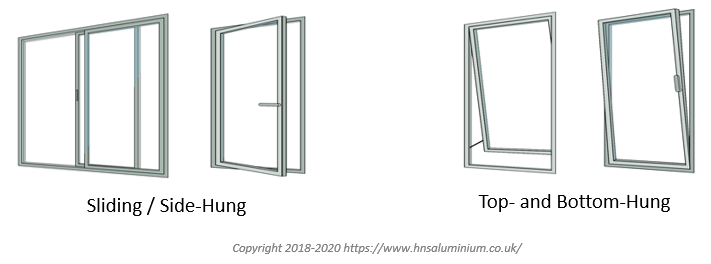
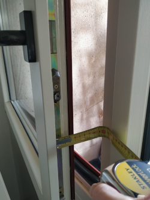

## [CAiMIRA Calculator](https://caimira.web.cern.ch/)

This guide helps on how to use the calculator app. For more information on the Airborne Transmission of SARS-CoV-2, feel free to check out the HSE Seminar: [https://cds.cern.ch/record/2743403](https://cds.cern.ch/record/2743403)

The methodology, mathematical equations and parameters of the model are described here in the CERN Report: [CERN-OPEN-2021-004](https://cds.cern.ch/record/2756083) <!-- outdated!! -->

??? "Disclaimer"

    CAiMIRA is a risk assessment tool developed to model the concentration of viruses in enclosed spaces, in order to inform space-management decisions.

    CAiMIRA models the concentration profile of virions in enclosed spaces with clear and intuitive graphs. The user can set a number of parameters, including room volume, exposure time, activity type, mask-wearing and ventilation. The report generated indicates how to avoid exceeding critical concentrations and chains of airborne transmission in spaces such as individual offices, meeting rooms and labs.

    The risk assessment tool simulates the airborne spread SARS-CoV-2 virus in a finite volume, assuming homogenous mixing for the long-range component and a two-stage jet model for short-range, and estimates the risk of COVID-19 airborne transmission therein. The results DO NOT include other known modes of SARS-CoV-2 transmission, such as contact or fomite. Hence, the output from this model is only valid when the other recommended public health & safety instructions are observed, such as adequate physical distancing, good hand hygiene and other barrier measures.

    The model used is based on scientific publications relating to airborne transmission of infectious diseases, dose-response exposures and aerosol science, as of February 2021. It can be used to compare the effectiveness of different airborne-related risk mitigation measures.

    Note that this model applies a deterministic approach, i.e., it is assumed at least one person is infected and shedding viruses into the simulated volume. Nonetheless, it is also important to understand that the absolute risk of infection is uncertain, as it will depend on the probability that someone infected attends the event. The model is most useful for comparing the impact and effectiveness of different mitigation measures such as ventilation, filtration, exposure time, physical activity, amount and nature of close-range interactions and the size of the room, considering both long- and short-range airborne transmission modes of COVID-19 in indoor settings.

    This tool is designed to be informative, allowing the user to adapt different settings and model the relative impact on the estimated infection probabilities. The objective is to facilitate targeted decision-making and investment through comparisons, rather than a singular determination of absolute risk. While the SARS-CoV-2 virus is in circulation among the population, the notion of 'zero risk' or 'completely safe scenario' does not exist. Each event modelled is unique, and the results generated therein are only as accurate as the inputs and assumptions.

    CAiMIRA has not undergone review, approval or certification by competent authorities, and as a result, it cannot be considered as a fully endorsed and reliable tool, namely in the assessment of potential viral emissions from infected hosts to be modelled.

### Simulation Name & Room number

In order to be able to trace back the simulations in your workplace risk assessments, performed with the tool, you can give each one a unique name - for example "Office use on Tuesday mornings". The simulation name has no bearing on the calculation.

A room number is included, if you do not wish to use a formal room number any reference will do - for example "57/2-004".

### Virus Data

Please choose the correct virus strain or any reported Variant of Concern (VOC) from the list. Changing this setting alters the properties of the virus which are used for the simulation. This has a significant effect on the probability of infection. The choices are:

- **SARS-CoV-2 (nominal strain)**, covering typical strains and variants which are not of concern from an epidemiologic point of view of the virus;
- **SARS-CoV-2 (Alpha VOC)**, first identified in the UK at the end of 2020 which is found to be approximately 1.5x more transmissible compared to the non-VOCs;
- **SARS-CoV-2 (Beta VOC)**, first identified in South Africa in May 2020 which is found to be approximately 1.25x more transmissible compared to the non-VOCs;
- **SARS-CoV-2 (Gamma VOC)**, first identified in Brazil in January 2021 which is found to be approximately 2.2x more transmissible compared to the non-VOCs.
- **SARS-CoV-2 (Delta VOC)**, first identified in India towards the end of 2020 which is found to be approximately 60% more transmissible compared to the ALPHA VOC.
- **SARS-CoV-2 (Omicron VOC)**, first identified in South Africa in November 2021 which is found to be at least 2.53x more transmissible compared to the DELTA VOC.

The user can modify the selected variant from the default, according to the prevalence of the different variants in the local area, e.g. for [Geneva](https://www.covid19.admin.ch/fr/epidemiologic/virus-variants?detGeo=GE).

N.B. The transmission data for the Gamma variant has been taken from a study data gathered in Manaus, Brazil where the variant was first observed. The local population in Manaus had very high levels of Covid-19 antibodies (>67%) in recent months. This factor has been taken into account by the authors of the study, via statistical adjustments to the transmission value (i.e. it has been increased, to account for spread in a population with significant acquired Covid-19 immunity). However, this value may be revised in the future as more studies of the Gamma VOC transmission in different geographical locations become available.

#### Vaccine effectiveness

The vaccination input corresponds to the vaccine type(s) administrated to the exposed population, assuming every exposed (or the occupant in question) has received the vaccine cocktail selected by the user. The respective vaccine effectiveness values were extracted from data available in [Results of COVID-19 Vaccine Effectiveness Studies: An Ongoing Systematic Review - Updated September 8, 2022](https://view-hub.org/resources), using this [script](https://gitlab.cern.ch/caimira/caimira/-/blob/master/caimira/src/caimira/scripts/data/vaccine_effectiveness.py).

### Room Data

Please enter either the room volume (in m³) or both the floor area (m²) and the room height (m). This information is available via GIS Portal ([https://gis.cern.ch/gisportal/](https://gis.cern.ch/gisportal/)).

#### Room heating system

The use of central heating (e.g. radiators) reduces relative humidity of the indoor air, which can decrease the decay rate of viral infectivity. If your space is heated with such water radiators, select 'Yes'. If your space does not have such heating, or they are not in use in the period of the simulation (e.g. summer), select 'No'.

### Ventilation type

There are three main options:

#### Mechanical ventilation

If the room has mechanical ventilation, supplying fresh air from outside (either a local or centralized system), you should select this option. In order to make an accurate calculation you will need to know either the flow rate of fresh air supplied in the room or th total number of air changes per hour with fresh air.

Please bear in mind that any of the two inputs only consider the supply of fresh air. If a portion of air is recirculated, it shall not be accounted for in the inputs.

#### Natural ventilation

Natural ventilation refers to rooms which have openable windows. There are many possibilities to calculate natural ventilation air flows, for simplification this tool assumes a single-sided natural ventilation scheme which is a conservative approach for the purpose of this tool.

Please choose the type of window (see illustration below):

- Sliding or side-hung
- Top- or bottom-hung

Please enter the number, height and width and opening distance of the windows (in m). If there are multiple windows of different sizes, you should take an average.

The window opening distance (in m) is:

- In the case of Sliding or Side-Hung option, the length the window is moved open. Window opening distance example (image of open window and measuring tape):

    

- In case of Top- or Bottom-Hung, the distance between the fixed frame and the movable glazed part when open.

**Notes**: If you are unsure about the opening distance for the window, it is recommended to choose a conservative value (5 cms, 0.05m or 10cms, 0.10m). If you open the window at different distances throughout the day, choose an average value.
When using natural ventilation, the circulation of air is simulated as a function of the difference between the temperature inside the room and the outside air temperature. The average outdoor temperature for each hour of the day has been computed for every month of the year based on historical data for Geneva, Switzerland. It is therefore very important to enter the correct time and date in the event data section. Finally, you must specify if the windows are open permanently (at all the times), or periodically (in intervals for a certain duration during the course of the day) - e.g. open the window for 10 minutes (duration) every 60 minutes (frequency).

#### No ventilation

This option assumes there is neither Mechanical nor Natural ventilation in the simulation.

#### HEPA filtration

A HEPA filter is a high efficiency particulate matter filter, which removes small airborne particles from the air. They can be very useful for removing particles with viruses from the air in an enclosed space. The calculator allows you to simulate the installation of a HEPA air filter within the room. The recommended airflow rate for the HEPA filter should correspond to a total air exchange rate of 3 - 6 ACH (the higher the better, even beyond 6).

### Event data

Here we capture the information about the event being simulated. First enter the number of occupants in the space, if you have a (small) variation in the number of people, please input the average or consider using the expert tool. Within the number of people occupying the space, you should specify how many are infected.

In case one would like to simulate an event happening at a given time and location, where the epidemiological situation is known, the tool allows for an estimation of the probability of on-site transmission, considering the chances that a given person in the event is infected. The user will need to select **Probabilistic event**, input the number of inhabitants and the the weekly (7-day rolling average) value of new reported laboratory - ⁠confirmed cases at the event location, as well as the confidence level of these inputs. The 7-day rolling average consists in the average of the previous 3 days to subsequent 3 days, generally reported by the different public health authorities (e.g. in Switzerland [here](https://www.covid19.admin.ch/en/epidemiologic/case/d/development?epiRelDev=abs)). These two inputs need to the related, i.e. the values of reported new cases and the number of inhabitants shall correspond to the a same geographical location. For example:

- Population of Geneva, CH: 508 000 inhabitants
- New lab reported cases in the canton of Geneva: 1000 (7-day rolling average)

The confidence level allows for an ascertainment bias to the data. The user can add the following options:

- High - mandatory population wide surveillance
- Medium - recommended population-wide surveillance
- Low - surveillance only for symptomatic patients

Depending on the epidemiological situation in the chosen location, the public health surveillance can be more or less active. The confidence level will provide an ascertainment bias to the data collected by the user.
The higher the incidence rate (i.e. new cases / population) the higher are the chances of having at least one infected occupant participating to the event.

For general and recurrent layout simply select the **Deterministic exposure** option. As an example, for a shared office with 4 people, where one person is infected, we enter 4 occupants and 1 infected person.

#### Activity type

There are a few predefined activities in the tool at present.

- **Office** - All persons seated, talking occasionally (1/3rd of the time, with normal breathing the other 2/3rds of the time). Everyone (exposed and infected occupants) is treated the same in this model.
- **Small meeting** - Less than 10 participants. All persons seated, having a conversation (approximately each occupant is 1/N % of the time talking, where N is the number of occupants). Everyone (exposed and infected occupants) is treated the same in this model.
- **Large Meeting** - 10 or more participants. Similar to a seminar with 'speakers and audience'. Infected occupant(s) is standing and speaking 1/3rd of the time, while the other occupants are seated.
- **Library** - All persons seated, breathing only (not talking), all the time.
- **Call Centre** - All persons seated, all talking simultaneously, all the time. This is a conservative profile, i.e. will show an increased P(i) compared to office/meeting activity. Everyone (exposed and infected occupants) is treated the same in this model.
- **Control Room (day shift)** - All persons seated, all talking 50% of the time. This is a conservative profile, i.e. will show an increased P(i) compared to office/meeting activity. Everyone (exposed and infected occupants) is treated the same in this model.
- **Control Room (night shift)** - All persons seated, all talking 10% of the time. Everyone (exposed and infected occupants) is treated the same in this model.
- **Lab** - Based on a typical lab or technical working area, all persons are doing light activity and talking 50% of the time. Everyone (exposed and infected occupants) is treated the same in this model.
- **Workshop** - Based on a mechanical assembly workshop or equipment installation scenario, all persons are doing moderate activity and talking 50% of the time. This activity is equally applicable to bicycling, or walking on a gradient, in the LHC tunnels. Everyone (exposed and infected occupants) is treated the same in this model.
- **Conference/Training (speaker infected)** - Based on a typical conference/training course scenario. One individual (the speaker/trainer) is standing and talking, with all other individuals seated and talking quietly (whispering). In this case it is assumed that the infected person is the speaker/trainer, because this is the worst case in terms of viral shedding.
- **Conference/Training (attendee infected)** - All individuals seated and breathing. In this case it is assumed that the infected person is not the speaker/trainer.
- **Gym** - All persons are doing heavy exercise and breathing (not talking). Everyone (exposed and infected occupants) is treated the same in this model.

### Timings

You should enter the time (hours:minutes) for the start and end of the simulation period (i.e. 8:30 to 17:30 for a typical office day). It is important to enter the correct times for the simulation, in particular when using natural ventilation. It is possible to specify a different time for the entry and exit of both the exposed and infected person, however for most cases (where we do not know apriori which of the occupants is infected), it is recommended to set these to the same values as the activity start and end.

#### When is the event?

This is included for completeness in all simulations, however it is of particular relevance to those using natural ventilation because of variations in outside air temperature.

Only the month is used by the model to retrieve the average outdoor air temperatures for the Geneva region.

### Breaks

#### Lunch break

You have the option to specify a lunch break. This will be useful if you plan to simulate a typical full working day. During the lunch break it is assumed that all occupants will leave the simulated space (to go eat lunch somewhere else - restaurant or break room). If you plan to eat lunch in the same area where you have been working, you should select 'No' even if a lunch break will be taken, since the risk of infection is related to the occupation of the simulated space. See 'Split Breaks' if the occupants do not break at the same time.

It should also be noted that the infection probabilities presented in the report does not take into account any potential exposures during the break times.

#### Coffee breaks

You have the option to choose 0(No breaks), 2 or 4 coffee breaks during the simulated period. It is assumed that all occupants vacate the space during the break period. If coffee breaks are taken in-situ, this option should be set to 'No breaks'.

When enabled, the breaks are spread equally throughout the day - for example if we simulate the period from 9:00 to 18:00, with a lunch break from 13:00 to 14:00 and considering 2 coffee breaks, the tool will schedule the first coffee break around 11:00 and the second around 16:00. The exact timing of the breaks within the day is not particularly critical to an accurate simulation, so you do not need to be concerned about major differences if you take a coffee break at 10:00 instead of 11:00. The variation of coffee breaks can be altered in 5 minute increments up to 30 minutes in length. Note that this doesn't necessarily have to be a coffee break, it can represent any period where the simulated space is vacated. See 'Split Breaks' if the occupants do not break at the same time.

It should also be noted that the infection probabilities presented in the report does not take into account any potential exposures during the break times.

#### Split breaks

You have the option to specify whether the exposed and infected person(s) break at the same time. If not, then you can input separate breaks. This is particularly different when specifying coffee breaks as they are spread evenly throughout the activity times specified.

If we take an example where the exposed person(s) activity time is from 9:00 to 18:00 and the infected person(s) is from 10:00 to 17:00, with both having a lunch break from 13:00 to 14:00 and have 2 coffee breaks each, we can have two different results:

1. Specify the default situation where both exposed and infected persons(s) have their breaks at the same time: in this case the coffee break times are calculated based on the activity time of the exposed - both will have their first coffee break around 11:00 and the second around 16:00.

2. Specify separate breaks for the infected person(s): in this case the coffee breaks will be calculated based on the different activity times (i.e. exposed from 9:00 to 18:00 and infected from 10:00 to 17:00) - the exposed person(s) will have their first coffee break around 11:00 and the second around 16:00, whereas the infected will have their first coffee break around 11:30 and the second around 15:30.

### Face masks

The model allows for a simulation with either a continuous wearing of face masks throughout the duration of the event, or have the removed at all times - i.e. all occupants (infected and exposed alike) wear or not masks for the duration of the simulation. Please bear in mind the user inputs shall be aligned with the current applicable public health & safety instructions. Please check what are the applicable rules, before deciding which assumptions are used for the simulation.

If you have selected the Conference/Training activity type, this equates to the speaker/trainer and all participants either wearing masks throughout the conference/training (Yes), or removing them when seated/standing at their socially distanced positions within the conference/training room (No). Please confirm what are the applicable rules, before deciding which assumptions are used for the simulation

For the time being only the Type 1 surgical, FFP2, and Cloth masks can be selected.

### Report

When you have entered all the necessary information, please click on the Generate Report button to execute the model. With the implementation of Monte Carlo simulations, the browser might take a few seconds to react.

The report will open in your web browser. It contains a summary of all the input data, which will allow the simulation to be repeated if required in the future as we improve the model.

#### Results

This part of the report shows the P(I) or probability of one exposed person getting infected. It is estimated based on the emission rate of virus into the simulated volume, and the amount which is inhaled by exposed individuals. This probability is valid for the simulation duration - i.e. the start and end time. If you are using the natural ventilation option, the simulation is only valid for the selected month, because the following or preceding month will have a different average temperature profile. The expected number of new cases for the simulation is calculated based on the probability of infection, multiplied by the number of exposed occupants.

The graph shows the variation in the concentration of virions within the simulated volume. It is determined by:

- The presence of the infected person, who emits airborne viruses in the volume.
- The emission rate is related to the type of activity of the infected person (sitting, light exercise), their level of vocalisation (breathing, speaking or shouting).
- The accumulation of virions in the volume, which is driven, among other factors, by ventilation (if applicable).
    - In a mechanical ventilation scenario, the removal rate is constant, based on fresh airflow supply in and out of the simulated space.
    - Under natural ventilation conditions, the effectiveness of ventilation relies upon the hourly temperature difference between the inside and outside air temperature.
    - A HEPA filter removes virions from the air at a constant rate and is modelled in the same way as mechanical ventilation, however air passed through a HEPA filter is recycled (i.e. it is not fresh air).

#### QR code

At the end of the report you can find a unique QR code / hyperlink for this report. This provides an automatic way to review the calculator form with the corresponding specified parameters. This allows for:

- sharing reports by either scanning or clicking on the QR code to obtain a shareable link.
- easily regenerating reports with any new versions of the CAiMIRA model released in the future.

### Conclusion

This tool provides informative comparisons for COVID-19 airborne risk only - see Disclaimer. If you have any comments on your experience with the app, or feedback for potential improvements, please share them with the development team - [send email](mailto:caimira-dev@cern.ch).