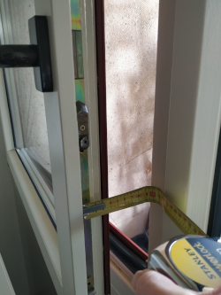

# Instructions for use

This is a guide to help you use the calculator app.
If you are using the expert version of the tool,  you should look at the expert notes.

For more information on the Airborne Transmission of SARS-CoV-2, feel free to check out the HSE Seminar: https://cds.cern.ch/record/2743403


## Disclaimer

The risk assessment tool simulates the long range airborne spread SARS-CoV-2 virus in a finite volume, assuming a homogenous mixture, and estimates the risk of COVID-19 infection thereto.
The results DO NOT include short-range airborne exposure (where the physical distance plays a factor) nor the other know modes of transmission of SARS-CoV-2.
Hence, this model implies that proper physical distancing, good hand hygiene and other barrier measures are ensured.
It is based on current scientific data and can be used to measures the effectiveness of different mitigation measures.

Note that this model is based on a deterministic approach, i.e., at least one person is infected and shedding viruses into the volume.
Nonetheless, it is also important to understand that the absolute risk of infection is uncertain as it will depend on the probability that someone infected attends the event.
The model is mostly useful to compare the impact and effectiveness of mitigation measures such as ventilation, filtration, exposure time, activity and the size of the room on long-range airborne transmission of COVID-19 in indoor settings.
This application is meant for informative and educational purposes.
The user can be able to adapt different settings and measure the relative impact on the estimated infection probabilities to allow for a targeted decision making and investment.
The user should acknowledge that until the virus is in circulation among the population, the notion of 'zero risk' or a 'completely safe scenario' does not exist.
Each event is unique and the results are as accurate as the inputs.
The app is based on our scientific understanding of infectious diseases transmission, exposure and aerosol science as of November 2020.

We do not assume responsibility for any injury or damage to persons or property arising out of or related to any use of this app.

## Usage

### Simulation Name & Room number

In order to be able to trace the risk assessments that you perform with the calculator, you can give each one a unique name - for example "Office use on Tuesday mornings".
The simulation name has no bearing on the calculation.
 
A room number is included, if you do not wish to use a formal room number any reference will do - for example "57/2-004"

### Room Data

Please enter either the room volume (in m<sup>3</sup>) or both the floor area (m<sup>2</sup>) and the room height (m).
This information is available via GIS Portal (https://gis.cern.ch/gisportal/).

### Ventilation type

There are three main options:

#### Mechanical ventilation

If the room has mechanical ventilation, suppling fresh air from outside (either a local or centralised system), you should select this option.
In order to make an accurate calculation you will need to know either the flow rate of fresh air supplied in the room or th total number of air changes per hour with fresh air.

Please bear in mind that any of the two inputs only consider the supply of fresh air. If a portion of air is recirculated, it shall not be accounted for in the inputs.

#### Natural ventilation

Natural ventilation refers to rooms which have openable windows. There are many possibilities to calculate natural ventilation air flows, for simplification this tool assumes a single-sided natural ventilation scheme which is a conservative appraoch for the purpose of this tool.

Please enter the number, height and width and opening distance of the windows (in m).
If there are multiple windows of different sizes, you should take an average.

The window opening distance (in m) is:

 * In the case of windows that slide, the length the window is moved open.

 * For articulated windows, it is the distance between the fixed frame and the movable glazed part when open.
   

 
**Notes**: If you are unsure about the opening distance for the window, it is recommended to choose a conservative value (5 cms, 0.05m or 10cms, 0.10m).
If you open the window at different distances throughout the day, choose an average value.

The width of the window is not currently used as an input to the model (height and opening distance is sufficient to calculate the free area), but is included for completeness of the report.
When using natural ventilation, the circulation of air is simulated as a function of the difference between the temperature inside the room and the outside air temperature. The average outdoor temperature for each hour of the day has been computed for every month of the year based on historical data for Geneva, Switzerland.
It is therefore very important to enter the correct time and date in the event data section.
Finally, you must specify when the windows are open - all the time (always), or for 10 minutes every 2 hours.

#### No ventilation
This option assumes there is neither Mechanical nor Natural ventilation in the simulation.


#### HEPA filtration

A HEPA filter is a high efficiency particulate matter filter, which removes small airborne particles from the air.
They can be very useful for removing particles with viruses from the air in an enclosed space.
The calculator allows you to simulate the installation of a HEPA air filter within the room.
The recommended air flow rate for the HEPA filter should correspond to a total air exchange rate of 3 - 6 ACH (the heigher the better, even beyond 6)

### Event Data

Here we capture the information about the event being simulated.
First enter the number of occupants in the space, if you have a (small) variation in the number of people, please input the average or consider using the expert tool.
Within the number of people occupying the space, you should specify how many are infected.

As an example, for a shared office with 4 people, where one person is infected, we enter 4 occupants and 1 infected person.

#### Activity type

There are a few predefined activities in the tool at present.

**Office ** = All persons seated, talking occasionally (1/3rd of the time, with normal breathing the other 2/3rds of the time). Everyone (exposed and infected occupants) is treated the same in this model.

**Meeting** = All persons seated, having a conversation (approximately each occupant is 1/N % of the time talking, where N is the number of occupants). Everyone (exposed and infected occupants) is treated the same in this model.

**Library** = All persons seated, breathing only (not talking), all the time.

**Call Centre** = All persons seated, all talking simultaneously, all the time. This is a conservative profile, i.e. will show an increased ``P(i)`` compared to office/meeting activity. Everyone (exposed and infected occupants) is treated the same in this model.

**Lab** = Based on a typical lab or technical working area, all persons are doing light activity and talking 50% of the time. Everyone (exposed and infected occupants) is treated the same in this model.

**Workshop** = Based on a mechanical assembly workshop or equipment installation scenario, all persons are doing moderate activity and talking 50% of the time. This activity is equally applicable to bicycling, or walking on a gradient, in the LHC tunnels. Everyone (exposed and infected occupants) is treated the same in this model. 

**Training** = Based on a typical training course scenario.
One individual (the trainer) is standing and talking, with all other individuals seated and talking quietly (whispering).
In this case it is assumed that the infected person is the trainer, because this is the worst case in terms of viral shedding.
 
**Gym** = All persons are doing heavy exercise and breathing (not talking). Everyone (exposed and infected occupants) is treated the same in this model.


### Timings

You should enter the time (hours:minutes) for the start and end of the simulation period (i.e. 8:30 to 17:30 for a typical office day).
It is important to enter the correct times for the simulation, in particular when using natural ventilation.
It is possible to specify a different time for the entry and exit of the infected person, however for most cases (where we do not know apriori which of the occupants is infected), it is recommended to set these to the same values as the activity start and end.

#### When is the event?

This is included for completeness in all simulations, however it is of particular relevance to those using natural ventilation because of variations in outside air temperature.
If you wish to simulate repetitive events, for example using an office for multiple days in the same month, choose recurrent usage.
 
Only the month is used by the model to look up outside air temperatures for the Geneva region.
 
### Breaks

#### Lunch

You have the option to specify a lunch break.
This will be useful if you plan to simulate a typical full working day.
During the lunch break it is assumed that all occupants will leave the simulated space (to go an eat lunch, somewhere else - restaurant or break room).
If you plan to eat lunch in the same area where you have been working, you should select 'No' even if a lunch break will be taken, since the risk of infection is related to the occupation of the simulated space.

It should also be noted that the infection probabilities presented in the report does not take into account any potential exposures during the break times.


### Coffee Breaks

You have the option to choose 0(No breaks), 2 or 4 coffee breaks during the simulated period.
It is assumed that all occupants vacate the space during the break period.
If coffee breaks are taken in-situ, this option should be set to 'No breaks'.

When enabled, the breaks are spread equally throughout the day - for example if we simulate the period from 9:00 to 18:00, with a lunch break from 13:00 to 14:00 and considering 2 coffee breaks, the app will  schedule the first coffee break at 11:00 and the second at 16:00.
The exact timing of the breaks within the day is not particularly critical to an accurate simulation, so you do not need to be concerned about major differences if you take a coffee break at 10:00 instead of 11:00.
The variation of coffee breaks can be altered in 5 minute increments up to 30 minutes in length.
Note that this doesn't necessarily have to be a coffee break, it can represent any period where the simulated space is vacated.
 
It should also be noted that the infection probabilities presented in the report does not take into account any potential exposures during the break times.

#### Face Masks

At the time of writing, the removal of masks is authorised at workstations provided a physical distance (2m minimum) can be maintained. The model therefore includes the possibility simulate this behaviour.
Alternatively, the continuous wearing of masks can be simulated, i.e. all occupants (infected and non-infected alike) wear masks for the duration of the simulation.
 
If you have selected the Training activity type, this equates to the trainer and all participants either wearing masks throughout the training (Yes), or removing them when seated/standing at their socially distanced positions within the training room (No).

For the time being only the Type 1 surgical and FFP2 masks can be selected.

## Generate Report

When you have entered all the necessary information, please click on the Generate Report button to execute the model.


# Report

The report will open in your web browser.
It contains a summary of all the input data, which will allow the simulation to be repeated if required in future as we improve the calculation.

## Results

This part of the report shows the ``P(i)`` or probability of one exposed person getting infected.
It is estimated based on the emission rate of virus into the simulated volume, and the amount which is inhaled by exposed individuals.
This probability is valid for the simulation duration - i.e. if you have simulated one day and plan to work 5 days in these conditions and the infected person emits the same amoung of viruses each day, the cumulative probability of infection is ``(1-(1-P(i))^5)```.
If you are using the natural ventilation option, the simulation is only valid for the selected month, because the following or preceding month will have a different average temperature profile.

The ``expected number of new cases`` for the simulation is calculated based on the probability of infection, multiplied by the number of exposed occupants.

### Exposure graph

The graph shows the variation in the concentration of infectious quanta (one quanta is the amount of inhaled viruses which can cause infection in 63% of the exposed occupants) within the simulated volume.
It is determined by:
* The presence of the infected person, who emits airborne viruses in the volume.
* The emission rate is related to the type of activity of the infected person (sitting, light exercise), their level of vocalisation (breathing, whispering or talking).
* The accumulation of infectious quanta in the volume, which is driven, amoung others, by ventilation (if applicable).
    * In a mechanical ventilation scenario, the removal rate is constant, based on fresh air flow supply in and out of the simulated space.
    * Under natural ventilation conditions, the effectiveness of ventilation relies upon the hourly temperature difference between the inside and outside air temperature.
    * A HEPA filter removes infectious quanta from the air at a constant rate and is modelled in the same way as mechanical ventilation, however air passed through a HEPA filter is recycled (i.e. it is not fresh air).

# Conclusion

This tool provides illustrations for COVID-19 (long range) airborne risk only - see Disclaimer
If you have any comments on your experience with the app, or feedback for potential improvements, please share them with the development team at cara-dev@cern.ch.
